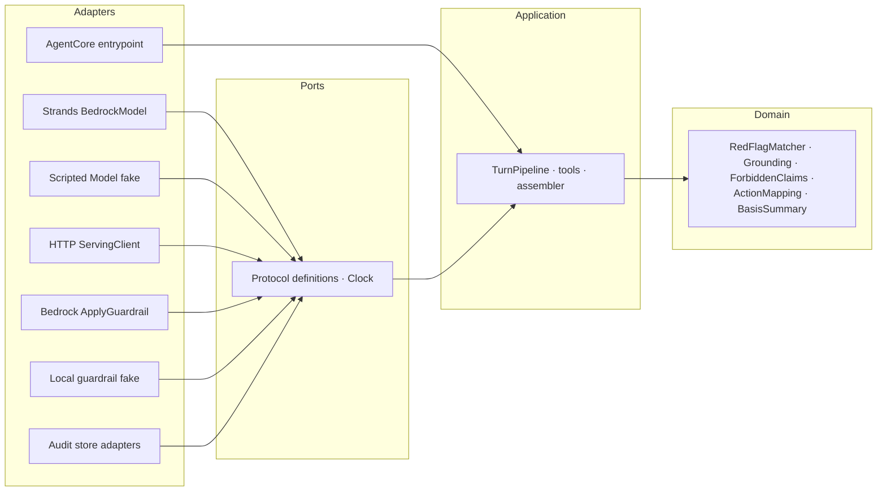

# Design Document

## Overview

The AI Advisor Agent (Service 3) turns the per-user JSON that Service 2 serves into plain-language,
condition-appropriate **exposure-reduction guidance** for a person with a respiratory illness. It is a
Strands agent, running its own loop in its own process, deployed as a container to Amazon Bedrock
AgentCore Runtime.

The design has one organising idea and one hazard.

The organising idea: **this service composes and verifies; it does not compute.** Service 2 already
derives the condition weighting, the escalation threshold and which thresholds were crossed, the inhaled
dose, the forecast and pollen outlook, the confidence flags, and the provenance of every number. Every
quantitative claim in the guidance is therefore a value that arrived in a retrieval, and the design's job
is to make an invented number *unrepresentable* rather than merely discouraged.

The hazard: **the output is generated by a language model**, which is the one place in this system where a
constraint can be violated by text nobody wrote. Every guardrail is consequently a check on the emitted
text, applied after generation, at a point no return path can bypass — and it fails closed.

### Design decisions

| # | Decision | Rationale |
|---|----------|-----------|
| DD1 | Hexagonal: every I/O boundary is a `Protocol` port with a local fake and a real adapter | The whole suite must pass with no AWS credentials and no network beyond localhost (Req 26.5); these are exactly the boundaries that get swapped (practice §1, DIP) |
| DD2 | The Strands `Model` abstract class **is** the Model_Port — no wrapper over it | Strands accepts any `Model` subclass wherever a model is expected, and a `Model` subclass whose `stream()` yields scripted events performs no network call. A second abstraction would need keeping in step with the framework's for no gain (Req 6.1a). **Verified against `strands-agents==1.55.1`: the abstract surface is FOUR methods — `stream`, `structured_output`, `get_config`, `update_config` — not one.** A fake implementing only `stream()` cannot be instantiated, so the scripted model implements all four; `tests/unit/test_scaffolding.py` pins the set so an SDK upgrade that changes it fails a test rather than the whole suite |
| DD3 | The advisory turn is a **Template Method** with a fixed step order: red-flag check → retrieve → generate → verify → assemble → audit | The order is itself a set of requirements — escalation before generation (Req 10.2), verification after any repair (Req 34.7), audit even for a rejected generation (Req 20.4) — so encoding it once stops a caller reordering it |
| DD4 | Guardrails are enforced at **two independent points**: a local pattern/closure check and a Bedrock `ApplyGuardrail` call, neither conditional on the other | The local check runs offline and when Bedrock is unreachable; the managed check catches phrasings no pattern anticipated. Either alone leaves a gap the other covers (Req 34.5) |
| DD5 | Grounding is a **decidable comparison** over numerals, never a similarity score | Req 7.1 requires every quantitative claim to *be* a retrieved value. A contextual-grounding score cannot decide that; extracting numerals and comparing them to a permitted set can (Req 34.8) |
| DD6 | Retrievals are **Strands tools**, so the model requests data rather than being handed a pre-stuffed prompt | Makes the trajectory observable and therefore assertable (Req 35.4, 35.5): a turn that answered without retrieving is a turn whose tool log is empty |
| DD7 | The red-flag check is **deterministic and model-independent**, and runs first | Req 10.4 requires escalation when the Serving_Client is down; the same reasoning applies to the model. A check that needed either could not fire when both are unavailable |
| DD8 | The Advisory_Response **is** the `/invocations` body | The Runtime fixes transport and status codes but leaves the JSON shape to the application (Req 32.3); a second wire shape would need keeping in step with the first |
| DD9 | The credential travels in a narrow carrier that is never interpolated into a prompt, and is treated as **opaque** | AgentCore validates it inbound and Service 2 validates it on receipt; a third parse adds a place for three things to disagree and a component that can log a claim (A4a) |
| DD10 | Background work uses the AgentCore SDK's `add_async_task` / `complete_async_task`; the entrypoint never blocks | A blocking handler also blocks `/ping`, and a blocked ping is read as an unhealthy session — termination, or the entrypoint re-invoked mid-turn (A11a) |
| DD11 | No AgentCore Memory and no session store; prior turns arrive as a parameter | Its long-term strategies extract health facts asynchronously into storage this spec does not govern (A12) |
| DD12 | Degradation composes a response from retrieved data **without prose** rather than failing the turn | Req 21.2: the envelope, the basis and any escalation are still owed to the user when the model cannot answer |
| DD13 | The exposure–symptom association is **Service 2's** computation, triggered asynchronously and never awaited in a turn | Deterministic numeric inference over two time series that service already holds; behind a language model it would be unreproducible and untestable (Req 33.1, A5) |

### Research grounding

Every clinical rule traces to `docs/research/FINDINGS.md`:

- **Escalate at the Orange band, not the public 151+** — cycle 1. Service 2 computes the escalation point;
  this service reports it.
- **Condition weighting**: COPD → NO2/O3 (meta-analysis RR 1.04/1.03 per 10 µg/m³); asthma → PM2.5/O3 plus
  allergens; allergic rhinitis → the pollen × pollution synergy — cycles 2 and 7.
- **The lag structure**: gaseous effects same-day, particulate effects peaking ~3 days later — cycle 2.
  This is why anticipatory warning is possible at all (Req 13.2).
- **Inhaled dose is the differentiator** over ambient concentration — cycle 4.
- **Guardrails are product requirements, not a disclaimer**; the general-wellness/medical-device line is
  drawn by intended use and claims, and FDA's 2026 CDS guidance grants enforcement discretion only where
  the basis is transparent and independently reviewable — cycle 6.
- **Fusion, not prediction** — cycle 8. The agent consumes forecasts; it does not model air quality.

## Architecture

### Component context

```
                  end user (chat / voice surface)
                             │  Advisory_Request + Cognito JWT
                             ▼
        ┌──────────────────────────────────────────────┐
        │   AgentCore Runtime  (linux/arm64 container)  │
        │   POST /invocations · GET /ping · :8080       │
        │   customJWTAuthorizer validates inbound       │
        ├──────────────────────────────────────────────┤
        │   Service 3 — Advisor Agent                   │
        │                                               │
        │   TurnPipeline (Template Method)              │
        │     1 red-flag check   (deterministic)        │
        │     2 retrieve         (Strands tools)  ──────┼──► Service 2 API
        │     3 generate         (Strands loop)   ──────┼──► Bedrock (model)
        │     4 verify           (local + managed)──────┼──► ApplyGuardrail
        │     5 assemble                                │
        │     6 audit                             ──────┼──► AdviceAuditStore
        └──────────────────────────────────────────────┘
                             │  (out of band, never awaited in a turn)
                             ▼
              association job ──► Service 2 Req 32 learning
```

The user's `Authorization` header reaches this service through the Runtime's request-header allowlist and
is forwarded unmodified to Service 2. Service 2 remains the single authorization enforcement point.

### Layering and dependency direction

Dependencies point inward. The advisory domain — red-flag recognition, action mapping, grounding, the
forbidden-claim rules, response assembly — knows nothing about Bedrock, HTTP, AgentCore, or the wall
clock.



Enforced by AST checks over real source, as Service 2 does: no `domain/` module imports `adapters/` or
`agentcore/`; no domain module reads the wall clock or imports `random`; no domain function takes a whole
config object.

### Advisory turn sequence

```
Advisory_Request
  │
  ├─ validate shape ────────────── malformed → documented rejection (never a container error)
  │
  ├─ 1. RedFlagMatcher(utterance, prior turns)     ← deterministic, no model, no network
  │        └─ match → Escalation recorded NOW, before anything can fail
  │
  ├─ 2. Strands agent loop
  │        ├─ tool: air_quality(credential)         → Air_Quality_Snapshot
  │        ├─ tool: history(start, end)             → readings window
  │        ├─ tool: profile_get / profile_put
  │        └─ tool: symptom_entry_put               (only after user confirmation)
  │      RetrievedValues accumulated from every tool result
  │
  ├─ 3. generation (structured output → AdvisoryDraft)
  │
  ├─ 4. verify  (all three, in order, after any repair)
  │        ├─ grounding: every numeral ∈ RetrievedValues ∪ structural constants
  │        ├─ forbidden claims: local pattern set
  │        └─ ApplyGuardrail(source=OUTPUT): denied topics
  │      any failure → one repair attempt → still failing → degraded response
  │
  ├─ 5. assemble: Guidance + Basis_Summary + Guardrail_Envelope + Escalation + degraded
  │
  └─ 6. audit: exactly one Advice_Record, including for a rejected generation
```

Step 1 is before step 2 deliberately: an escalation determined first survives the failure of everything
after it. Step 4 runs after any repair so a repair cannot reintroduce what the first check rejected.

### Guardrail enforcement points

Registered through Strands hooks at the after-generation point rather than called from the ordinary path,
so a future early return cannot skip them (Req 31.5).

| Check | Runs offline | Catches | On failure |
|---|---|---|---|
| Grounding | yes | an invented number | reject, one repair, then degrade |
| Forbidden claims | yes | diagnosis, dosing, medication instruction | reject, one repair, then degrade |
| Medication closure | yes | a drug not in the user's stored list | reject |
| `ApplyGuardrail` OUTPUT | no | phrasings no pattern anticipated | reject |
| Strands `guardrail_intervened` / `content_filtered` stop reasons | yes (scripted) | the model declining | treat as rejection, not failure |

**Fails closed.** When the managed check is unavailable, any generation the local checks cannot clear is
not returned (Req 34.6). An unverifiable health-adjacent generation is worse than none.

### Directory layout

```
agent-advisor/
├── Dockerfile                      # linux/arm64, :8080, /invocations + /ping
├── pyproject.toml                  # strands-agents==1.55.1 [otel], bedrock-agentcore, exact pins
├── uv.lock
├── src/aqm_advisor/
│   ├── domain/                     # pure; no adapters, no clock, no random
│   │   ├── redflag.py              # RedFlagMatcher — deterministic
│   │   ├── grounding.py            # numeral extraction + permitted-set comparison
│   │   ├── forbidden.py            # Forbidden_Claim patterns + medication closure
│   │   ├── actions.py              # condition → exposure-reduction action registry
│   │   ├── instants.py             # iso_z — this service's own copy, no cross-service import
│   │   └── models.py               # AdvisoryRequest/Response, BasisSummary, RecordReference, Escalation
│   ├── ports/
│   │   ├── clock.py                # Clock protocol + Fixed/System
│   │   └── protocols.py            # ServingClient, GuardrailChecker, AdviceAuditStore,
│   │                               # AssociationTrigger
│   ├── agent/
│   │   ├── tools.py                # Strands @tool wrappers over ServingClient
│   │   ├── prompt.py               # system prompt loaded as configuration, not a literal
│   │   ├── hooks.py                # after-generation verification hooks
│   │   └── pipeline.py             # TurnPipeline (Template Method)
│   ├── adapters/
│   │   ├── model/                  # BedrockModel config + ScriptedModel fake
│   │   ├── serving/                # httpx client over Service 2 + scripted fake
│   │   ├── guardrail/              # ApplyGuardrail + local fake
│   │   └── audit/                  # audit store adapters
│   ├── agentcore/
│   │   └── app.py                  # @app.entrypoint, @app.ping, async task tracking
│   ├── config/loader.py            # fail-fast, one message per invalid value
│   └── observability/              # OTel + JSON logging with central redaction
└── tests/{unit,properties,contracts,integration}/
```

`agentcore/` is the only package importing `bedrock_agentcore`, and nothing under `domain/` or `agent/`
imports it (Req 32.2).

### Deployment topology

Container on AgentCore Runtime. Inbound auth is a `customJWTAuthorizer` on the Cognito pool. Traces,
metrics and logs go to AgentCore Observability via OpenTelemetry — automatic under Runtime, so no
collector is configured here. The association job is triggered out of band (Step Functions task token,
the direct SDK integration, or a durable function) and never awaited inside a turn.

## Components and Interfaces

### Clock (time boundary — DIP)

```python
class Clock(Protocol):
    def now(self) -> datetime: ...
```

`SystemClock` at the process edge; `FixedClock` in tests. Every instant in a response comes from here, so
a turn is reproducible (Req 25.2).

### Ports

```python
class ServingClient(Protocol):
    """Service 2's API. The credential is opaque and forwarded, never parsed."""
    def air_quality(self, credential: str) -> Mapping[str, object]: ...
    def history(self, credential: str, start: datetime, end: datetime,
                species: frozenset[str] | None) -> Mapping[str, object]: ...
    def profile_get(self, credential: str) -> Mapping[str, object]: ...
    def profile_put(self, credential: str, patch: Mapping[str, object]) -> Mapping[str, object]: ...
    def profile_delete(self, credential: str) -> Mapping[str, object]: ...
    def symptom_entry_put(self, credential: str,
                          entry: Mapping[str, object]) -> Mapping[str, object]: ...

class GuardrailChecker(Protocol):
    """Independent verification of emitted text. `source` is always OUTPUT here."""
    def check(self, text: str) -> GuardrailVerdict: ...

class AdviceAuditStore(Protocol):
    def append(self, record: AdviceRecord) -> None: ...
    def forget_user(self, user_id: str) -> int: ...

class AssociationTrigger(Protocol):
    """Fire-and-forget. Never awaited inside a turn (DD13)."""
    def request(self, user_id: str, correlation_id: str) -> None: ...
```

No Bedrock, AgentCore, or httpx type appears in any signature — asserted by a test that renders each
signature and scans for SDK imports, as Service 2 does.

### RedFlagMatcher (domain, deterministic)

```python
@dataclass(frozen=True, slots=True)
class RedFlagRule:
    marker: str          # e.g. "severe_breathlessness"
    patterns: tuple[str, ...]

def match_red_flags(utterance: str, rules: Sequence[RedFlagRule]) -> tuple[str, ...]: ...
```

Defaults are the research's three: severe breathlessness, a reliever that is not working, blue lips or
face. Matching is case-insensitive over a normalised utterance.

**It errs toward escalating, deliberately.** A false positive costs an unnecessary sentence directing
someone to emergency care; a false negative could cost a life. That asymmetry is not symmetric, so the
rules are permissive and the pattern set is configuration a deployment can widen. The matcher is also
belt-and-braces with the model: the model may additionally report a red flag, and **either** source
escalating is sufficient — but the deterministic matcher is authoritative, because it is the only one
that works when the model is down.

### Grounding (domain)

```python
def numerals(text: str) -> tuple[str, ...]: ...
def permitted_values(retrieved: RetrievedValues,
                     constants: Sequence[str]) -> frozenset[str]: ...
def ungrounded(text: str, permitted: frozenset[str]) -> tuple[str, ...]: ...
```

Numerals are extracted from the emitted text, normalised (trailing zeros, thousands separators), and
compared against the union of every value that arrived in a retrieval and a small configured set of
**structural constants** — the ~3-day particulate lag, and spelled-out small numbers used as prose
("one", "three days") rather than as measurements.

**Deliberately strict, and the asymmetry justifies it:** a false rejection costs one repair attempt; a
false acceptance ships an invented health-adjacent number. Where the strictness bites in practice, the
fix is to add the value to what the retrieval returns — not to loosen the check.

### ForbiddenClaims and medication closure (domain)

```python
def forbidden_matches(text: str, patterns: Sequence[str]) -> tuple[str, ...]: ...
def unlisted_medications(text: str, listed: frozenset[str]) -> tuple[str, ...]: ...
```

Patterns cover diagnosis assertions, dosing instructions, and administration verbs adjacent to a
medication name. A configured set **replaces** the defaults rather than extending them, so a deployment
can correct a pattern that misfires (Req 8.7).

The medication rule is a **closure** check, not a pattern: any drug name in the text must be in the
retrieved `Medication_Entry` set. Naming a medication is permitted only in the preparedness construction;
an administration instruction adjacent to any medication name is rejected regardless of listing (Req 29).

### ActionMapping (domain, registry)

```python
CONDITION_ACTIONS: Mapping[str, tuple[ActionTemplate, ...]]
def actions_for(condition: str, driving: str | None) -> tuple[ActionTemplate, ...]: ...
```

A registry keyed by condition, so a new condition is an entry and not a branch (Req 12.5). Every template
is exposure-reduction phrasing. The mapping never *chooses* a weighting — that arrives from Service 2's
`personalized.weightedFocus` in the order that service returned it.

### TurnPipeline (Template Method)

```python
class TurnPipeline:
    def __init__(self, deps: TurnDependencies, settings: TurnSettings) -> None: ...
    def run(self, request: AdvisoryRequest) -> AdvisoryResponse: ...
```

The six steps of the sequence above, in that fixed order. Each is a small overridable method; the order
is not configurable, because the order *is* several requirements.

### Strands tools

Each retrieval is a `@tool` whose docstring is the description the model sees. Tool results are recorded
into a `RetrievedValues` accumulator as they return, which is what later makes the grounding check
possible and the trajectory assertable.

The tool set is exactly: `air_quality`, `history`, `profile_get`, `profile_put`, `symptom_entry_put`. No
general-purpose tool library is installed (A9), so the reachable surface is these five and nothing else.

### AgentCore entrypoint

```python
app = BedrockAgentCoreApp()

@app.entrypoint
async def invoke(payload: dict, context) -> dict:      # never blocks
    ...

@app.ping
def status() -> PingStatus:                            # Healthy / HealthyBusy
    ...
```

Async throughout, so `/ping` stays responsive while a turn is in flight (DD10). Background work is
bracketed by `add_async_task` / `complete_async_task`, which also manage the ping status.

## Data Models

### Turn contract

```python
class AdvisoryRequest(BaseModel):
    utterance: str = Field(min_length=1, max_length=4000)
    credential: SecretStr                    # opaque; excluded from every dump
    prior_turns: tuple[PriorTurn, ...] = ()
    locale: str | None = None

class AdvisoryResponse(BaseModel):
    guidance: str | None                     # None in a degraded response
    basis: BasisSummary | None
    envelope: GuardrailEnvelope              # always present
    escalation: Escalation | None
    degraded: bool = False
    answered_at: datetime
```

`credential` is a `SecretStr` so an accidental interpolation renders as a placeholder rather than the
token, and it is excluded from serialisation — the same structural approach Service 2 took to making its
`UserProfile` refuse to render itself.

### Basis and envelope (read, never recomputed)

```python
class SpeciesBasis(BaseModel):
    species: str
    sub_index: int | None
    band: str | None
    confidence: str

class RecordReference(BaseModel):
    """One retrieved Reading the claim rests on, as Service 2 names it in `basis.records`."""
    site_code: str
    species: str
    date_time: datetime
    duration: str

    def identifier(self) -> str:
        """The stable composite identifier an Advice_Record stores (Req 20.2)."""
        return f"{self.site_code}:{self.species}:{iso_z(self.date_time)}:{self.duration}"

class BasisSummary(BaseModel):
    driving_pollutant: str | None
    site_code: str
    distance_km: float
    as_of: datetime | None
    per_species: tuple[SpeciesBasis, ...]
    threshold: int | None
    threshold_source: str | None             # includes "learned" (Service 2 Req 32.7)
    breakpoint_table: str | None
    calibration_strategies: Mapping[str, str]
    records: tuple[RecordReference, ...]     # Service 2's `basis.records`

class GuardrailEnvelope(BaseModel):
    advisory_scope: str
    emergency_guidance: str
    disclaimer: str
```

Every field is copied from the retrieved response. There is no code path that computes one (Req 9.4).

`records` is here because **Req 20.2 requires the Advice_Record to store "the identifiers of the
retrieved records the Basis_Summary named"** — and without this field the Basis_Summary names none, so
that clause referred to something the design never gave it. The audit trail would have had to invent its
own provenance or store nothing, and "nothing" is the failure that passes quietly.

`identifier()` is a method rather than a call-site f-string because a bare `site_code` would collapse two
genuinely different records: the same sensor reports several species, and the same sensor and species
report at successive instants. All four parts are needed to tell one Reading from another, and none of
them is health-adjacent — a site code, a pollutant name and a timestamp are public sensor facts, so
storing the composite does not breach Req 20.3's ban on health-adjacent content.

`iso_z` is **this service's own** helper in `domain/instants.py`, not Service 2's function of the same
name. The engineering practices forbid importing across service directories until a shared contract
package is specced, so each service keeps its own copy covered by its own round-trip test — the same rule
that already governs the record contract. The name is deliberately identical because the wire form it
must produce is: a whole-second UTC instant with a `Z` suffix.

### Escalation

```python
class Escalation(BaseModel):
    kind: Literal["emergency", "clinician"]
    markers: tuple[str, ...]                 # which red-flag rules matched
    guidance: str                            # Service 2's emergency_guidance text
```

### Retrieved values (the grounding set)

```python
@dataclass(frozen=True, slots=True)
class RetrievedValues:
    numerals: frozenset[str]
    medications: frozenset[str]
    pollen_categories: frozenset[str]
    tool_calls: tuple[ToolCall, ...]         # ordered — the trajectory
```

`tool_calls` is ordered because Req 35.4 asserts *which* tools were called and in what order.

### Symptom entry draft

```python
class SymptomEntryDraft(BaseModel):
    date: date
    severity: int = Field(ge=1, le=5)
    markers: tuple[str, ...]
    reliever_used: bool
    note: str | None = Field(default=None, max_length=280)
    confirmed: bool = False
```

`confirmed` defaults to **False** and a write is refused unless it is True (Req 28.3). The draft is
restated to the user and corrected by them before it becomes a write, because inferring a severity from
prose is a judgement about their health and they are the authority on it.

### Advice record (audit)

```python
class AdviceRecord(BaseModel):
    user_id: str
    turn_at: datetime
    route: str
    escalated: bool
    threshold_crossed: bool
    driving_pollutant: str | None
    record_references: tuple[str, ...]       # RecordReference.identifier() per record
    guardrail_rejected: bool
    rejection_category: str | None
    idempotency_key: str
```

There is **nowhere** to put an utterance, the guidance text, a condition, a threshold value, or a
coordinate (Req 20.3) — the same structural minimisation Service 2 applied to its own audit trail, which
is what keeps erasure to removing an identity. `idempotency_key` exists because a re-invoked entrypoint
delivers the same turn twice (Req 32.4c).

`record_references` holds `RecordReference.identifier()` for each record the Basis_Summary named, one
composite string per Reading — flat, because an audit row is queried by identity and date, not joined.
It is populated from `BasisSummary.records` and from nothing else: deriving it anywhere but from the
basis the response actually cited would let the trail claim provenance the guidance never had.

## Correctness Properties

Each is implemented as **exactly one** property-based test at no fewer than 100 examples, tagged
`Feature: agent-advisor-service, Property {n}`.

### Property 1: Grounding totality

*For all* generated texts and retrieval sets, if an Advisory_Response is returned with guidance, then
every numeral in that guidance is a member of the permitted set — the retrieved values union the
configured structural constants.

**Validates: Requirements 7.1, 7.2, 34.8**

### Property 2: Ungrounded generations are never returned

*For all* generated texts containing a numeral outside the permitted set, no Advisory_Response is
returned carrying that text.

**Validates: Requirements 7.2, 22.2**

### Property 3: Red-flag escalation is unconditional

*For all* utterances matching a configured red-flag rule, an Escalation of kind `emergency` is returned —
for every combination of retrieval success or failure, model success or failure, and air-quality band.

**Validates: Requirements 10.1, 10.3, 10.4**

### Property 4: Escalation precedes advice

*For all* escalating turns, the emergency guidance appears before any exposure guidance in the response.

**Validates: Requirement 10.2**

### Property 5: Guardrail verdict totality

*For all* generations, the outcome is exactly one of: returned and passing every check, or not returned.
There is no generation that is both returned and failing a check.

**Validates: Requirements 8.2, 34.4, 34.7**

### Property 6: Medication naming closure

*For all* generated texts naming a medication, an Advisory_Response is returned only if that medication is
in the retrieved Medication_Entry set; and no returned text pairs a medication name with an
administration instruction.

**Validates: Requirements 29.1, 29.3, 29.6**

### Property 7: Envelope invariance

*For all* Advisory_Responses — including degraded ones, escalating ones, and those whose generation was
rejected — the Guardrail_Envelope is present and equals the one Service 2 returned.

**Validates: Requirements 8.5, 21.3, A8**

### Property 8: Credential non-disclosure

*For all* Advisory_Requests, the credential appears in no part of the Advisory_Response, no log line, and
no Advice_Record — including on every failure path.

**Validates: Requirements 5.1, 5.2, 5.4**

### Property 9: Personal data never reaches a log

*For all* turns, no log line contains a condition, a sensitivity, a personal threshold, a coordinate, a
medication name, or any substring of the utterance.

**Validates: Requirements 19.2, 19.4, 24.5**

### Property 10: Turn reproducibility

*For all* identical inputs — utterance, retrievals, prior turns, configuration, Clock instant — two
independently constructed pipelines with the scripted Model_Port produce byte-identical
Advisory_Responses.

**Validates: Requirements 25.1, 25.2, 25.3**

### Property 11: Invocation bounds hold

*For all* turns, including those whose generations are repeatedly rejected, the number of Model_Port
invocations never exceeds the configured maximum and the number of Serving_Client calls never exceeds
its own.

**Validates: Requirements 22.1, 22.1a, 22.3**

### Property 12: Degradation is complete and honest

*For all* Serving_Client and Model_Port failures, an Advisory_Response is returned with `degraded` true,
carrying no condition value that was not retrieved, and no raw exception text.

**Validates: Requirements 21.1, 21.2, 21.4, 7.3**

### Property 13: Malformed input never yields a server error

*For all* malformed Advisory_Requests — empty, over-long, wrong types, hostile strings — the result is a
documented rejection naming the offending field, and never a 4xx or 5xx from the container.

**Validates: Requirements 1.4, 1.5, 21.6, 32.5**

### Property 14: Exactly one audit record per turn

*For all* turns — successful, degraded, escalating, and guardrail-rejected — exactly one Advice_Record is
written, and a failure to write it does not prevent the response.

**Validates: Requirements 20.1, 20.4, 20.5**

### Property 15: Audit minimisation

*For all* turns, the Advice_Record contains no utterance substring, no guidance substring, no condition,
no threshold value, and no coordinate.

**Validates: Requirement 20.3**

### Property 16: Ping stays live while a turn is in flight

*For all* turn durations and shapes, `GET /ping` answers within its budget for the whole time a turn is
executing, and reports `HealthyBusy` throughout.

**Validates: Requirements 32.4, 32.4a, 32.4b**

### Property 17: Writes are idempotent under redelivery

*For all* turns performing a Serving_Client write, delivering the same turn twice leaves Service 2 in the
state a single delivery would have produced.

**Validates: Requirement 32.4c**

### Property 18: Injection does not move the guardrails

*For all* utterances containing instruction-shaped text — attempts to change framing, disable a check,
reveal instructions, or widen scope — the guardrail verdict, the advisory scope, and the tool set are the
same as for the equivalent benign utterance.

**Validates: Requirements 18.1, 18.2, 18.3, 18.4**

### Property 19: Claims require retrieval

*For all* turns whose guidance makes a claim about current conditions, the trajectory contains an
air-quality retrieval.

**Validates: Requirements 2.1, 35.5**

### Property 20: Nothing is recomputed

*For all* retrieved snapshots, every value in the Basis_Summary equals the corresponding retrieved value —
so a mutated snapshot changes the basis exactly and only where it was mutated.

**Validates: Requirements 2.2, 2.3, 9.4, 12.1, 16.2**

## Error Handling

Practice §5, and the container's own constraint.

| Failure | Handling |
|---|---|
| Malformed Advisory_Request | Documented rejection naming the field. No model call. Never a container error. |
| Serving_Client transport failure or unusable body | Degraded response; one warning naming the failure kind; no condition value stated |
| Serving_Client 401 | "Session needs re-authentication", naming neither the credential nor Service 2's detail |
| Serving_Client 400 on a history window | Report the period is unavailable and the permitted bound; no silent re-request |
| Model_Port failure, timeout, or truncation | Degraded response built from retrieved data; one warning |
| `StructuredOutputException` | Treated as a model failure, not an unvalidated response |
| `guardrail_intervened` / `content_filtered` stop reason | A guardrail rejection, not a failure |
| Grounding / forbidden / closure rejection | One repair attempt, then degrade; warning names the category, never the rejected text |
| `ApplyGuardrail` unavailable | Fail closed: any generation the local checks cannot clear is not returned |
| Audit write failure | Logged; the response is still returned |
| Association trigger failure | Logged; turns continue against stored thresholds |
| Anything unhandled | Caught at the entrypoint boundary, logged with type and stack, converted to a degraded Advisory_Response — **never** allowed to become a container 4xx/5xx, which would surface as an opaque `424` and lose the envelope and escalation |

Broad catches appear only at the entrypoint, and log there.

## Testing Strategy

### Dual approach

- **Property tests** (`hypothesis`, `tests/properties/`) verify the twenty properties above — one test
  each, minimum 100 examples, tagged `Feature: agent-advisor-service, Property {n}`.
- **Unit tests** (`tests/unit/`) pin concrete behaviours, boundaries and error cases.
- **Port contract tests** (`tests/contracts/`) are one shared behavioural suite per port, parameterised
  over every adapter of that port — the pattern that caught a real divergence in Service 2 on its first
  run.
- **Negative suite** (`tests/unit/test_negative_guidance.py`) asserts what the agent does **not** say.
- **Integration tests** (`tests/integration/`) cover only what needs a live model, a live guardrail, or a
  container engine, and are excluded from the offline suite.

### The negative suite is the safety argument

For a corpus of adversarial utterances — asking for a diagnosis, asking what dose to take, asking it to
ignore its instructions, asking for a drug not in the list, describing a red flag in oblique language —
the assertion is that the emitted guidance is either rejected or contains no Forbidden_Claim. This corpus
grows from **observed** rejections (Req 35.10) rather than from imagination alone.

### Trajectory assertions

Golden turns assert the *structured* outcome — escalation, basis, degraded flag, guardrail verdict — and
the trajectory: which tools were called, in what order, how many times. Prose is deliberately not
asserted, because prose is the part a model may legitimately vary. A turn producing plausible text while
retrieving nothing fails Property 19.

### Determinism in CI

Every advisory path runs against the scripted `Model` subclass. No live model, no cost, exact
reproducibility. Strands documents no seed parameter and `temperature=0` does not fully determine a
hosted model, so the production reproducibility claim is confined to what this service composes itself —
basis, envelope, escalation, degraded flag (Req 25.4a).

An LLM-as-judge evaluation may run, and its verdict is **advisory only**: it never gates the build,
because a non-deterministic judge cannot gate a deterministic one (Req 35.9).

### The offline suite covers the deployment contract

`app.run()` serves `/invocations` and `/ping` with no AWS involvement, so the contract that decides
whether a deployment answers at all is asserted offline — including Property 16, the blocked-ping hazard
that otherwise appears only once deployed.

### Architecture checks

AST checks over real source, with self-checks proving each detector can fail: no `domain/` import of
`adapters/` or `agentcore/`; no wall-clock read or `random` import in `domain/`; no cloud type in a port
signature; no whole-config parameter in a domain function; and every Strands stop reason handled, so an
SDK upgrade adding one fails a test rather than falling through (Req 31.7).
