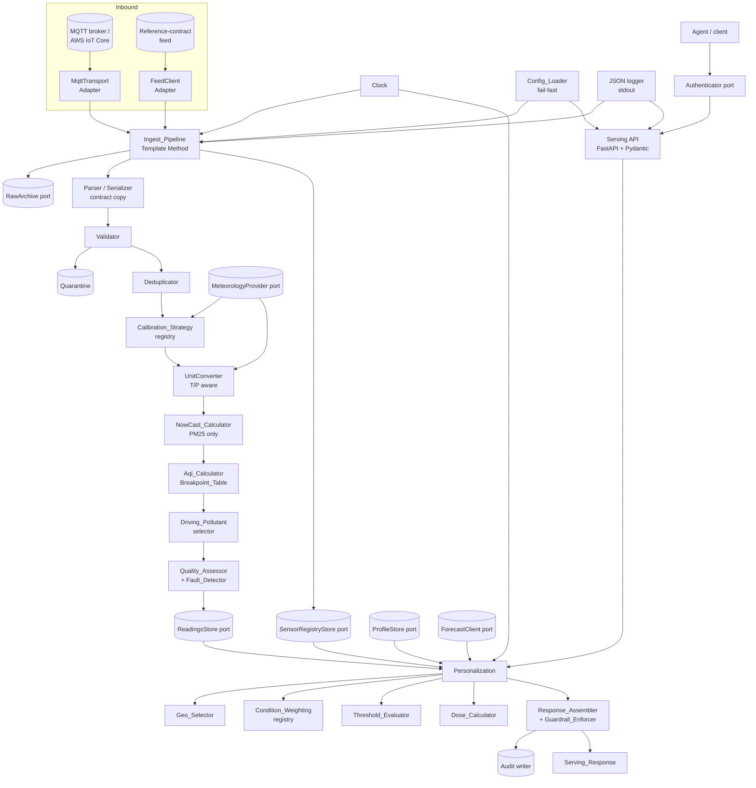
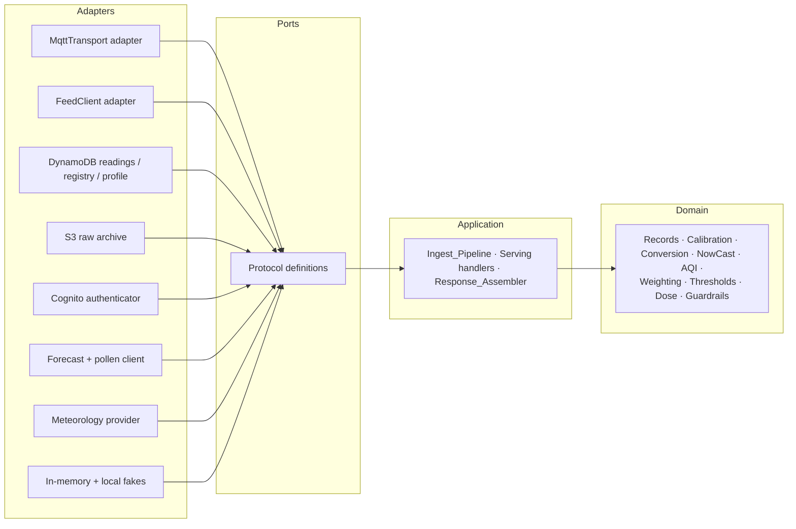
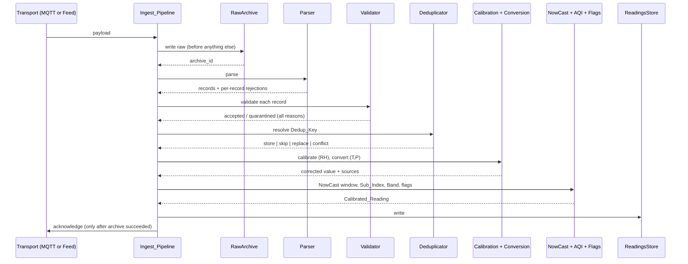
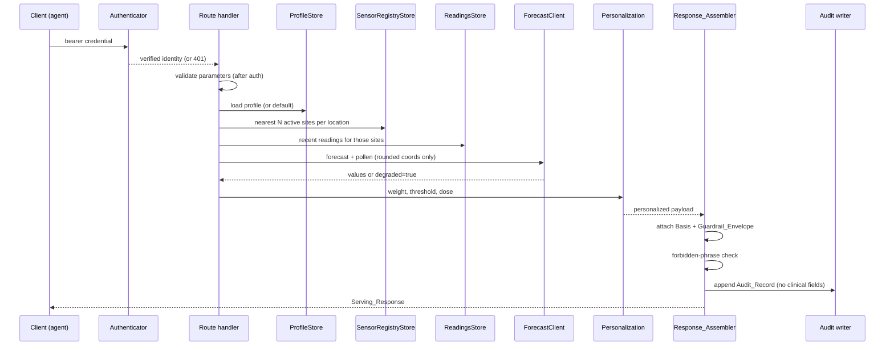

# Design Document

## Overview

The Ingestion & Serving Service (Service 2) turns a stream of raw, uncalibrated low-cost sensor records
into per-user, authenticated, non-diagnostic air-quality guidance data. It sits between the Sensor
Simulator Service (Service 1), whose reference network contract it consumes, and the Bedrock advisor
agent (Service 3), which consumes its serving API as a tool.

Three properties of the problem shape almost every decision in this document:

1. **Correction is not a post-processing step; it is on the critical path.** Uncalibrated optical PM2.5
   carries a mean absolute error around 17.40 µg/m³ — larger than the WHO 24-hour guideline of 15 µg/m³
   — falling to roughly 5.85 µg/m³ under humidity-aware calibration (FINDINGS SQ5). An index computed
   from an uncorrected value is not a slightly worse index, it is a systematically wrong one, biased
   upward exactly when humidity is high. So calibration precedes index computation in a fixed pipeline
   order (Req 8.1), and the correction applied is retained alongside the value it replaced (Req 8.10) so
   the transformation is always auditable.

2. **The unit and averaging mismatches between the contract and the index tables are real defects
   waiting to happen.** The contract carries hourly µg/m³ for both species. The EPA NO2 breakpoints are
   1-hour but expressed in **ppb**, and the PM2.5 breakpoints are µg/m³ but defined over a **24-hour**
   average. Neither can be fed an hourly µg/m³ value directly. The design therefore treats unit
   conversion (Req 9) and NowCast (Req 11) as first-class domain components with their own properties,
   rather than as inline arithmetic. The conversion is parameterized by temperature and pressure because
   the fleet sits near 2,560 m, where the sea-level factor of 1.8804 µg/m³ per ppb becomes 1.4210 — a
   24 percent error in the ppb value, enough to move a reading a whole AQI band.

3. **The guardrails and the auth boundary are structural, not cosmetic.** The response carries
   health-adjacent data, and the framing of that response is what keeps the system in the general-wellness
   lane rather than the regulated-medical-device lane (FINDINGS cycle 6). A disclaimer that an individual
   handler can forget to add is not a guardrail. So the Guardrail_Envelope and the Basis block are applied
   by a single response-assembly stage every data-bearing route passes through (Reqs 25.1, 25.12), and
   authentication resolves before any parameter validation so an unauthenticated request can never
   provoke a 400 that reveals route internals (Req 18.4).

A fourth constraint is organizational rather than technical: **this service keeps its own copy of the
record contract.** Engineering practice §0 forbids importing across service directories until a shared
contract package is specced, so Reqs 1 and 2 restate the nine `/SensorData` and twenty `/ListSensors`
fields independently. The copy is not duplication for its own sake — it makes a drift between the two
services a failing test on this side rather than a silent incompatibility.

### Design decisions

| # | Decision | Rationale |
|---|----------|-----------|
| DD1 | Hexagonal architecture: every I/O boundary is a `Protocol` port with an in-memory or local fake and a cloud adapter | The whole suite must pass with no AWS credentials and no network beyond localhost (Req 28.5); these are exactly the boundaries that get swapped (practice §1, DIP) |
| DD2 | The record contract is an independent Pydantic model set with its own round-trip tests | No cross-service imports (Req 28.3, practice §0); contract validation lives in the model, not handler bodies (practice §0) |
| DD3 | The Ingest_Pipeline is a Template Method with a fixed step order: archive → parse → validate → deduplicate → calibrate → convert → index → flag → store | The order is itself a requirement — archive before validation (Req 6.11), dedup before calibration (Req 7.9), calibration before index (Req 8.1) — so encoding it once in a pipeline prevents a caller from reordering it |
| DD4 | Calibration is a named Strategy resolved from a registry, with `rh_linear` the default and `identity` the NO2 default | Open/Closed: a new correction model is a registry entry, not another branch (Reqs 8.2, 8.12; practice §4) |
| DD5 | Breakpoint tables are versioned data loaded by identifier, never literals in code | A future EPA revision, or the EU EAQI / UK DAQI, becomes a new table; every served value declares the table that produced it (Reqs 10.2, A5) |
| DD6 | NowCast applies to PM2.5 only; NO2 uses its own 1-hour value | The PM2.5 table is a 24-hour average and needs the bridge; the NO2 table is already 1-hour, so applying NowCast to it would corrupt a correct value (Req 11.10) |
| DD7 | Unit conversion takes temperature and pressure as explicit parameters with a declared source | Altitude correctness (Req 9.3); a defaulted conversion caps Confidence at `medium` so an assumption is visible rather than hidden (Req 9.8) |
| DD8 | The readings store is DynamoDB behind a `ReadingsStore` port, not Timestream | AWS closed Timestream for LiveAnalytics to new customers on 2025-06-20, and Timestream for InfluxDB is provisioned rather than scale-to-zero, contradicting D6's rationale; DynamoDB is already needed for registry and profiles, and `SiteCode#Species` + interval start serves the access pattern as one range query (Req 14.9, A3) |
| DD9 | Deduplication resolves conflicts by a rule chosen to be order-independent: ratified beats provisional, then the greater value wins with a `suspect_conflict` flag | An at-least-once transport plus an overlapping poll window means arrival order is not controllable, so the resolution rule must be commutative to be correct (Reqs 7.6, 7.7); the greater value is the conservative choice for a health advisory |
| DD10 | A `Clock` is injected everywhere; no domain component reads the wall clock | Reproducibility of both ingestion and serving (Reqs 27.1–27.3); testability without waiting (practice §2) |
| DD11 | Condition_Weighting is a Strategy registry whose output affects ordering, emphasis, and pollen relevance only — never a value | Weighting a health signal into the number itself would make the AQI non-standard and unreviewable; ordering achieves the personalization without corrupting the scale (Req 21.9) |
| DD12 | The Guardrail_Envelope, the Basis block, and the forbidden-phrase check are applied by one response-assembly stage every data-bearing route passes through | A guardrail an individual handler can omit is not a guardrail (Reqs 25.1, 25.11, 25.12) |
| DD13 | Authentication is an `Authenticator` port resolved before parameter validation | Cognito is a deployment concern, but the security behavior is specified and tested here (Reqs 18.1, 18.4, A6) |
| DD14 | Quality_Flag and Confidence are fields of the stored Calibrated_Reading, not computed at serving time | A value can then never be served without them (Reqs 13.10, 14.11), and the assessment reflects the data available at ingestion |
| DD15 | RH, temperature, and pressure arrive through a `MeteorologyProvider` port with a three-source precedence | The contract carries no meteorology species and Service 1 emits none, so a port is the only correct source; the precedence keeps the service forward-compatible if a feed starts publishing met channels, without changing the contract (Reqs 8.4, 8.5, A10) |
| DD16 | One shared behavioral test suite per port, executed against every adapter of that port | An adapter swap must not be able to change domain behavior (Reqs 14.10, 28.10) |
| DD17 | Structured single-line JSON logging configured once at startup, with a redaction rule applied centrally | Nothing non-JSON on stdout, and no profile field or credential can leak through an ad hoc log call (Reqs 29.1, 29.4; practice §6) |
| DD18 | The index species `NO2Index` and `PM25Index` are stored but structurally excluded from every index computation | They come from an undocumented band table that is not the Breakpoint_Table; letting them near the AQI path would silently mix two scales (Req 1.7) |

### Research grounding

Breakpoints and bands come from the EPA AQS reference table, with the PM2.5 values reflecting the
revision effective 2024-05-06 (Reqs 10.3, 10.4). The escalation point is the **Orange band, AQI 101**,
one band earlier than the public `Unhealthy` threshold, because that is where effects appear for
asthma and COPD populations (FINDINGS SQ1); Sensitivity_Level moves it earlier still, to 76 or 51
(Req 22.2). Condition weighting follows the mechanism evidence: NO2 and O3 are the strongest gaseous
drivers of COPD exacerbation (relative risk 1.04 and 1.03 per 10 µg/m³), while PM2.5 and aeroallergens
dominate allergic asthma and rhinitis, where pollen interacts multiplicatively with traffic pollution
(FINDINGS SQ3, cycle 7) — hence pollen is a *required* enrichment for the allergic conditions rather
than a nice-to-have (Req 21.6). Inhaled dose is included because personal exposure can diverge from the
nearest fixed station by orders of magnitude, and dose is concentration times an activity-adjusted
breathing rate times time (FINDINGS SQ2, Req 23.1). The guardrail set — exposure-reduction framing,
transparency of basis, deference to the clinician's action plan, emergency escalation, confidence
disclosure, no autonomous action, and an audit trail — is taken from FINDINGS cycle 6 as a set of
product requirements (Req 25). The exposure lag structure, gaseous effects at lag0 and particulate
effects peaking around lag3, is why the forecast enrichment exists (FINDINGS SQ3, Req 24); this service
supplies the fused data and leaves the anticipatory phrasing to the agent.

Two research-derived facts are deliberately *not* implemented here. The full six-pollutant WHO set is
unavailable because the contract carries only PM2.5 and NO2, so weighting declares its unavailable
species rather than substituting a proxy (A11, Req 21.4). And threshold *learning* from a symptom log is
deferred, because inferring a health threshold from logged symptoms carries its own evidentiary and
guardrail burden; the design keeps the threshold source pluggable so a learned value can replace a set
one without a contract change (A12, Req 22.6).

## Architecture

### Component context

One domain core, two inbound ingestion paths, one outbound serving path, and nine ports. Nothing in the
domain knows what is behind a port.



### Layering and dependency direction

Dependencies point inward. The domain — records, calibration, conversion, index, NowCast,
personalization, thresholds, dose, guardrails — knows nothing about MQTT, HTTP, DynamoDB, S3, Cognito,
or the wall clock. Those arrive as injected abstractions (DIP, practice §1).



The rule that makes this checkable: no module under `domain/` may import from `adapters/`, and no
domain function may take a configuration object wholesale — it takes the narrow parameter object it
needs (interface segregation, practice §1). The Aqi_Calculator receives a Breakpoint_Table and a
concentration, not the service config.

### Ingest sequence



The acknowledgement is deliberately placed after the archive write rather than after the store write
(Req 4.6, 16.7): archiving is what makes a failure recoverable, so it is the point past which losing
the message is acceptable.

### Serving sequence



### Directory layout

```
data-processing/
├── pyproject.toml               # Python 3.12, every direct dependency pinned exactly (Req 28.2)
├── uv.lock                      # committed (dev-environment steering)
├── Justfile                     # or workspace recipes: test, lint, typecheck, run, up (Req 28.7)
├── docker-compose.yml           # service + MQTT broker + local store emulation (Req 28.8)
├── config/
│   ├── default.toml
│   └── breakpoints/
│       └── epa-2024-05-06.toml  # versioned Breakpoint_Table data (DD5)
├── src/aqm_ingestion/
│   ├── contract/                # independent record copy (DD2)
│   │   ├── records.py           # SensorDataRecord, SensorMetadataRecord
│   │   ├── serializer.py
│   │   └── parser.py
│   ├── domain/                  # pure; imports nothing from adapters/
│   │   ├── readings.py          # RawReading, CalibratedReading, QualityFlag, Confidence
│   │   ├── validation.py
│   │   ├── dedup.py
│   │   ├── calibration/         # Strategy registry (DD4)
│   │   │   ├── registry.py
│   │   │   ├── rh_linear.py
│   │   │   └── identity.py
│   │   ├── units.py             # T/P-aware conversion (DD7)
│   │   ├── aqi/
│   │   │   ├── breakpoints.py   # table loading + validation
│   │   │   ├── sub_index.py
│   │   │   ├── nowcast.py
│   │   │   └── driving.py
│   │   ├── quality.py           # Quality_Assessor + Fault_Detector
│   │   └── personalization/
│   │       ├── geo.py
│   │       ├── weighting/       # Condition_Weighting registry (DD11)
│   │       ├── thresholds.py
│   │       └── dose.py
│   ├── ports/                   # Protocol definitions only (DD1)
│   │   ├── clock.py
│   │   ├── readings_store.py
│   │   ├── registry_store.py
│   │   ├── raw_archive.py
│   │   ├── profile_store.py
│   │   ├── forecast_client.py
│   │   ├── meteorology.py
│   │   ├── mqtt_transport.py
│   │   ├── feed_client.py
│   │   └── authenticator.py
│   ├── adapters/
│   │   ├── memory/              # fakes for the offline suite (Req 28.5)
│   │   ├── dynamodb/
│   │   ├── s3/
│   │   ├── mqtt/
│   │   ├── http_feed/
│   │   ├── forecast/
│   │   └── auth/
│   ├── ingest/
│   │   ├── pipeline.py          # Template Method (DD3)
│   │   ├── mqtt_entry.py
│   │   └── poller_entry.py
│   ├── serving/
│   │   ├── app.py               # FastAPI wiring
│   │   ├── routes/
│   │   ├── models.py            # response Pydantic models
│   │   ├── assembler.py         # Basis + Guardrail_Envelope (DD12)
│   │   └── audit.py
│   ├── config/
│   │   └── loader.py            # fail-fast (Req 26)
│   └── observability/
│       └── logging.py           # configured once, central redaction (DD17)
└── tests/
    ├── unit/
    ├── properties/              # one test per design property, ≥100 examples (Req 28.11)
    ├── contracts/               # shared per-port behavioral suites (DD16)
    └── integration/             # container-fenced checks (Req 28.6)
```

### Deployment topology

Deployment is out of scope for this spec and belongs to a separate `ingestion-and-serving-deployment`
spec. What matters here is that the design does not prejudge it. The intended split — an
invocation-scoped function for ingestion triggered by an IoT rule, a scheduled invocation for the feed
poller, and an invocation-scoped function behind an HTTP API for serving — is possible precisely because
the determinism of Req 27 means no component carries state between invocations: the NowCast window is
read from the ReadingsStore rather than held in memory, the Fault_Detector's state is derived from stored
Readings, and the forecast cache is an optimization whose absence changes only latency. The one component
that would prefer to be resident is the MQTT subscriber, which holds a TLS session; Req 4.5's reconnect
behavior is written for that case, and an IoT-rule-driven invocation simply never exercises it.

## Components and Interfaces

### Clock (time boundary — DIP)

```python
class Clock(Protocol):
    def now(self) -> datetime: ...      # timezone-aware UTC (Req 27.8)
```

`SystemClock` reads the real clock at the process edge; `FixedClock` and `AdvanceableClock` serve tests
and backfill. Every component that needs "now" — validation's future-dating and staleness checks, the
poll window derivation, the freshness window, retention exclusion, `generatedAt` — takes the Clock or
takes the instant as a parameter. No domain module imports `datetime.now` (Req 27.1, practice §2).

### Ports

All nine ports are `Protocol` definitions with no implementation and no cloud types in their signatures
(DD1). The shapes that matter to the domain:

```python
class ReadingsStore(Protocol):
    def put(self, reading: CalibratedReading) -> None: ...
    def put_batch(self, readings: Sequence[CalibratedReading]) -> None: ...
    def get(self, key: DedupKey) -> CalibratedReading | None: ...
    def query_window(self, site_code: str, species: frozenset[str] | None,
                     start: datetime, end: datetime) -> WindowResult: ...   # [start, end)
    def latest_per_species(self, site_codes: Sequence[str],
                           not_before: datetime) -> Mapping[str, Sequence[CalibratedReading]]: ...

class SensorRegistryStore(Protocol):
    def upsert(self, record: SensorMetadataRecord, at: datetime) -> UpsertOutcome: ...
    def get(self, site_code: str) -> RegistryEntry | None: ...
    def list_active(self) -> Sequence[RegistryEntry]: ...
    def nearest(self, lat: float, lon: float, n: int,
                max_km: float | None) -> Sequence[NearestSite]: ...

class RawArchive(Protocol):
    def write(self, payload: bytes, meta: ArchiveMeta) -> str: ...   # returns archive_id
    def read(self, archive_id: str) -> bytes: ...

class ProfileStore(Protocol):
    def get(self, user_id: str) -> UserProfile | None: ...
    def put(self, profile: UserProfile) -> UserProfile: ...
    def delete(self, user_id: str) -> None: ...

class MeteorologyProvider(Protocol):
    def observation(self, site_code: str, at: datetime) -> MetObservation | None: ...

class ForecastClient(Protocol):
    def forecast(self, lat: float, lon: float) -> ForecastResult: ...   # rounded coords only (Req 24.8)
    def pollen(self, lat: float, lon: float) -> PollenResult: ...

class Authenticator(Protocol):
    def verify(self, credential: str) -> VerifiedIdentity: ...   # raises AuthRejected(category)
```

`WindowResult` carries the Readings plus a `truncated` flag, so Req 14.8's "report truncation rather
than silently returning a partial set" is in the type rather than in a convention.

### Parser and Serializer (contract boundary)

The independent contract copy (DD2). The Parser accepts a single object or an array, validates each
record fully, and returns accepted records alongside one rejection per failed record identified by array
index — a sibling failure never discards accepted records (Req 3.5). It never produces a partially
populated record (Req 3.7). Unknown `Species` values are routed to a meteorology channel when the
configured mapping names them, and rejected otherwise (Req 3.6). The Serializer exists for the archive
round-trip and for the round-trip properties, not to re-emit the contract to clients — this service
serves its own response shape, not `/SensorData`.

### Ingest_Pipeline (Template Method)

One fixed sequence with pluggable steps (DD3). The order is load-bearing and encoded once:

```
archive → parse → validate → deduplicate → calibrate → convert → nowcast → sub-index →
driving pollutant → quality/fault flags → store
```

The pipeline is transport-agnostic; `mqtt_entry` and `poller_entry` differ only in how a payload and its
`ArchiveMeta` are obtained, which is what makes Req 5.4's push/pull equivalence and Req 27.7's
identical-final-state property achievable rather than aspirational. Per-message failure isolation lives
here: one record's exception is caught, logged with its `SiteCode`, and the batch continues (Req 4.4).

### Validator

Evaluates every rule and collects **all** violated reasons rather than short-circuiting (Req 6.1), which
is what makes a quarantine record diagnosable. Rules: finiteness and sign, per-species plausibility
ceiling, future-dating against the Clock plus skew tolerance, staleness against the Retention_Window,
interval-boundary alignment, and unit agreement. An unknown `SiteCode` is *not* a validation failure —
the Reading is kept and a warning logged (Req 6.7), because losing data to a lagging registry refresh
would be worse than holding a reading whose coordinates are not yet known.

### Deduplicator

Resolves by Dedup_Key with the order-independent rule of DD9. The resolution is a pure function of the
two candidate records, which is what allows the commutativity property to be stated and tested at all:

| Stored | Incoming | Outcome |
|--------|----------|---------|
| absent | any | store |
| equal fields | equal fields | no write, count duplicate |
| `P` | `R` | replace (ratified supersedes) |
| `R` | `P` | keep stored, warn |
| same status, different value | same status, different value | keep the greater, flag `suspect_conflict`, warn |

### Calibration (Strategy registry)

```python
class CalibrationStrategy(Protocol):
    name: str
    domain: CalibrationDomain
    def correct(self, reported: float, rh_pct: float | None) -> float: ...
```

`rh_linear` implements `max(0, a*reported + b*rh + c)` with defaults `a=0.524`, `b=-0.0862`, `c=5.75`
(Req 8.3). `identity` returns the reported value and is the NO2 default (Req 8.12) and the no-RH fallback
(Req 8.6). Applying a strategy outside its `CalibrationDomain` is permitted but downgrades the
Quality_Flag to `calibrated_extrapolated` (Req 8.7) — refusing to correct would be worse, since the
uncorrected value is the known-biased one.

### UnitConverter

```python
def mass_to_mixing_ratio(ug_m3: float, molar_mass_g_mol: float,
                         temperature_k: float, pressure_pa: float) -> float: ...
```

Implements the ideal-gas relation of Req 9.2 with the molar gas constant 8.314462618 J/(mol·K). Takes
temperature and pressure as parameters, never from ambient configuration — which is what makes the
altitude sensitivity of Req 9.5 and the pinned factors of Req 9.6 testable as properties of a function
rather than of a deployment.

### Aqi_Calculator, NowCast_Calculator, and driving-pollutant selection

`Breakpoint_Table` is loaded from versioned data and validated on load for contiguity, ordering, and unit
agreement (Req 10.11) — a malformed table is a configuration failure, not a runtime surprise.
`sub_index` truncates to the table's reporting precision, locates the band, interpolates linearly, and
rounds half away from zero (Reqs 10.1, 10.6). `NowCast_Calculator` computes the weighted average of
Req 11.3 over the window it is given, returning both the value and the coverage metadata the Basis needs;
it is a pure function of an ordered series, so its bounds and convergence properties are directly
testable. The driving-pollutant selector takes the argmax with a deterministic precedence tie-break
(Req 12.2).

### Quality_Assessor and Fault_Detector

The Quality_Assessor is a pure mapping from (calibration outcome, RH source, conversion source, NowCast
coverage, dedup conflict, fault flags) to a Quality_Flag and a Confidence (Reqs 13.1, 13.2), applying the
caps from Reqs 9.8 and 11.5. Making it a single total function is what guarantees no value is ever stored
or served without both fields (Req 13.10). The Fault_Detector derives stuck, dropout, and drift flags
from stored history rather than in-memory state (Reqs 13.4–13.6), which keeps it correct in an
invocation-scoped runtime.

### Personalization

Four narrow components behind one coordinator, each independently testable:

- **Geo_Selector** — nearest-N active sites per User_Location within the radius, deduplicated across
  locations, deterministically ordered (Req 20).
- **Condition_Weighting** — a Strategy registry keyed by Condition, producing an ordered species list and
  a pollen-relevance flag, restricted to available species and reporting the unavailable ones
  (Reqs 21.2–21.4). It affects ordering only (DD11, Req 21.9).
- **Threshold_Evaluator** — resolves the effective escalation Sub_Index by the precedence of Req 22.1 and
  reports crossings on `>=` (Req 22.3), naming the threshold source.
- **Dose_Calculator** — concentration × breathing rate × duration from the corrected value only,
  returning `None` when activity inputs are absent rather than assuming a level (Reqs 23.1, 23.3).

### Response_Assembler and Guardrail_Enforcer

Every data-bearing route returns through this stage (DD12). It populates the Basis from the identifiers
the pipeline recorded on each Reading, attaches the Guardrail_Envelope, runs the forbidden-phrase check,
and appends the Audit_Record. The forbidden-phrase check failing produces a 500 rather than a
guardrail-violating body (Req 25.11) — the one case in this service where a 500 is the correct answer,
and it is a response-construction fault rather than a bad-input fault, so it does not conflict with
Req 19.8.

### Config_Loader (fail-fast)

Validates every resolved value, writes one single-line JSON message per invalid value, and exits non-zero
without half-starting (Req 26.3, practice §5). Registry-name resolution for all eleven pluggable names is
checked here, so an unknown strategy or adapter name fails at startup rather than on the first record.

### Observability

One central logging configuration emitting single-line JSON to stdout, with the redaction rule applied in
one place so no ad hoc call site can leak a profile field or a credential (DD17, Reqs 29.1, 29.4).
Counters and gauges are exposed through one internal interface that a deployment adapter publishes
(Req 29.10).

## Data Models

### Contract records (independent copy — Reqs 1, 2)

```python
SpeciesName = Literal["NO2", "PM25", "NO2Index", "PM25Index"]         # case-sensitive (Req 1.2)
RatificationStatusName = Literal["P", "R"]
SiteClassificationName = Literal["Roadside", "Urban Background", "Suburban"]
PowerTagName = Literal["Mains", "Solar"]

class SensorDataRecord(BaseModel):        # exactly nine fields (Req 1.1)
    Species: SpeciesName
    Source: Literal["Measurement"]
    Units: str                            # "ug.m-3" for NO2/PM25 (Req 1.6, 1.8)
    SiteCode: str                         # non-empty; no format constraint (Req 1.9)
    DateTime: str                         # ISO-8601 UTC, whole-second, Z (Req 1.3)
    Duration: str                         # "PT1H" by default (Req 1.4)
    ScaledValue: float                    # preserved as received (Req 1.5)
    RatificationStatus: RatificationStatusName
    SensorContract: str

class SensorMetadataRecord(BaseModel):    # exactly twenty fields, declared order (Req 2.1)
    SiteCode: str
    SiteName: str
    DeviceCode: str
    InstallationCode: str | None
    Facility: str | None
    Location: GeoLocation                 # Feature/Point; coordinates == [Latitude, Longitude] (Req 2.3)
    Latitude: str                         # signed decimal, exactly 7 dp (Req 2.2)
    Longitude: str                        # signed decimal, exactly 7 dp (Req 2.2)
    Borough: str
    SiteClassification: SiteClassificationName
    SensorHeightAboveGround: float
    DistanceToKerb: float
    SponsorName: str
    SiteLocationType: str | None
    StartDate: str
    EndDate: str | None                   # null == active (Req 2.6)
    PowerTag: PowerTagName
    SiteDescription: str | None
    SitePhotoURL: str | None
    SensorContract: str
```

Field names, order, and types are identical to Service 1's copy by construction; the round-trip
properties and a golden-payload test are what keep them identical over time (Req 3.4).

### Internal reading models (not part of any contract)

```python
class QualityFlag(StrEnum):
    calibrated = "calibrated"
    calibrated_extrapolated = "calibrated_extrapolated"
    uncalibrated = "uncalibrated"
    suspect_fault = "suspect_fault"
    suspect_conflict = "suspect_conflict"

class Confidence(StrEnum):
    high = "high"
    medium = "medium"
    low = "low"

@dataclass(frozen=True)
class DedupKey:                     # Req 7.1
    site_code: str
    species: str
    interval_start: datetime
    duration: str

@dataclass(frozen=True)
class RawReading:
    key: DedupKey
    reported_value: float
    units: str
    ratification_status: str
    sensor_contract: str
    ingested_at: datetime
    transport: Literal["mqtt", "feed"]
    archive_id: str                 # Req 16.2

@dataclass(frozen=True)
class CalibratedReading:
    key: DedupKey
    reported_value: float           # retained for audit (Req 8.10)
    corrected_value: float
    units: str
    mixing_ratio_ppb: float | None  # populated for NO2 (Req 9.1)
    sub_index: int | None
    band: str | None
    method: Literal["nowcast", "hourly"] | None       # Req 12.7
    quality_flag: QualityFlag
    confidence: Confidence
    calibration_strategy: str                         # Req 8.11
    humidity_source: Literal["channel", "provider", "none"]
    conversion_source: Literal["channel", "provider", "default"] | None
    conversion_temperature_k: float | None            # Req 9.7
    conversion_pressure_pa: float | None
    nowcast_window_hours: int | None                  # Req 11.9
    nowcast_hours_available: int | None
    nowcast_weight_factor: float | None
    breakpoint_table: str                             # Req 10.2
    ratification_status: str
    ingested_at: datetime
    archive_id: str
```

A `CalibratedReading` is never serialized as a `/SensorData` record — it is not part of the contract, and
conflating the two is what DD18 and Req 1.7 exist to prevent.

### Quarantine and archive models

```python
@dataclass(frozen=True)
class QuarantinedRecord:            # Req 6.8
    raw_record: Mapping[str, object]        # as received
    reasons: tuple[RejectionReason, ...]    # every violated rule (Req 6.1)
    ingested_at: datetime
    transport: str
    archive_id: str

@dataclass(frozen=True)
class ArchiveMeta:                  # Req 16.2
    ingested_at: datetime
    transport: str
    source: str                     # topic or request window
    archive_id: str                 # derived from injected inputs (Req 27.6)
```

### DynamoDB key design (default adapter — Req 14.9)

| Table | Partition key | Sort key | Serves |
|-------|---------------|----------|--------|
| readings | `SITE#{SiteCode}#SP#{Species}` | `{interval_start ISO-8601}` | Dedup_Key get, site-species window query (Req 14.3), latest-per-species (Req 14.4) |
| registry | `SITE#{SiteCode}` | — | `SiteCode` lookup, active listing (Req 15.3) |
| profiles | `USER#{user_id}` | — | profile get/put/delete (Req 17.11) |
| quarantine | `QUAR#{yyyy-MM-dd}` | `{ingested_at}#{archive_id}` | time-ranged diagnosis, TTL expiry (Req 6.8) |
| audit | `AUDIT#{user_id}` | `{served_at}#{route}` | per-user audit trail, TTL expiry (Req 25.9) |

The Dedup_Key maps exactly onto one item, so Req 7's resolution is a conditional write rather than a
read-modify-write race. Nearest-N is served by loading the active registry (bounded by Req 19.11's
500-site sizing) and computing distances in the domain, rather than by a geospatial index — a deliberate
simplicity choice at this scale, and one confined to the adapter, so a geohash index can replace it
without touching the Geo_Selector.

### Profile and personalization models

```python
class Condition(StrEnum):
    asthma = "asthma"; copd = "copd"; allergic_rhinitis = "allergic_rhinitis"
    asthma_copd_overlap = "asthma_copd_overlap"; none_declared = "none_declared"

class SensitivityLevel(StrEnum):
    standard = "standard"; elevated = "elevated"; high = "high"

class ActivityLevel(StrEnum):
    rest = "rest"; light = "light"; moderate = "moderate"; vigorous = "vigorous"

@dataclass(frozen=True)
class UserLocation:                 # Req 17.5
    name: Literal["home", "work", "commute"]
    lat: float                      # rounded to 3 dp
    lon: float

@dataclass(frozen=True)
class PersonalThreshold:            # Req 22.4
    species: str
    sub_index: int | None
    concentration: float | None
    units: str | None

@dataclass(frozen=True)
class UserProfile:                  # exactly these fields (Req 17.2)
    user_id: str
    condition: Condition
    sensitivity: SensitivityLevel
    thresholds: tuple[PersonalThreshold, ...]
    locations: tuple[UserLocation, ...]        # ≤ 5 (Req 17.6)
    activity_level: ActivityLevel | None       # Req 23.2
    activity_duration_h: float | None
    consent: ConsentRecord
    created_at: datetime
    updated_at: datetime
```

The model is an allowlist: anything outside it is a rejected write naming the offending field (Req 17.4).
That is the mechanism behind data minimization — not a policy document but a type that cannot hold a
clinical narrative.

### Serving response models

Pydantic models mirroring the pinned shape of Req 19.2, one model per nested member so that a missing
member is a validation error at construction rather than a missing key at the client. `null` is emitted
for an unavailable member; keys are never dropped (Req 19.12).

```python
class Basis(BaseModel):                        # Req 25.5
    breakpointTable: str
    calibrationStrategies: dict[str, str]
    humiditySource: str
    conversionSource: str | None
    nowcast: NowcastBasis | None
    records: list[RecordRef]

class GuardrailEnvelope(BaseModel):            # Req 25.1
    advisoryScope: Literal["exposure-reduction"]
    emergencyGuidance: str
    disclaimer: str
```

### Audit record

```python
@dataclass(frozen=True)
class AuditRecord:                  # Req 25.7, constrained by Req 25.8
    user_id: str
    served_at: datetime
    route: str
    breakpoint_table: str
    calibration_strategies: Mapping[str, str]
    threshold_crossed: bool
    records: tuple[RecordRef, ...]
    # deliberately absent: condition, sensitivity, threshold values,
    # location coordinates, forecast and pollen values (Req 25.8)
```

The absence list is part of the model's documentation because the audit trail's value depends on it *not*
becoming a second copy of the health-adjacent data it exists to oversee.

## Correctness Properties

*A property is a characteristic or behavior that should hold true across all valid executions of a
system — essentially, a formal statement about what the system should do. Properties serve as the
bridge between human-readable specifications and machine-verifiable correctness guarantees.*

The forty properties below are derived from the acceptance criteria and reduced for redundancy. The
determinism facets fold into three properties — one for ingestion, one for serving, one for push/pull
equivalence — rather than one per component. The per-rule quarantine clauses fold into one completeness
property while the store-exclusion consequence stays separate. The AQI family splits by what it
quantifies over: monotonicity over concentrations, exactness over breakpoints, and argmax over species.
Each property is implemented by a single property-based test running at least 100 examples (Req 28.11).

### Property 1: Measurement record round-trip

*For all* Sensor_Data_Record values whose `Species` is one of the four permitted values, parsing the
Serializer output produces a record whose every field equals the original, including null-valued fields,
with `ScaledValue` preserved exactly as received.

**Validates: Requirements 3.4, 1.1, 1.3, 1.5**

### Property 2: Metadata record round-trip

*For all* Sensor_Metadata_Record values covering both `PowerTag` values, all three
Site_Classification values, and both a null and a non-null `EndDate`, parsing the Serializer output
produces a record whose every field equals the original, with `Latitude` and `Longitude`
character-identical at 7 decimal places and character-identical to the `Location.coordinates` entries.

**Validates: Requirements 3.4, 2.1, 2.2, 2.3**

### Property 3: Parser rejection is total and reasoned

*For all* record objects that omit a required field, add a field outside the contract, carry a field of
the wrong JSON type, or carry a `Species` or `RatificationStatus` outside its permitted set, the Parser
raises a rejection naming the offending field and the violated condition, and produces no record value —
never a partially populated one.

**Validates: Requirements 3.3, 3.7**

### Property 4: Batch partial acceptance preserves accepted records

*For all* arrays mixing conforming and non-conforming records, the Parser returns exactly the
conforming records in their original relative order together with exactly one rejection per
non-conforming record identified by its array index, and discards no conforming record because a
sibling failed.

**Validates: Requirements 3.5, 3.1**

### Property 5: Raw archive precedes processing and round-trips

*For all* ingested payloads, including those every validation rule rejects, an archive entry exists
whose bytes read back identical to those received, and whose archive identifier is recorded on every
Raw_Reading, Calibrated_Reading, and QuarantinedRecord derived from that payload.

**Validates: Requirements 16.1, 16.4, 16.2, 6.11**

### Property 6: Quarantined records are fully reasoned and never stored

*For all* Sensor_Data_Record values violating one or more validation rules, the Service produces one
rejection reason per violated rule rather than only the first, writes no Reading to the ReadingsStore for
that record, and includes it in no Serving_Response.

**Validates: Requirements 6.1, 6.2, 6.3, 6.4, 6.5, 6.6, 6.10**

### Property 7: Ingestion is idempotent

*For all* Sensor_Data_Record values and all repeat counts of two or more, ingesting the record that many
times leaves the ReadingsStore in the state produced by ingesting it once, and leaves the count of stored
Readings equal to the count after the first ingestion.

**Validates: Requirements 7.8, 7.3**

### Property 8: Deduplication is order-independent

*For all* sets of Sensor_Data_Record values sharing one Dedup_Key and all permutations of their
ingestion order, the final stored Reading is identical across permutations in every field, including its
Quality_Flag.

**Validates: Requirements 7.7, 7.6**

### Property 9: Deduplication resolution follows the stated precedence

*For all* pairs of records sharing a Dedup_Key, the stored outcome is: the incoming record when the
stored one is provisional and the incoming is ratified; the stored record when the stored one is ratified
and the incoming is provisional; and the greater `ScaledValue` with a `suspect_conflict` Quality_Flag when
the statuses are equal and the values differ.

**Validates: Requirements 7.4, 7.5, 7.6**

### Property 10: Calibration humidity monotonicity

*For all* pairs of RH values within 0 to 100 percent where the first is less than or equal to the second,
the `rh_linear` strategy applied to one identical reported concentration produces a corrected value for
the first that is greater than or equal to the corrected value for the second.

**Validates: Requirements 8.8**

### Property 11: Corrected values are finite and non-negative

*For all* reported concentrations and all RH values, including those outside the Calibration_Domain,
every Calibration_Strategy in the registry produces a finite corrected value greater than or equal to 0,
and the reported value remains retrievable alongside it.

**Validates: Requirements 8.9, 8.3, 8.10**

### Property 12: Out-of-domain calibration is flagged, not refused

*For all* inputs whose reported concentration or resolved RH lies outside the selected strategy's
Calibration_Domain, the strategy is still applied and the resulting Quality_Flag is
`calibrated_extrapolated`; and for all inputs with no RH available, the fallback strategy is applied and
the Quality_Flag is `uncalibrated` with Confidence `low`.

**Validates: Requirements 8.7, 8.6, 13.1**

### Property 13: Unit conversion round-trip

*For all* Mixing_Ratio values and all temperature and pressure pairs within physical bounds, converting
to Mass_Concentration and back returns the original value within a relative tolerance of 1e-9.

**Validates: Requirements 9.4**

### Property 14: Conversion factor responds correctly to temperature and pressure

*For all* pairs of pressures at one temperature, the conversion factor is strictly increasing in
pressure; and for all pairs of absolute temperatures at one pressure, it is strictly decreasing in
temperature.

**Validates: Requirements 9.5**

### Property 15: Conversion factor is pinned at reference conditions

*For all* evaluations, the NO2 conversion factor equals 1.8804 µg/m³ per ppb at 25 °C and 101,325 Pa and
1.4210 µg/m³ per ppb at 15 °C and 74,000 Pa, each within a relative tolerance of 1e-4.

**Validates: Requirements 9.6, 9.2**

### Property 16: Sub-index monotonicity

*For all* pairs of concentrations for one species where the first is less than or equal to the second,
the Sub_Index computed for the first is less than or equal to the Sub_Index computed for the second.

**Validates: Requirements 10.7**

### Property 17: Breakpoint boundary exactness

*For all* bands of a Breakpoint_Table, the Sub_Index at the band's lower breakpoint equals the band's
lower index value exactly, and the Sub_Index at its upper breakpoint equals the band's upper index value
exactly.

**Validates: Requirements 10.8, 10.1, 10.6**

### Property 18: Sub-index and band agree, and the ceiling holds

*For all* concentrations, the reported Band is the band the Sub_Index falls in under the mapping of
Requirement 10 criterion 5; and for all concentrations above the table's highest breakpoint, the
Sub_Index is capped at the configured ceiling and the Band is `Hazardous`.

**Validates: Requirements 10.5, 10.9**

### Property 19: Overall AQI is the maximum and the driving pollutant is its argmax

*For all* sets of available Sub_Index values at one site and instant, the Overall_AQI is greater than or
equal to every one of them and equal to at least one; the Driving_Pollutant is a species whose Sub_Index
equals the Overall_AQI; and where two or more tie, it is the one first in the configured species
precedence.

**Validates: Requirements 12.1, 12.2, 12.3**

### Property 20: Index species never influence a computed index

*For all* ingestion sequences containing `NO2Index` and `PM25Index` records with arbitrary values, every
Sub_Index, Overall_AQI, Band, and Threshold_Crossing the Service computes is identical to what it
computes from the same sequence with those records removed.

**Validates: Requirements 1.7, 12.1**

### Property 21: NowCast is bounded by its window

*For all* NowCast_Window series with at least two of the three most recent hours available, the NowCast
is greater than or equal to the minimum and less than or equal to the maximum of the available corrected
values in that window.

**Validates: Requirements 11.6, 11.3**

### Property 22: NowCast preserves a constant series

*For all* NowCast_Window series in which every available value is one identical value, the NowCast equals
that value.

**Validates: Requirements 11.7, 11.4**

### Property 23: NowCast weights recency and is deterministic

*For all* NowCast_Window series, the weight applied to the most recent available hour is greater than or
equal to the weight applied to any older available hour, the weight factor lies within 0.5 to 1.0
inclusive, and re-evaluating the same ordered series yields the same NowCast.

**Validates: Requirements 11.8, 11.4, 11.11**

### Property 24: Insufficient NowCast coverage falls back and downgrades confidence

*For all* NowCast_Window series with fewer than two of the three most recent hours available, the Service
reports no NowCast, computes the Sub_Index from the Reading's own corrected hourly value, caps the
Confidence at `low`, and records the fallback in the Basis.

**Validates: Requirements 11.5, 13.2**

### Property 25: Readings store round-trip

*For all* Calibrated_Reading values written through any ReadingsStore adapter, a query whose window
contains the Reading's interval start returns a Reading equal to the written one in every field.

**Validates: Requirements 14.5, 14.2**

### Property 26: Window query completeness and half-open exclusivity

*For all* sets of stored Readings and all query windows, the result contains every stored Reading whose
interval start lies within the half-open window from the start instant inclusive to the end instant
exclusive, and no Reading whose interval start lies outside it, ordered by ascending interval start.

**Validates: Requirements 14.6, 14.3**

### Property 27: Retention window excludes aged readings

*For all* stored Readings and all Clock instants, a query returns no Reading whose interval start is
older than the Retention_Window measured from that instant, and a truncated result reports its
truncation.

**Validates: Requirements 14.7, 14.8**

### Property 28: Nearest-N ordering and radius inclusion

*For all* registries and all query points, the nearest-N result has non-decreasing distances, contains no
inactive site, contains no site whose distance exceeds the supplied radius, includes a site whose
distance equals the radius, holds at most N entries, and breaks distance ties by ascending `SiteCode`.

**Validates: Requirements 15.5, 15.6, 15.7, 15.8, 20.2**

### Property 29: Great-circle distance is symmetric and zero on identity

*For all* pairs of positions, the computed distance is non-negative, equals the distance computed with
the arguments exchanged, and is 0 for a position against itself.

**Validates: Requirements 15.4, 20.10**

### Property 30: Every served value carries a quality flag and a confidence

*For all* Serving_Response documents containing any concentration, Sub_Index, or dose value, every such
value is accompanied by a Quality_Flag and a Confidence, and no declared response member is absent —
an unavailable member is `null` rather than dropped.

**Validates: Requirements 13.10, 14.11, 19.12**

### Property 31: Confidence derivation is deterministic and respects its caps

*For all* combinations of calibration outcome, RH source, conversion source, NowCast coverage, dedup
conflict, and fault state, the derived Confidence is the same on every evaluation, is `low` whenever the
Quality_Flag is `uncalibrated`, `suspect_fault`, or `suspect_conflict`, and is at most `medium` whenever
the conversion used defaulted temperature and pressure.

**Validates: Requirements 13.2, 13.12, 9.8**

### Property 32: Weighting orders the response without altering any value

*For all* Conditions and all sets of available species, the Weighted_Focus is the weighting's ordered
species restricted to the available ones in the weighting's order, every named-but-unavailable species
appears in `unavailableWeightedSpecies`, the site measurements are ordered by that focus, and every
corrected value, Sub_Index, Band, and Overall_AQI is identical to what the same inputs produce under any
other Condition.

**Validates: Requirements 21.3, 21.4, 21.7, 21.9**

### Property 33: Threshold crossing holds exactly on greater-or-equal

*For all* Sub_Index and effective-threshold pairs, a Threshold_Crossing is reported if and only if the
Sub_Index is greater than or equal to the threshold, and the reported `thresholdSource` names the
precedence level the threshold came from.

**Validates: Requirements 22.3, 22.7, 22.6, 22.1**

### Property 34: Inhaled dose scales correctly and vanishes at zero duration

*For all* concentrations, breathing rates, and durations, the Inhaled_Dose is non-negative, is 0 when the
duration is 0, and is strictly increasing in each of the three factors while the other two are held
positive and constant; and it is `null` whenever the profile supplies no activity inputs.

**Validates: Requirements 23.5, 23.1, 23.3**

### Property 35: The guardrail envelope is always present

*For all* successful responses from every data-bearing route, including the history route, the body
carries a non-empty `disclaimer`, an `advisoryScope` of exactly `exposure-reduction`, and a non-empty
`emergencyGuidance`.

**Validates: Requirements 25.1, 25.12, 25.2, 25.3**

### Property 36: The basis is always populated

*For all* successful responses carrying any Sub_Index, the `basis` member names the Breakpoint_Table
identifier, the Calibration_Strategy per species, the RH source, the conversion source where one applied,
the NowCast window and coverage where one applied, and one record reference per contributing Reading.

**Validates: Requirements 25.5, 10.2, 8.11, 9.7, 11.9**

### Property 37: No forbidden phrasing in responses and no sensitive data in logs

*For all* successful responses, the serialized body matches none of the configured forbidden-phrase
patterns; and for all operations, no emitted log line contains a User_Profile field value, a bearer
credential, a resolved secret, or an Authenticator claim beyond the user identity.

**Validates: Requirements 25.4, 25.11, 29.4, 17.9, 18.7**

### Property 38: Serving responses are deterministic

*For all* fixed combinations of stored Readings, User_Profile, forecast values, configuration, and Clock
instant, two independent evaluations of a route produce byte-identical response bodies.

**Validates: Requirements 27.2, 27.4**

### Property 39: Push and pull ingestion converge on the same state

*For all* sequences of Sensor_Data_Record values, ingesting the sequence entirely through the push path
and ingesting the byte-identical records entirely through the pull path, under the same configuration,
Clock instant, and RH input, produce identical final ReadingsStore state and identical
Calibrated_Reading values.

**Validates: Requirements 27.7, 5.4, 27.3**

### Property 40: Authentication precedes validation and leaks nothing

*For all* requests to a data-bearing route, an absent, malformed, or unverifiable credential yields 401
regardless of whether the query parameters are also invalid, a credential scoped to a different user
yields 403, and in both cases the body contains no Reading value, no profile value, and no site
metadata.

**Validates: Requirements 18.2, 18.3, 18.4, 18.5, 18.9**

## Error Handling

Errors are caught at the boundaries — the MQTT message loop, the poll entry point, the FastAPI handlers,
and the CLI/config entry point — and never surface as a raw stack trace to a client (practice §5).
Expected exception types are caught specifically (`ValueError`, `ValidationError`, `OSError`, and the
service's own `AuthRejected`, `ParseRejected`, `StoreUnavailable`), with broad catches reserved for the
true top-level loops, where they are logged with `logger.exception(...)`. Every handled error is still
logged; silent failure is not acceptable (practice §6, Req 29.8).

### Configuration errors (fail-fast, before anything starts)

The Config_Loader validates every resolved value before a listener opens, a subscription is created, or a
store call is issued. It does not stop at the first failure: it completes validation of all values, writes
one single-line JSON message per invalid value naming the value and the constraint it violated, exits
non-zero, and never half-starts (DD3 of the practice set; Req 26.3).

| Failure | Handling | Requirement |
|---------|----------|-------------|
| Unrecognized configuration key | reject naming the key, list recognized keys in its category | 26.4 |
| Unknown Breakpoint_Table, Calibration_Strategy, Condition_Weighting, or adapter name | reject naming the supplied value and the registered names | 26.5, 8.2 |
| Malformed Breakpoint_Table: overlapping bands, gap, non-increasing sequence, unit mismatch | reject naming the offending band and the violated constraint | 10.11 |
| Non-finite calibration coefficient, or domain minimum ≥ maximum | reject naming the offending value | 8.13 |
| Non-positive duration for retention, NowCast window, freshness, history span, quarantine or audit retention | reject naming the value | 26.6 |
| Retention_Window shorter than the maximum history span | reject naming both values | 26.6 |
| Bound pair with minimum ≥ maximum, or non-positive count, radius, or limit | reject naming the pair or value | 26.7 |
| Unresolvable feed, store, or forecast credential for an enabled interface | one message per unresolved value, naming the configuration value and never the secret | 26.8, 24.10, 5.2 |
| Unreadable or unparseable configuration file | name the path and failure kind, exit non-zero, no fallback to defaults | 26.9 |
| No interface enabled | reject, naming the three interface switches | 26.10 |
| Unrecognized log level | reject naming the supplied value and the permitted values | 29.9 |
| Unrecognized consent version on a profile write | 400 at the API rather than a startup failure | 17.7 |

### Ingestion errors (archive first, isolate, log, continue)

- **RawArchive write failure** is the one failure that stops ingestion of that payload: the push path does
  not acknowledge the message and the pull path fails the invocation, both logging one `error` naming the
  failure kind, so a payload is never processed without being recoverable (Reqs 16.7, 4.6).
- **Parse rejection** produces no record and is logged with the failure kind and, for a batch, the array
  index of each rejected element; accepted siblings still proceed (Reqs 3.3, 3.5).
- **Validation failure** quarantines the record with every violated reason, emits one `warning` per record
  naming `SiteCode`, `Species`, interval start, and the reason categories, and increments the per-reason
  counter (Reqs 6.8, 6.9).
- **Per-message processing failure** is caught per message, logged at `error` with the topic, the extracted
  site identifier, and the error type; the subscription survives and the next message proceeds (Req 4.4).
- **Broker connection loss** is retried with exponential backoff from 1 second doubling to the configured
  maximum, indefinitely, each attempt logged at `warning` with the attempt count (Req 4.5).
- **Feed failure** — transport error, non-success status, or wholesale-rejected body — logs one `error`,
  leaves the ingestion high-water mark unchanged so the next invocation retries the same window, and exits
  non-zero without partially advancing state (Req 5.6).
- **Dedup conflict** retains the conservative value, flags `suspect_conflict`, and logs one `warning`
  naming the Dedup_Key and both values (Req 7.6).
- **Unavailable conversion inputs** — a non-positive resolved temperature or pressure — produce no NO2
  Sub_Index for that Reading and log one `error` naming the offending value; the Reading is still stored
  with its corrected concentration (Req 9.9).
- **Unknown `SiteCode`** is not an error: the Reading is stored and one `warning` is logged, and the site
  is excluded from geographic results until its metadata arrives (Req 6.7).

### Serving request errors (authenticate, then validate, never 500 on input)

The FastAPI layer resolves the credential first, then validates parameters, so an unauthenticated request
carrying a bad parameter receives 401 rather than 400 (Req 18.4). Every documented failure returns its
documented status with a JSON body naming the offending parameter or the rejection category. Bad input
never produces a 500 (Req 19.8, practice §5).

| Failure | Status | Requirement |
|---------|--------|-------------|
| Absent, non-bearer, or empty `Authorization` header | 401 | 18.2 |
| Unverifiable, expired, or wrong-audience credential | 401 (category only) | 18.3 |
| Verified identity requesting another identity's resource | 403 | 18.5 |
| `startTime` later than `endTime`; either unparseable; one supplied without the other | 400 | 19.6 |
| `species` outside the permitted set | 400 (lists permitted values) | 19.6 |
| History span exceeding the maximum | 400 (names span and maximum) | 19.9 |
| Unknown `siteCode` | 404 | 19.7 |
| Profile write with a field outside the allowlist, too many locations, absent or unrecognized consent, out-of-range threshold, or out-of-range activity duration | 400 (names the offending field) | 17.4, 17.6, 17.7, 22.4, 23.6 |
| Per-identity rate limit exceeded | 429 (names limit and retry interval) | 18.11 |
| Response body would match a forbidden-phrase pattern | 500, logged at `error`, body withheld | 25.11 |

The last row is the sole case where this service answers 500 by design. It is a response-construction
fault rather than a bad-input fault, so it does not contradict Req 19.8: emitting no body is strictly
better than emitting one that breaches the non-diagnostic boundary.

### Degradation rather than failure

Two dependencies are explicitly allowed to be absent, because failing the request would remove more value
than the missing data does:

- **ForecastClient failure or timeout** serves the response with no forecast values, `degraded` set to
  true, and one `warning` logged; the request succeeds (Req 24.4).
- **Absent User_Profile** serves the response from the configured default profile with
  `usedDefaultProfile` declared true; the request succeeds (Req 17.12).

By contrast, an unavailable ReadingsStore or ProfileStore is not degradable — those are 503-class
failures logged at `error`, since a response built without them would be silently wrong rather than
visibly partial.

## Testing Strategy

Property-based testing suits this service: the core is pure, input-driven numeric and contract logic —
parsing, dedup resolution, calibration, unit conversion, NowCast, sub-index interpolation, weighting,
thresholds, dose — with universal properties over large input spaces. TDD applies throughout: a failing
test first, then the smallest clean change to pass it (practice §3). The suite must pass with no AWS
credentials and no network access beyond localhost (Req 28.5).

### Dual approach

- **Property tests** (`hypothesis`, `tests/properties/`) verify the forty properties above.
- **Unit / example tests** (`pytest`, `tests/unit/`) pin concrete behaviors, boundaries, and error
  conditions: every Config_Loader fail-fast case, each documented HTTP status with its body content, the
  EPA breakpoint boundary values as literal examples, the fault-detector thresholds, the log redaction
  cases, and the registry name enumerations.
- **Port contract tests** (`tests/contracts/`) are one shared behavioral suite per port, parameterized over
  every adapter of that port — in-memory and DynamoDB for readings, registry, and profiles; in-memory and
  S3 for the archive; fake and HTTP for the feed and forecast clients (DD16, Reqs 14.10, 28.10). This is
  what makes the adapter swap safe: the same assertions run against both sides.
- **Integration tests** (`tests/integration/`) cover the boundaries property tests do not fit: broker
  connect-subscribe-ingest against a local MQTT broker, the DynamoDB and S3 adapters against local
  emulation, and the Compose stack smoke check.

Both layers are necessary and complementary: property tests find general correctness violations across
inputs; example tests pin exact status codes, messages, and literal EPA values that a property would
happily satisfy with a wrong-but-consistent table.

### Property test configuration

- Library: `hypothesis` for Python, not hand-rolled generation.
- Each of the forty properties is implemented by a **single** property-based test running a **minimum of
  100 examples** (Req 28.11).
- Each property test carries a comment referencing its design property in the form
  **Feature: ingestion-and-serving-service, Property {number}: {property text}**.
- Generators are shared fixtures: canonical `SensorDataRecord` and `SensorMetadataRecord` builders across
  all four species and both ratification statuses; concentration and RH pairs spanning and exceeding the
  Calibration_Domain; temperature and pressure pairs spanning sea level to 2,560 m; hourly series with
  configurable gaps for the NowCast window; registries with configurable site spreads; User_Profile
  builders across every Condition, Sensitivity_Level, and activity level; and Dedup_Key collision sets with
  permuted arrival order. The Clock is an injected fake so no test waits on real time, and every port is a
  fake so no test touches a network.
- The property families the requirements name explicitly map as: contract round-trip → Properties 1, 2;
  idempotency → Property 7; humidity monotonicity → Property 10; index monotonicity → Property 16;
  determinism → Properties 38, 39; guardrail invariants → Properties 35, 36, 37.

### Numeric verification anchored on published values

Three numeric areas are verified against externally published values as literal example tests, not only
as properties, because a self-consistent implementation of the wrong table would pass every property:

- **Breakpoints**: each PM2.5 and NO2 band boundary from Req 10.3 and 10.4 asserted as an exact
  concentration-to-Sub_Index pair, including both ends of every band.
- **Conversion factors**: 1.8804 µg/m³ per ppb at 25 °C and 101,325 Pa, and 1.4210 at 15 °C and 74,000 Pa
  (Req 9.6).
- **Escalation points**: 101, 76, and 51 for `standard`, `elevated`, and `high` (Req 22.2), with the
  Orange_Band lower bound of 101 asserted as the default.

### Offline guarantee and the fenced exceptions

The default suite runs entirely in-process against in-memory adapters, with no AWS credentials and no
network beyond localhost (Req 28.5). Checks that need a container engine — the local MQTT broker, the
DynamoDB and S3 local emulation, and the Compose smoke check — are marked so the offline suite excludes
them and a separate command runs them, and they depend on a container engine and localhost networking only,
never on a cloud account (Req 28.6). Having `awscli2` and the CDK toolkit on the PATH must not make any
test depend on cloud access.

### Command surface

Every command named here is a `just` recipe so a contributor and a pipeline invoke the same code path
(Req 28.7, dev-environment steering): `just test` for the offline suite, `just test-integration` for the
container-fenced checks, `just lint`, `just typecheck`, `just run` for the local service, and `just up` for
the Compose stack.

### Coverage expectation

Every new function, route, and class ships with its normal case, edge cases, and error cases before it
counts as done (practice §3). Property tests carry broad input coverage, so unit tests stay focused on
specific examples, integration points, and error conditions rather than duplicating the property space.
The full offline suite runs from one documented command and exits 0 only if every test passes (Req 28.4).
