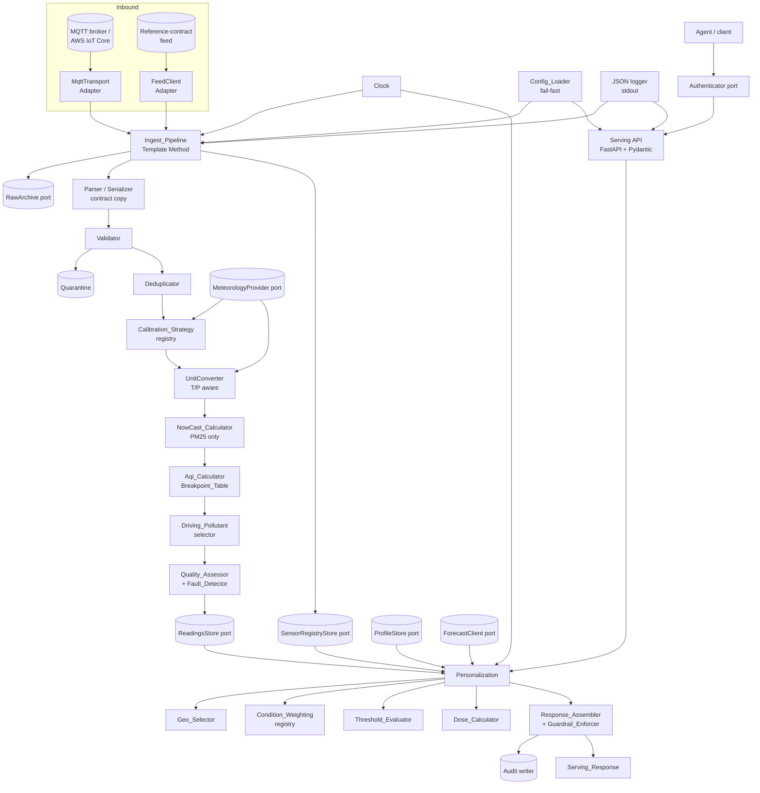
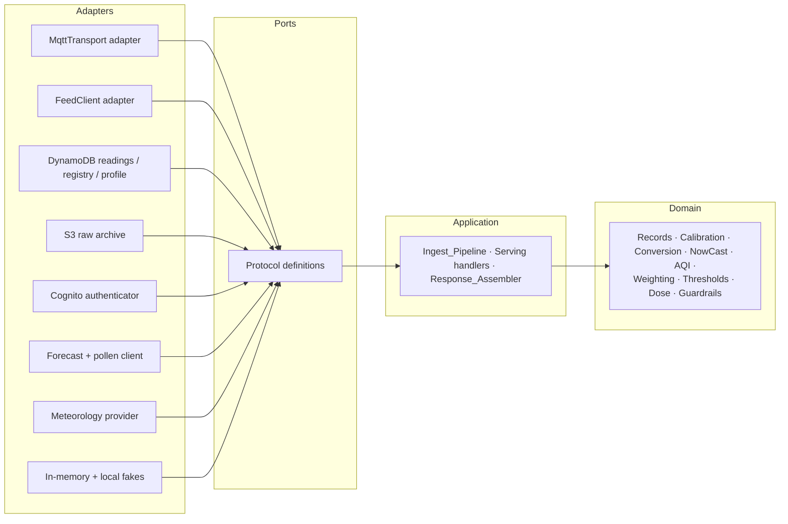
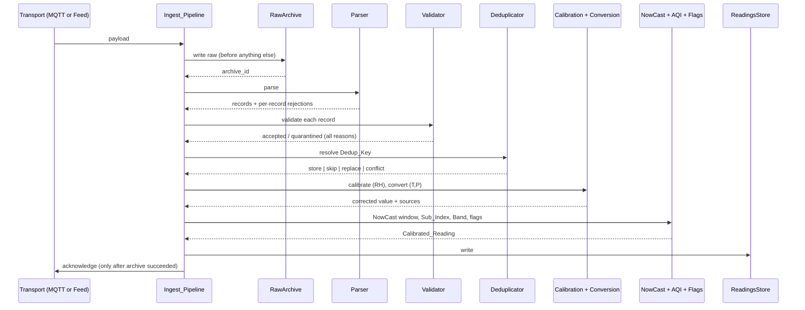
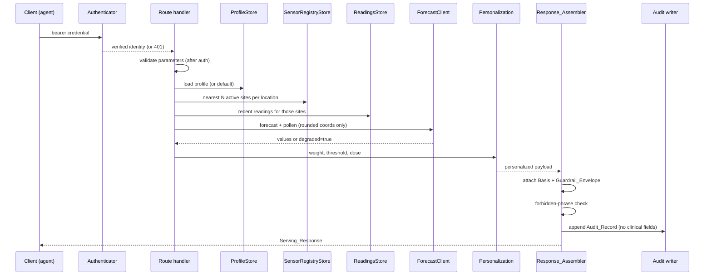

# Design Document

## Overview

The Ingestion & Serving Service (Service 2) turns a stream of raw, uncalibrated low-cost sensor records
into per-user, authenticated, non-diagnostic air-quality guidance data. It sits between the Sensor
Simulator Service (Service 1), whose reference network contract it consumes, and the Bedrock advisor
agent (Service 3), which consumes its serving API as a tool.

Three properties of the problem shape almost every decision in this document:

1. **Correction is not a post-processing step; it is on the critical path.** Uncalibrated optical PM2.5
   carries a mean absolute error around 17.40 µg/m³ — larger than the WHO 24-hour guideline of 15 µg/m³
   — falling to roughly 5.85 µg/m³ under humidity-aware calibration (FINDINGS SQ5). An index computed
   from an uncorrected value is not a slightly worse index, it is a systematically wrong one, biased
   upward exactly when humidity is high. So calibration precedes index computation in a fixed pipeline
   order (Req 8.1), and the correction applied is retained alongside the value it replaced (Req 8.10) so
   the transformation is always auditable.

2. **The unit and averaging mismatches between the contract and the index tables are real defects
   waiting to happen.** The contract carries hourly µg/m³ for both species. The EPA NO2 breakpoints are
   1-hour but expressed in **ppb**, and the PM2.5 breakpoints are µg/m³ but defined over a **24-hour**
   average. Neither can be fed an hourly µg/m³ value directly. The design therefore treats unit
   conversion (Req 9) and NowCast (Req 11) as first-class domain components with their own properties,
   rather than as inline arithmetic. The conversion is parameterized by temperature and pressure because
   the fleet sits near 2,560 m, where the sea-level factor of 1.8806 µg/m³ per ppb becomes 1.4219 — a
   24 percent error in the ppb value, enough to move a reading a whole AQI band.

3. **The guardrails and the auth boundary are structural, not cosmetic.** The response carries
   health-adjacent data, and the framing of that response is what keeps the system in the general-wellness
   lane rather than the regulated-medical-device lane (FINDINGS cycle 6). A disclaimer that an individual
   handler can forget to add is not a guardrail. So the Guardrail_Envelope and the Basis block are applied
   by a single response-assembly stage every data-bearing route passes through (Reqs 25.1, 25.12), and
   authentication resolves before any parameter validation so an unauthenticated request can never
   provoke a 400 that reveals route internals (Req 18.4).

A fourth constraint is organizational rather than technical: **this service keeps its own copy of the
record contract.** Engineering practice §0 forbids importing across service directories until a shared
contract package is specced, so Reqs 1 and 2 restate the nine `/SensorData` and twenty `/ListSensors`
fields independently. The copy is not duplication for its own sake — it makes a drift between the two
services a failing test on this side rather than a silent incompatibility.

### Design decisions

| # | Decision | Rationale |
|---|----------|-----------|
| DD1 | Hexagonal architecture: every I/O boundary is a `Protocol` port with an in-memory or local fake and a cloud adapter | The whole suite must pass with no AWS credentials and no network beyond localhost (Req 28.5); these are exactly the boundaries that get swapped (practice §1, DIP) |
| DD2 | The record contract is an independent Pydantic model set with its own round-trip tests | No cross-service imports (Req 28.3, practice §0); contract validation lives in the model, not handler bodies (practice §0) |
| DD3 | The Ingest_Pipeline is a Template Method with a fixed step order: archive → parse → validate → deduplicate → calibrate → convert → index → flag → store | The order is itself a requirement — archive before validation (Req 6.11), dedup before calibration (Req 7.9), calibration before index (Req 8.1) — so encoding it once in a pipeline prevents a caller from reordering it |
| DD4 | Calibration is a named Strategy resolved from a registry, with `rh_linear` the default and `identity` the NO2 default | Open/Closed: a new correction model is a registry entry, not another branch (Reqs 8.2, 8.12; practice §4) |
| DD5 | Breakpoint tables are versioned data loaded by identifier, never literals in code | A future EPA revision, or the EU EAQI / UK DAQI, becomes a new table; every served value declares the table that produced it (Reqs 10.2, A5) |
| DD6 | NowCast applies to PM2.5 only; NO2 uses its own 1-hour value | The PM2.5 table is a 24-hour average and needs the bridge; the NO2 table is already 1-hour, so applying NowCast to it would corrupt a correct value (Req 11.10) |
| DD7 | Unit conversion takes temperature and pressure as explicit parameters with a declared source | Altitude correctness (Req 9.3); a defaulted conversion caps Confidence at `medium` so an assumption is visible rather than hidden (Req 9.8) |
| DD8 | The readings store is DynamoDB behind a `ReadingsStore` port, not Timestream | AWS closed Timestream for LiveAnalytics to new customers on 2025-06-20, and Timestream for InfluxDB is provisioned rather than scale-to-zero, contradicting D6's rationale; DynamoDB is already needed for registry and profiles, and `SiteCode#Species` + interval start serves the access pattern as one range query (Req 14.9, A3) |
| DD9 | Deduplication resolves conflicts by a rule chosen to be order-independent: ratified beats provisional, then the greater value wins with a `suspect_conflict` flag | An at-least-once transport plus an overlapping poll window means arrival order is not controllable, so the resolution rule must be commutative to be correct (Reqs 7.6, 7.7); the greater value is the conservative choice for a health advisory |
| DD10 | A `Clock` is injected everywhere; no domain component reads the wall clock | Reproducibility of both ingestion and serving (Reqs 27.1–27.3); testability without waiting (practice §2) |
| DD11 | Condition_Weighting is a Strategy registry whose output affects ordering, emphasis, and pollen relevance only — never a value | Weighting a health signal into the number itself would make the AQI non-standard and unreviewable; ordering achieves the personalization without corrupting the scale (Req 21.9) |
| DD12 | The Guardrail_Envelope, the Basis block, and the forbidden-phrase check are applied by one response-assembly stage every data-bearing route passes through | A guardrail an individual handler can omit is not a guardrail (Reqs 25.1, 25.11, 25.12) |
| DD13 | Authentication is an `Authenticator` port resolved before parameter validation | Cognito is a deployment concern, but the security behavior is specified and tested here (Reqs 18.1, 18.4, A6) |
| DD14 | Quality_Flag and Confidence are fields of the stored Calibrated_Reading, not computed at serving time | A value can then never be served without them (Reqs 13.10, 14.11), and the assessment reflects the data available at ingestion |
| DD15 | RH, temperature, and pressure arrive through a `MeteorologyProvider` port with a three-source precedence | The contract carries no meteorology species and Service 1 emits none, so a port is the only correct source; the precedence keeps the service forward-compatible if a feed starts publishing met channels, without changing the contract (Reqs 8.4, 8.5, A10) |
| DD16 | One shared behavioral test suite per port, executed against every adapter of that port | An adapter swap must not be able to change domain behavior (Reqs 14.10, 28.10) |
| DD17 | Structured single-line JSON logging configured once at startup, with a redaction rule applied centrally | Nothing non-JSON on stdout, and no profile field or credential can leak through an ad hoc log call (Reqs 29.1, 29.4; practice §6) |
| DD18 | The index species `NO2Index` and `PM25Index` are stored but structurally excluded from every index computation | They come from an undocumented band table that is not the Breakpoint_Table; letting them near the AQI path would silently mix two scales (Req 1.7) |

### Research grounding

Breakpoints and bands come from the EPA AQS reference table, with the PM2.5 values reflecting the
revision effective 2024-05-06 (Reqs 10.3, 10.4). The escalation point is the **Orange band, AQI 101**,
one band earlier than the public `Unhealthy` threshold, because that is where effects appear for
asthma and COPD populations (FINDINGS SQ1); Sensitivity_Level moves it earlier still, to 76 or 51
(Req 22.2). Condition weighting follows the mechanism evidence: NO2 and O3 are the strongest gaseous
drivers of COPD exacerbation (relative risk 1.04 and 1.03 per 10 µg/m³), while PM2.5 and aeroallergens
dominate allergic asthma and rhinitis, where pollen interacts multiplicatively with traffic pollution
(FINDINGS SQ3, cycle 7) — hence pollen is a *required* enrichment for the allergic conditions rather
than a nice-to-have (Req 21.6). Inhaled dose is included because personal exposure can diverge from the
nearest fixed station by orders of magnitude, and dose is concentration times an activity-adjusted
breathing rate times time (FINDINGS SQ2, Req 23.1). The guardrail set — exposure-reduction framing,
transparency of basis, deference to the clinician's action plan, emergency escalation, confidence
disclosure, no autonomous action, and an audit trail — is taken from FINDINGS cycle 6 as a set of
product requirements (Req 25). The exposure lag structure, gaseous effects at lag0 and particulate
effects peaking around lag3, is why the forecast enrichment exists (FINDINGS SQ3, Req 24); this service
supplies the fused data and leaves the anticipatory phrasing to the agent.

Two research-derived facts are deliberately *not* implemented here. The full six-pollutant WHO set is
unavailable because the contract carries only PM2.5 and NO2, so weighting declares its unavailable
species rather than substituting a proxy (A11, Req 21.4). And threshold *learning* from a symptom log is
deferred, because inferring a health threshold from logged symptoms carries its own evidentiary and
guardrail burden; the design keeps the threshold source pluggable so a learned value can replace a set
one without a contract change (A12, Req 22.6).

## Architecture

### Component context

One domain core, two inbound ingestion paths, one outbound serving path, and nine ports. Nothing in the
domain knows what is behind a port.



### Layering and dependency direction

Dependencies point inward. The domain — records, calibration, conversion, index, NowCast,
personalization, thresholds, dose, guardrails — knows nothing about MQTT, HTTP, DynamoDB, S3, Cognito,
or the wall clock. Those arrive as injected abstractions (DIP, practice §1).



The rule that makes this checkable: no module under `domain/` may import from `adapters/`, and no
domain function may take a configuration object wholesale — it takes the narrow parameter object it
needs (interface segregation, practice §1). The Aqi_Calculator receives a Breakpoint_Table and a
concentration, not the service config.

### Ingest sequence



The acknowledgement is deliberately placed after the archive write rather than after the store write
(Req 4.6, 16.7): archiving is what makes a failure recoverable, so it is the point past which losing
the message is acceptable.

### Serving sequence



### Directory layout

```
data-processing/
├── pyproject.toml               # Python 3.12, every direct dependency pinned exactly (Req 28.2)
├── uv.lock                      # committed (dev-environment steering)
├── Justfile                     # or workspace recipes: test, lint, typecheck, run, up (Req 28.7)
├── docker-compose.yml           # service + MQTT broker + local store emulation (Req 28.8)
├── config/
│   ├── default.toml
│   └── breakpoints/
│       └── epa-2024-05-06.toml  # versioned Breakpoint_Table data (DD5)
├── src/aqm_ingestion/
│   ├── contract/                # independent record copy (DD2)
│   │   ├── records.py           # SensorDataRecord, SensorMetadataRecord
│   │   ├── serializer.py
│   │   └── parser.py
│   ├── domain/                  # pure; imports nothing from adapters/
│   │   ├── readings.py          # RawReading, CalibratedReading, QualityFlag, Confidence
│   │   ├── validation.py
│   │   ├── dedup.py
│   │   ├── calibration/         # Strategy registry (DD4)
│   │   │   ├── registry.py
│   │   │   ├── rh_linear.py
│   │   │   └── identity.py
│   │   ├── units.py             # T/P-aware conversion (DD7)
│   │   ├── aqi/
│   │   │   ├── breakpoints.py   # table loading + validation
│   │   │   ├── sub_index.py
│   │   │   ├── nowcast.py
│   │   │   └── driving.py
│   │   ├── quality.py           # Quality_Assessor + Fault_Detector
│   │   └── personalization/
│   │       ├── geo.py
│   │       ├── weighting/       # Condition_Weighting registry (DD11)
│   │       ├── thresholds.py
│   │       └── dose.py
│   ├── ports/                   # Protocol definitions only (DD1)
│   │   ├── clock.py
│   │   ├── readings_store.py
│   │   ├── registry_store.py
│   │   ├── raw_archive.py
│   │   ├── profile_store.py
│   │   ├── forecast_client.py
│   │   ├── meteorology.py
│   │   ├── mqtt_transport.py
│   │   ├── feed_client.py
│   │   └── authenticator.py
│   ├── adapters/
│   │   ├── memory/              # fakes for the offline suite (Req 28.5)
│   │   ├── dynamodb/
│   │   ├── s3/
│   │   ├── mqtt/
│   │   ├── http_feed/
│   │   ├── forecast/
│   │   └── auth/
│   ├── ingest/
│   │   ├── pipeline.py          # Template Method (DD3)
│   │   ├── mqtt_entry.py
│   │   └── poller_entry.py
│   ├── serving/
│   │   ├── app.py               # FastAPI wiring
│   │   ├── routes/
│   │   ├── models.py            # response Pydantic models
│   │   ├── assembler.py         # Basis + Guardrail_Envelope (DD12)
│   │   └── audit.py
│   ├── config/
│   │   └── loader.py            # fail-fast (Req 26)
│   └── observability/
│       └── logging.py           # configured once, central redaction (DD17)
└── tests/
    ├── unit/
    ├── properties/              # one test per design property, ≥100 examples (Req 28.11)
    ├── contracts/               # shared per-port behavioral suites (DD16)
    └── integration/             # container-fenced checks (Req 28.6)
```

### Deployment topology

Deployment is out of scope for this spec and belongs to a separate `ingestion-and-serving-deployment`
spec. What matters here is that the design does not prejudge it. The intended split — an
invocation-scoped function for ingestion triggered by an IoT rule, a scheduled invocation for the feed
poller, and an invocation-scoped function behind an HTTP API for serving — is possible precisely because
the determinism of Req 27 means no component carries state between invocations: the NowCast window is
read from the ReadingsStore rather than held in memory, the Fault_Detector's state is derived from stored
Readings, and the forecast cache is an optimization whose absence changes only latency. The one component
that would prefer to be resident is the MQTT subscriber, which holds a TLS session; Req 4.5's reconnect
behavior is written for that case, and an IoT-rule-driven invocation simply never exercises it.

## Components and Interfaces

### Clock (time boundary — DIP)

```python
class Clock(Protocol):
    def now(self) -> datetime: ...      # timezone-aware UTC (Req 27.8)
```

`SystemClock` reads the real clock at the process edge; `FixedClock` and `AdvanceableClock` serve tests
and backfill. Every component that needs "now" — validation's future-dating and staleness checks, the
poll window derivation, the freshness window, retention exclusion, `generatedAt` — takes the Clock or
takes the instant as a parameter. No domain module imports `datetime.now` (Req 27.1, practice §2).

### Ports

All nine ports are `Protocol` definitions with no implementation and no cloud types in their signatures
(DD1). The shapes that matter to the domain:

```python
class ReadingsStore(Protocol):
    def put(self, reading: CalibratedReading) -> None: ...
    def put_batch(self, readings: Sequence[CalibratedReading]) -> None: ...
    def get(self, key: DedupKey) -> CalibratedReading | None: ...
    def query_window(self, site_code: str, species: frozenset[str] | None,
                     start: datetime, end: datetime) -> WindowResult: ...   # [start, end)
    def latest_per_species(self, site_codes: Sequence[str],
                           not_before: datetime) -> Mapping[str, Sequence[CalibratedReading]]: ...

class SensorRegistryStore(Protocol):
    def upsert(self, record: SensorMetadataRecord, at: datetime) -> UpsertOutcome: ...
    def get(self, site_code: str) -> RegistryEntry | None: ...
    def list_active(self) -> Sequence[RegistryEntry]: ...
    def nearest(self, lat: float, lon: float, n: int,
                max_km: float | None) -> Sequence[NearestSite]: ...

class RawArchive(Protocol):
    def write(self, payload: bytes, meta: ArchiveMeta) -> str: ...   # returns archive_id
    def read(self, archive_id: str) -> bytes: ...

class ProfileStore(Protocol):
    def get(self, user_id: str) -> UserProfile | None: ...
    def put(self, profile: UserProfile) -> UserProfile: ...
    def delete(self, user_id: str) -> None: ...

class MeteorologyProvider(Protocol):
    def observation(self, site_code: str, at: datetime) -> MetObservation | None: ...

class ForecastClient(Protocol):
    def forecast(self, lat: float, lon: float) -> ForecastResult: ...   # rounded coords only (Req 24.8)
    def pollen(self, lat: float, lon: float) -> PollenResult: ...

class Authenticator(Protocol):
    def verify(self, credential: str) -> VerifiedIdentity: ...   # raises AuthRejected(category)
```

`WindowResult` carries the Readings plus a `truncated` flag, so Req 14.8's "report truncation rather
than silently returning a partial set" is in the type rather than in a convention.

### Parser and Serializer (contract boundary)

The independent contract copy (DD2). The Parser accepts a single object or an array, validates each
record fully, and returns accepted records alongside one rejection per failed record identified by array
index — a sibling failure never discards accepted records (Req 3.5). It never produces a partially
populated record (Req 3.7). Unknown `Species` values are routed to a meteorology channel when the
configured mapping names them, and rejected otherwise (Req 3.6). The Serializer exists for the archive
round-trip and for the round-trip properties, not to re-emit the contract to clients — this service
serves its own response shape, not `/SensorData`.

### Ingest_Pipeline (Template Method)

One fixed sequence with pluggable steps (DD3). The order is load-bearing and encoded once:

```
archive → parse → validate → deduplicate → calibrate → convert → nowcast → sub-index →
driving pollutant → quality/fault flags → store
```

The pipeline is transport-agnostic; `mqtt_entry` and `poller_entry` differ only in how a payload and its
`ArchiveMeta` are obtained, which is what makes Req 5.4's push/pull equivalence and Req 27.7's
identical-final-state property achievable rather than aspirational. Per-message failure isolation lives
here: one record's exception is caught, logged with its `SiteCode`, and the batch continues (Req 4.4).

### Validator

Evaluates every rule and collects **all** violated reasons rather than short-circuiting (Req 6.1), which
is what makes a quarantine record diagnosable. Rules: finiteness and sign, per-species plausibility
ceiling, future-dating against the Clock plus skew tolerance, staleness against the Retention_Window,
interval-boundary alignment, and unit agreement. An unknown `SiteCode` is *not* a validation failure —
the Reading is kept and a warning logged (Req 6.7), because losing data to a lagging registry refresh
would be worse than holding a reading whose coordinates are not yet known.

### Deduplicator

Resolves by Dedup_Key with the order-independent rule of DD9. The resolution is a pure function of the
two candidate records, which is what allows the commutativity property to be stated and tested at all:

| Stored | Incoming | Outcome |
|--------|----------|---------|
| absent | any | store |
| equal fields | equal fields | no write, count duplicate |
| `P` | `R` | replace (ratified supersedes) |
| `R` | `P` | keep stored, warn |
| same status, different value | same status, different value | keep the greater, flag `suspect_conflict`, warn |

### Calibration (Strategy registry)

```python
class CalibrationStrategy(Protocol):
    name: str
    domain: CalibrationDomain
    def correct(self, reported: float, rh_pct: float | None) -> float: ...
```

`rh_linear` implements `max(0, a*reported + b*rh + c)` with defaults `a=0.524`, `b=-0.0862`, `c=5.75`
(Req 8.3). `identity` returns the reported value and is the NO2 default (Req 8.12) and the no-RH fallback
(Req 8.6). Applying a strategy outside its `CalibrationDomain` is permitted but downgrades the
Quality_Flag to `calibrated_extrapolated` (Req 8.7) — refusing to correct would be worse, since the
uncorrected value is the known-biased one.

### UnitConverter

```python
def mass_to_mixing_ratio(ug_m3: float, molar_mass_g_mol: float,
                         temperature_k: float, pressure_pa: float) -> float: ...
```

Implements the ideal-gas relation of Req 9.2 with the molar gas constant 8.314462618 J/(mol·K). Takes
temperature and pressure as parameters, never from ambient configuration — which is what makes the
altitude sensitivity of Req 9.5 and the pinned factors of Req 9.6 testable as properties of a function
rather than of a deployment.

### Aqi_Calculator, NowCast_Calculator, and driving-pollutant selection

`Breakpoint_Table` is loaded from versioned data and validated on load for contiguity, ordering, and unit
agreement (Req 10.11) — a malformed table is a configuration failure, not a runtime surprise.
`sub_index` truncates to the table's reporting precision, locates the band, interpolates linearly, and
rounds half away from zero (Reqs 10.1, 10.6). `NowCast_Calculator` computes the weighted average of
Req 11.3 over the window it is given, returning both the value and the coverage metadata the Basis needs;
it is a pure function of an ordered series, so its bounds and convergence properties are directly
testable. The driving-pollutant selector takes the argmax with a deterministic precedence tie-break
(Req 12.2).

### Quality_Assessor and Fault_Detector

The Quality_Assessor is a pure mapping from (calibration outcome, RH source, conversion source, NowCast
coverage, dedup conflict, fault flags) to a Quality_Flag and a Confidence (Reqs 13.1, 13.2), applying the
caps from Reqs 9.8 and 11.5. Making it a single total function is what guarantees no value is ever stored
or served without both fields (Req 13.10). The Fault_Detector derives stuck, dropout, and drift flags
from stored history rather than in-memory state (Reqs 13.4–13.6), which keeps it correct in an
invocation-scoped runtime.

### Personalization

Four narrow components behind one coordinator, each independently testable:

- **Geo_Selector** — nearest-N active sites per User_Location within the radius, deduplicated across
  locations, deterministically ordered (Req 20).
- **Condition_Weighting** — a Strategy registry keyed by Condition, producing an ordered species list and
  a pollen-relevance flag, restricted to available species and reporting the unavailable ones
  (Reqs 21.2–21.4). It affects ordering only (DD11, Req 21.9).
- **Threshold_Evaluator** — resolves the effective escalation Sub_Index by the precedence of Req 22.1 and
  reports crossings on `>=` (Req 22.3), naming the threshold source.
- **Dose_Calculator** — concentration × breathing rate × duration from the corrected value only,
  returning `None` when activity inputs are absent rather than assuming a level (Reqs 23.1, 23.3).

### Response_Assembler and Guardrail_Enforcer

Every data-bearing route returns through this stage (DD12). It populates the Basis from the identifiers
the pipeline recorded on each Reading, attaches the Guardrail_Envelope, runs the forbidden-phrase check,
and appends the Audit_Record. The forbidden-phrase check failing produces a 500 rather than a
guardrail-violating body (Req 25.11) — the one case in this service where a 500 is the correct answer,
and it is a response-construction fault rather than a bad-input fault, so it does not conflict with
Req 19.8.

### Config_Loader (fail-fast)

Validates every resolved value, writes one single-line JSON message per invalid value, and exits non-zero
without half-starting (Req 26.3, practice §5). Registry-name resolution for all eleven pluggable names is
checked here, so an unknown strategy or adapter name fails at startup rather than on the first record.

### Observability

One central logging configuration emitting single-line JSON to stdout, with the redaction rule applied in
one place so no ad hoc call site can leak a profile field or a credential (DD17, Reqs 29.1, 29.4).
Counters and gauges are exposed through one internal interface that a deployment adapter publishes
(Req 29.10).

## Data Models

### Contract records (independent copy — Reqs 1, 2)

```python
SpeciesName = Literal["NO2", "PM25", "NO2Index", "PM25Index"]         # case-sensitive (Req 1.2)
RatificationStatusName = Literal["P", "R"]
SiteClassificationName = Literal["Roadside", "Urban Background", "Suburban"]
PowerTagName = Literal["Mains", "Solar"]

class SensorDataRecord(BaseModel):        # exactly nine fields (Req 1.1)
    Species: SpeciesName
    Source: Literal["Measurement"]
    Units: str                            # "ug.m-3" for NO2/PM25 (Req 1.6, 1.8)
    SiteCode: str                         # non-empty; no format constraint (Req 1.9)
    DateTime: str                         # ISO-8601 UTC, whole-second, Z (Req 1.3)
    Duration: str                         # "PT1H" by default (Req 1.4)
    ScaledValue: float                    # preserved as received (Req 1.5)
    RatificationStatus: RatificationStatusName
    SensorContract: str

class SensorMetadataRecord(BaseModel):    # exactly twenty fields, declared order (Req 2.1)
    SiteCode: str
    SiteName: str
    DeviceCode: str
    InstallationCode: str | None
    Facility: str | None
    Location: GeoLocation                 # Feature/Point; coordinates == [Latitude, Longitude] (Req 2.3)
    Latitude: str                         # signed decimal, exactly 7 dp (Req 2.2)
    Longitude: str                        # signed decimal, exactly 7 dp (Req 2.2)
    Borough: str
    SiteClassification: SiteClassificationName
    SensorHeightAboveGround: float
    DistanceToKerb: float
    SponsorName: str
    SiteLocationType: str | None
    StartDate: str
    EndDate: str | None                   # null == active (Req 2.6)
    PowerTag: PowerTagName
    SiteDescription: str | None
    SitePhotoURL: str | None
    SensorContract: str
```

Field names, order, and types are identical to Service 1's copy by construction; the round-trip
properties and a golden-payload test are what keep them identical over time (Req 3.4).

### Internal reading models (not part of any contract)

```python
class QualityFlag(StrEnum):
    calibrated = "calibrated"
    calibrated_extrapolated = "calibrated_extrapolated"
    uncalibrated = "uncalibrated"
    suspect_fault = "suspect_fault"
    suspect_conflict = "suspect_conflict"

class Confidence(StrEnum):
    high = "high"
    medium = "medium"
    low = "low"

@dataclass(frozen=True)
class DedupKey:                     # Req 7.1
    site_code: str
    species: str
    interval_start: datetime
    duration: str

@dataclass(frozen=True)
class RawReading:
    key: DedupKey
    reported_value: float
    units: str
    ratification_status: str
    sensor_contract: str
    ingested_at: datetime
    transport: Literal["mqtt", "feed"]
    archive_id: str                 # Req 16.2

@dataclass(frozen=True)
class CalibratedReading:
    key: DedupKey
    reported_value: float           # retained for audit (Req 8.10)
    corrected_value: float
    units: str
    mixing_ratio_ppb: float | None  # populated for NO2 (Req 9.1)
    sub_index: int | None
    band: str | None
    method: Literal["nowcast", "hourly"] | None       # Req 12.7
    quality_flag: QualityFlag
    confidence: Confidence
    calibration_strategy: str                         # Req 8.11
    humidity_source: Literal["channel", "provider", "none"]
    conversion_source: Literal["channel", "provider", "default"] | None
    conversion_temperature_k: float | None            # Req 9.7
    conversion_pressure_pa: float | None
    nowcast_window_hours: int | None                  # Req 11.9
    nowcast_hours_available: int | None
    nowcast_weight_factor: float | None
    breakpoint_table: str                             # Req 10.2
    ratification_status: str
    ingested_at: datetime
    archive_id: str
```

A `CalibratedReading` is never serialized as a `/SensorData` record — it is not part of the contract, and
conflating the two is what DD18 and Req 1.7 exist to prevent.

### Quarantine and archive models

```python
@dataclass(frozen=True)
class QuarantinedRecord:            # Req 6.8
    raw_record: Mapping[str, object]        # as received
    reasons: tuple[RejectionReason, ...]    # every violated rule (Req 6.1)
    ingested_at: datetime
    transport: str
    archive_id: str

@dataclass(frozen=True)
class ArchiveMeta:                  # Req 16.2
    ingested_at: datetime
    transport: str
    source: str                     # topic or request window
    archive_id: str                 # derived from injected inputs (Req 27.6)
```

### DynamoDB key design (default adapter — Req 14.9)

| Table | Partition key | Sort key | Serves |
|-------|---------------|----------|--------|
| readings | `SITE#{SiteCode}#SP#{Species}` | `{interval_start ISO-8601}` | Dedup_Key get, site-species window query (Req 14.3), latest-per-species (Req 14.4) |
| registry | `SITE#{SiteCode}` | — | `SiteCode` lookup, active listing (Req 15.3) |
| profiles | `USER#{user_id}` | — | profile get/put/delete (Req 17.11) |
| quarantine | `QUAR#{yyyy-MM-dd}` | `{ingested_at}#{archive_id}` | time-ranged diagnosis, TTL expiry (Req 6.8) |
| audit | `AUDIT#{user_id}` | `{served_at}#{route}` | per-user audit trail, TTL expiry (Req 25.9) |

The Dedup_Key maps exactly onto one item, so Req 7's resolution is a conditional write rather than a
read-modify-write race. Nearest-N is served by loading the active registry (bounded by Req 19.11's
500-site sizing) and computing distances in the domain, rather than by a geospatial index — a deliberate
simplicity choice at this scale, and one confined to the adapter, so a geohash index can replace it
without touching the Geo_Selector.

### Profile and personalization models

```python
class Condition(StrEnum):
    asthma = "asthma"; copd = "copd"; allergic_rhinitis = "allergic_rhinitis"
    asthma_copd_overlap = "asthma_copd_overlap"; none_declared = "none_declared"

class SensitivityLevel(StrEnum):
    standard = "standard"; elevated = "elevated"; high = "high"

class ActivityLevel(StrEnum):
    rest = "rest"; light = "light"; moderate = "moderate"; vigorous = "vigorous"

@dataclass(frozen=True)
class UserLocation:                 # Req 17.5
    name: Literal["home", "work", "commute"]
    lat: float                      # rounded to 3 dp
    lon: float

@dataclass(frozen=True)
class PersonalThreshold:            # Req 22.4
    species: str
    sub_index: int | None
    concentration: float | None
    units: str | None

@dataclass(frozen=True)
class UserProfile:                  # exactly these fields (Req 17.2)
    user_id: str
    condition: Condition
    sensitivity: SensitivityLevel
    thresholds: tuple[PersonalThreshold, ...]
    locations: tuple[UserLocation, ...]        # ≤ 5 (Req 17.6)
    activity_level: ActivityLevel | None       # Req 23.2
    activity_duration_h: float | None
    consent: ConsentRecord
    created_at: datetime
    updated_at: datetime
```

The model is an allowlist: anything outside it is a rejected write naming the offending field (Req 17.4).
That is the mechanism behind data minimization — not a policy document but a type that cannot hold a
clinical narrative.

### Serving response models

Pydantic models mirroring the pinned shape of Req 19.2, one model per nested member so that a missing
member is a validation error at construction rather than a missing key at the client. `null` is emitted
for an unavailable member; keys are never dropped (Req 19.12).

```python
class Basis(BaseModel):                        # Req 25.5
    breakpointTable: str
    calibrationStrategies: dict[str, str]
    humiditySource: str
    conversionSource: str | None
    nowcast: NowcastBasis | None
    records: list[RecordRef]

class GuardrailEnvelope(BaseModel):            # Req 25.1
    advisoryScope: Literal["exposure-reduction"]
    emergencyGuidance: str
    disclaimer: str
```

### Audit record

```python
@dataclass(frozen=True)
class AuditRecord:                  # Req 25.7, constrained by Req 25.8
    user_id: str
    served_at: datetime
    route: str
    breakpoint_table: str
    calibration_strategies: Mapping[str, str]
    threshold_crossed: bool
    records: tuple[RecordRef, ...]
    # deliberately absent: condition, sensitivity, threshold values,
    # location coordinates, forecast and pollen values (Req 25.8)
```

The absence list is part of the model's documentation because the audit trail's value depends on it *not*
becoming a second copy of the health-adjacent data it exists to oversee.
