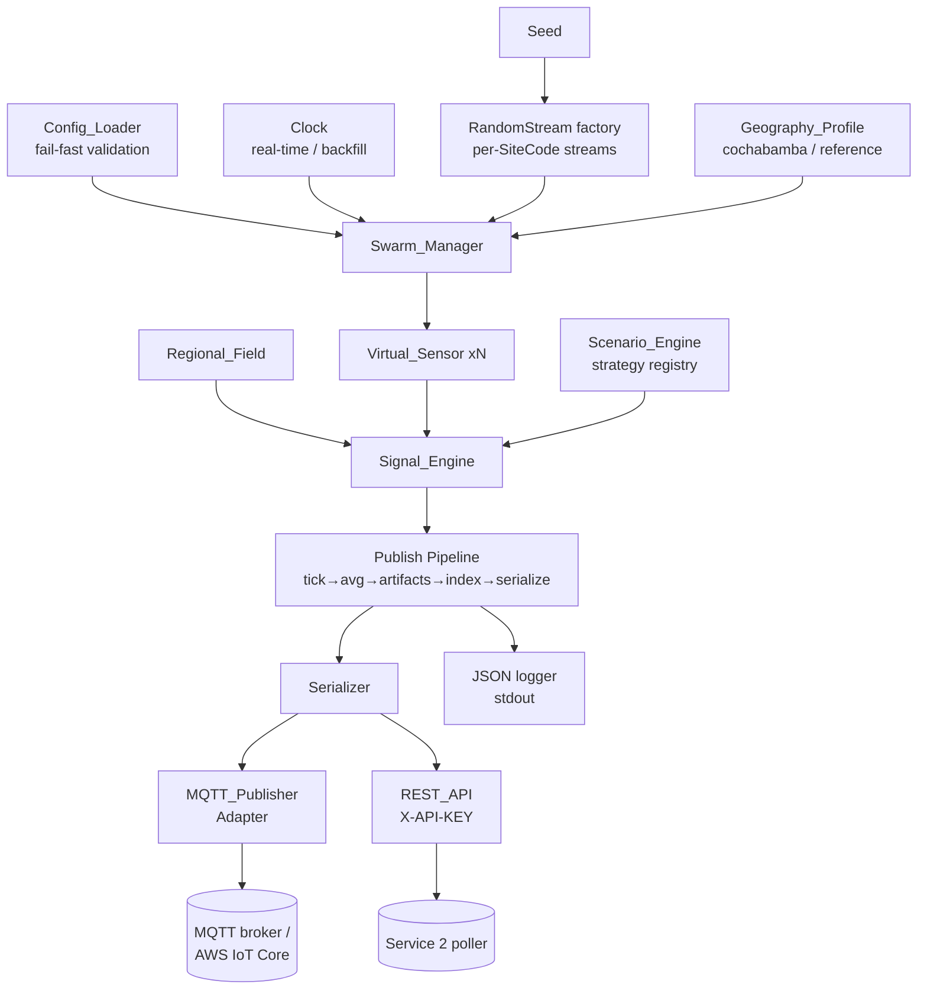
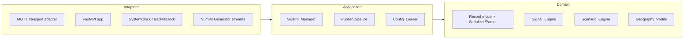

# Design Document

## Overview

The Sensor Simulator Service (Service 1) emits realistic, schema-accurate air-quality telemetry
modelled on a public municipal air-quality network built on commercial low-cost sensor units, so that
Service 2 (Ingestion & Serving) and Service 3 (the Bedrock advisor) can be built and demonstrated
without physical hardware. Its one load-bearing constraint is **contract fidelity**: the JSON it
produces is byte-for-byte a valid reference network contract `/ListSensors` and `/SensorData` payload,
so Service 2 can be repointed at a live public air-quality feed later with no code change
(decision D1).

The service is deployed by default over the **Cochabamba metropolitan area, Bolivia** (the
Kanata region — Cochabamba, Sacaba, Quillacollo, Tiquipaya, Colcapirhua, Vinto, Sipe Sipe) at
~2,560 m elevation, `America/La_Paz` (UTC-4, no DST). Geography is a *configuration* concern, not a
*contract* concern: a swappable `reference` Geography_Profile (a temperate sea-level reference city)
keeps reference-contract parity available, and further regions can be added as additional registry
entries declared in configuration without a contract change. Only field **values** change between
profiles; field **names** never do.

The design is driven by three properties of the problem that shape almost every decision:

1. **Determinism is a functional requirement, not a nicety.** A run must replay byte-identically
   from a seed (Req 11), and backfill output must equal real-time output for the same simulated
   interval (Req 12). This forces every source of time and randomness behind an injected
   abstraction — no `datetime.now()` and no module-level `random` in domain code (engineering
   practice §2).

2. **The record contract is the spine.** Nine `/SensorData` fields and twenty `/ListSensors` fields,
   in a fixed order, with fixed JSON value types, round-tripping cleanly (Reqs 1–3). Push (MQTT) and
   pull (REST) must serialize through the *same* Serializer to guarantee byte-identical output
   (Req 3.6).

3. **Realism has to be measurable.** The signal requirements are stated as inequalities over
   windows (rush-hour ratio, humidity monotonicity, spatial decay, autocorrelation). The signal
   model is therefore built from composable, individually testable terms rather than opaque noise.

### Design decisions

| # | Decision | Rationale |
|---|----------|-----------|
| DD1 | One canonical record model (Pydantic) shared by Serializer, Parser, MQTT, and REST | Guarantees push/pull byte-identity (Req 3.6); contract validation lives in the model, not handlers (engineering practice §0) |
| DD2 | Inject a `Clock` and a per-sensor `RandomStream` at every boundary | Deterministic replay and mode-equivalence (Reqs 11, 12); testability (practice §2, DIP) |
| DD3 | Signal = shared `Regional_Field` + per-site local modifier | Produces spatial correlation and its decay with distance (Req 9) rather than independent noise |
| DD4 | Scenarios and Geography_Profiles are Strategy objects selected by name from a registry | Open/Closed: a new scenario is a new registry entry, not another `if/elif` arm, and a new region is a new profile registry entry declared in configuration, not an edit to existing code (practice §1, §4) |
| DD5 | The tick→average→artifacts→index→serialize→publish pipeline is a Template Method | Fixed sequence, pluggable steps; real-time and backfill differ only in the driving clock (practice §4) |
| DD6 | MQTT transport and the (future) time-source are Adapters behind narrow interfaces | Local broker vs AWS IoT Core interchangeable with no source change (Reqs 13.4, practice §4) |
| DD7 | Config_Loader validates *all* values, reports one message per failure, exits non-zero | Fail-fast, never half-start (practice §5; Reqs 15.5, 4.10, 5.14, 6.7, 7.10, 8.10, 10.11, 11.6, 12.6) |
| DD8 | Index species derived from the emitted concentration `ScaledValue`, not raw ticks, via a breakpoint table | Monotone, deterministic, reproducible index (Req 6); breakpoints configurable without contract change |
| DD9 | Structured single-line JSON logging configured once at startup | Contract requires nothing non-JSON on stdout (Req 17.1, practice §6) |
| DD10 | Runtime shape is chosen per interface rather than once for the service — invocation-scoped for pull and Backfill_Mode, resident for real-time push | Determinism (Req 11) plus mode-equivalence (Req 12.4) make invocation-scoped recomputation provably identical to a resident run (Property 35), while per-device mutual-TLS session cost and in-memory buffering keep push resident (Reqs 13.3, 13.5–13.8); the cloud runtime selection itself is deferred (Scope, A2) |

### Research grounding

The signal ranges are anchored in `docs/research/FINDINGS.md`: PM2.5 typically 3–35 µg/m³ urban with
episodic spikes past 100; NO2 5–90 µg/m³ with roadside dominance; WHO 24-h references PM2.5 15,
NO2 25 µg/m³. Humidity is the **dominant confounder** — uncalibrated optical PM2.5 reads hygroscopic
swelling as extra mass (MAE ~17 µg/m³, reducible to ~6 with RH-aware calibration). The simulator
deliberately injects that RH-driven overestimation (Req 5) so Service 2's calibration step has a real
artifact to recover. Index species default to **the default ten-band index table (band identifiers
1–10)** (FINDINGS SQ1), configurable to an alternative band table without touching the contract
(assumption A5).

## Architecture

### Component context

The Simulator is one process that can run the whole swarm as asyncio tasks. It exposes two
interfaces over the same canonical record.



### Layering and dependency direction

Dependencies point inward toward the domain. The domain (Signal_Engine, Scenario_Engine,
Virtual_Sensor, record model) knows nothing about MQTT, HTTP, wall-clock time, or the OS random
source — those arrive as injected abstractions (DIP, practice §1).



### Directory layout

Everything lives under `sensor-simulator/`, with source, tests, and configuration in separate sibling
subdirectories (Req 16.1). No module imports across service directories; the record contract is this
service's own copy (practice §0, assumption A4).

```
sensor-simulator/
├── pyproject.toml              # Python 3.12, all deps pinned to exact versions (Req 16.2)
├── README.md                   # run/config/scenario/profile/contract docs (Req 16.7)
├── Dockerfile                  # single image, whole swarm in one process (Req 16.5)
├── docker-compose.yml          # simulator + local MQTT broker, no AWS creds (Req 16.6)
├── src/
│   └── aqm_simulator/
│       ├── contract/           # Pydantic record models, Serializer, Parser
│       ├── signal/             # Signal_Engine, Regional_Field, meteorology, humidity growth
│       ├── scenarios/          # Scenario strategy registry
│       ├── geography/          # Geography_Profile registry + built-ins (cochabamba, reference)
│       ├── swarm/              # Swarm_Manager, Virtual_Sensor, Factory
│       ├── pipeline/           # Template-method publish pipeline
│       ├── time/               # Clock abstraction, real-time + backfill drivers
│       ├── rng/                # RandomStream factory (seed + SiteCode)
│       ├── interfaces/
│       │   ├── mqtt/           # MQTT_Publisher + transport adapter
│       │   └── rest/           # FastAPI app, X-API-KEY dependency, /health
│       ├── config/             # Config_Loader, defaults, validation
│       └── observability/      # JSON logger setup, diagnostic recorder
├── scripts/
│   └── gen_dev_certs.py        # documented credential-generation command (Req 16.11)
├── certs/                      # git-ignored, generated per-SiteCode client.crt/key (Reqs 13.4, 16.11)
├── tests/
│   ├── properties/             # hypothesis property tests (one per design property)
│   ├── unit/                   # pytest example + edge + error tests
│   └── integration/            # REST failure modes, docker-compose check
└── config/
    ├── cochabamba.example.yaml
    ├── reference.example.yaml
    └── custom-region.example.yaml   # user-declared profile registered at load time (Req 15.11)
```

### Deployment topology

Only the local path is in scope for this spec. Cloud deployment topology and runtime selection, the
infrastructure-as-code expressing them, and device provisioning are deferred to a separate deployment
spec (Scope, A2). What follows records the *shape* this design leaves available and, more importantly,
why it can leave the choice open at all.

**Local (in scope).** One container runs the whole Swarm as asyncio tasks in a single process,
alongside a local MQTT broker, both started by Docker Compose with no cloud credentials present
(Reqs 16.5, 16.6). That process stays resident across consecutive Publish_Intervals, so the local path
is a Long_Running_Deployment and exercises the residency-scoped behaviors directly.

**Why the runtime can vary at all.** Req 11 makes every emitted value a pure function of the Seed, the
`SiteCode`, and the simulated timestamp, and Req 12.4 requires backfill output to equal real-time
output for the same simulated interval. Together those mean an invocation-scoped runtime can recompute
a completed Publish_Interval from scratch, carrying no state across the invocation boundary, and get
identical records — which is precisely what Property 35 already proves. It is also why
`RandomStreamFactory` derives each stream from the `SiteCode` rather than a positional index
(Req 11.4): per-sensor work is independently recomputable, and therefore shardable across invocations
rather than only across tasks inside one process.

| Interface | Intended runtime shape | Reason |
|-----------|------------------------|--------|
| REST / pull | invocation-scoped (e.g. Lambda behind an API Gateway HTTP API) | request/response, scales to zero, holds no persistent connection |
| Backfill_Mode | invocation-scoped, one invocation per shard | bounded range, stateless, parallelizable per `SiteCode` |
| Real-time MQTT push | Long_Running_Deployment (e.g. an ECS Fargate task) | persistent per-device mutual-TLS sessions, in-memory buffer, indefinite retry (Reqs 13.5–13.8) |

The acceptance criteria stay deployment-neutral; naming runtimes here is design commentary, not a
contract commitment.

**What constrains the choice.** At the 500-sensor maximum, push mode needs 500 distinct mutual-TLS
sessions, each authenticated with a certificate and key used by no other Virtual_Sensor (Req 13.3).
Re-establishing all of them on every invocation is the cost that makes push mode want a resident
process; the buffering and backoff requirements then follow from residency rather than causing it. The
stuck-value fault is the one piece of apparent state on the generation side — it repeats the
`ScaledValue` of the last interval completed before the window (Req 7.4) — but it does not force
residency, because that previous value is itself a pure function of Seed, `SiteCode`, and timestamp, so
an invocation-scoped run recomputes it rather than remembering it.

**Open decision, deferred (A6).** The default `/SensorData` query returns only the most recently
completed Publish_Interval (Req 2.10), which is cheap to recompute per request. Wide queries are the
problem: the retention window reaches 365 simulated days (Req 14.7), which at a 1-hour Publish_Interval
is 8,760 intervals, and at 500 Virtual_Sensor instances across four Species is on the order of 10⁷
records — against a 2-second response budget already required at that swarm size (Req 1.8).
Recomputing that per request is not viable, so wide queries need a backing store or precomputation
rather than per-request recomputation. Whether served records come from in-process retention, from
recomputation from the Seed, or from a store is therefore the single decision that determines whether
the Simulator is stateless, and A6 defers it to the deployment spec. Nothing in this design depends on
the answer: Req 14.7 constrains only that every served record fall inside the retention window and
mandates no storage mechanism.

## Components and Interfaces

### Clock (time boundary — DIP)

Domain code never reads the wall clock. It receives simulated timestamps or a `Clock`.

```python
class Clock(Protocol):
    def now(self) -> datetime: ...                 # current simulated instant (UTC, tz-aware)
    async def wait_until(self, instant: datetime) -> None: ...  # real-time: sleep; backfill: no-op
```

- `SystemClock` drives real-time mode: exactly one Tick per Virtual_Sensor per elapsed wall-clock
  minute, each Tick's simulated timestamp aligned to the start of that minute (Req 12.1);
  `wait_until` sleeps. Req 12.1 constrains the Tick set and their timestamps, not when the compute
  happens; the five-second bound is on *emission* after a Publish_Interval closes (Req 12.7).
- `BackfillClock` drives Backfill_Mode: advances simulated time in Publish_Interval steps with no
  waiting, ≥ 24 simulated hours/wall-second/sensor (Req 12.3); `wait_until` returns immediately.

Real-time and backfill differ *only* in which Clock drives the pipeline, which is what makes
mode-equivalence (Req 12.4) achievable and testable.

### RandomStream factory (randomness boundary — DIP)

```python
class RandomStreamFactory:
    def __init__(self, seed: int) -> None: ...
    def stream_for(self, site_code: str, purpose: str) -> numpy.random.Generator: ...
```

Each Virtual_Sensor gets an independent generator derived from `(seed, SiteCode, purpose)` where
`purpose` separates identity, signal, meteorology, artifacts, and fault streams. Deriving from the
`SiteCode` (not a positional index) means a retained sensor's stream is unchanged when the swarm size
changes (Req 11.4). No domain code calls `numpy.random.*` module functions (practice §2).

### Geography_Profile (Strategy) and its registry

A Geography_Profile is a self-contained set of geographic defaults, selected by name from a
`GeographyProfileRegistry`. Two profiles ship built in — `cochabamba` (the default) and `reference` —
and additional named profiles are **declared in configuration** and registered at load time, so
retargeting the swarm to a new region requires no source change (Reqs 15.11, 8.13).

The Open/Closed and LSP consequence is general, not limited to the two built-ins: **all** registered
profiles are substitutable wherever a profile is expected, and they differ in field **values** only,
never in the set of emitted field names (Req 8.9). A configuration-declared profile is therefore
validated by exactly the same rules as a built-in one — it must supply the complete value set
(bounding box, timezone, sub-area names, elevation, `SiteCode` prefix, `SponsorName`,
`SensorContract`, temperature/RH/pressure ranges, seasonal PM2.5 multiplier), its name must not
collide with an already-registered name, and its `SiteCode` prefix must be unique across all
registered profiles so sensor identities stay unambiguous (Reqs 8.13, 8.14).

```python
@dataclass(frozen=True)
class GeographyProfile:
    name: str                         # registry key; built-ins "cochabamba" | "reference"
    bounding_box: BoundingBox         # lat/lon min/max
    timezone: str                     # "America/La_Paz" | "UTC"
    sub_areas: tuple[SubArea, ...]    # named polygons → Borough values
    elevation_m: float                # ~2560 (cochabamba)
    site_code_prefix: str             # "CB" | "RF"
    sponsor_name: str
    sensor_contract: str              # "Cellular-BO" | "Cellular-REF"
    temp_range_c: Range               # default 5..30 (cochabamba)
    rh_range_pct: Range               # default 15..90 (cochabamba)
    pressure_range_hpa: Range         # 730..755 (cochabamba) | 980..1040 (reference)
    seasonal_pm_multiplier: SeasonalMultiplier  # dry-season burning 1.5..3.0
```

```python
class GeographyProfileRegistry(Protocol):
    def register(self, profile: GeographyProfile) -> None: ...   # config-declared (Req 15.11)
    def get(self, name: str) -> GeographyProfile: ...            # raises on unknown (Reqs 8.12, 15.9)
    def names(self) -> tuple[str, ...]: ...                      # for error messages
```

The built-in profiles are seeded into the registry at startup and configuration-declared profiles are
merged in before any validation of the selected profile name, so an unknown-name rejection can list
every registered profile (Req 15.9).

### Signal_Engine (single responsibility: compute values)

Computes pollutant and meteorology values for a tick from narrow, purpose-built inputs (Interface
Segregation — it never sees MQTT or REST config). Its inputs are the simulated timestamp, the
Virtual_Sensor identity, the sensor's random streams, the shared Regional_Field sample, and the
Geography_Profile. It composes independently testable terms:

- **NO2** = base + non-negative diurnal traffic component (peaks in rush-hour windows, ≤ 30 % of daily
  max overnight, Req 4.1), scaled by Site_Classification (Roadside ≫ Urban Background ≫ Suburban,
  Reqs 4.2–4.3), plus per-site drift and Gaussian noise.
- **PM2.5 Dry_Concentration** = Regional_Field baseline (≤ 5 µg/m³ change/hour, weak diurnal,
  Req 4.4) × seasonal multiplier (Req 4.8) + per-site local modifier + noise.
- **Humidity growth** multiplies Dry_Concentration by a factor `g(RH)` that is monotone
  non-decreasing, strictly increasing for 50 < RH < 85, exactly 1.0 for RH ≤ 50, and ≥ 1.5 for
  RH ≥ 85, capped at the configured max (default 2.0) (Req 5.7–5.9, 5.12) → Reported_Concentration.
- **Meteorology**: temperature peaks in the afternoon window (Req 5.1), diurnal range 10–20 °C
  (Req 5.3); RH inversely tracks temperature (Pearson ≤ −0.5, Req 5.4); pressure is absolute station
  pressure at elevation (Reqs 5.5–5.6).
- **Clamping**: any value outside plausible bounds is clamped to the nearer bound and the event is
  recorded in diagnostic output (Reqs 4.11, 5.2, 5.5).

The autocorrelation floor (lag-1 ≥ 0.6, Req 4.9) falls out of the slow-moving Regional_Field plus
temporally coherent diurnal terms rather than per-tick independent draws.

### Regional_Field (spatial correlation source)

One city-wide latent series per simulated hour, shared identically by every Virtual_Sensor
(Req 9.1). Because every sensor adds the same regional component plus a smaller local modifier,
nearby same-classification sensors correlate (Pearson ≥ 0.6 under 2 km, Req 9.2), correlation does
not increase with distance (spatial-decay, Req 9.3), and the regional component carries ≥ 60 % of
hourly PM2.5 variance (Req 9.1). City-wide scenarios perturb the Regional_Field; targeted scenarios
leave it untouched and perturb only named sensors (Req 9.4, 9.6).

### Scenario_Engine (Strategy registry)

Named scenarios (`clean`, `pollution_episode`, `rush_hour_no2`, `wildfire_smoke`, `sensor_fault`,
Req 10.1) are strategy objects selected by name (Open/Closed — DD4). Each declares how it perturbs
the Regional_Field or an individual sensor over a scheduled window, with ramp/onset/recovery
durations (Reqs 10.2, 10.4, 10.10). Overlapping windows apply in configured precedence order
(Req 10.7). `clean` is the identity strategy, giving every other scenario a baseline to differ from
(observable-effect, Req 10.8).

```python
class Scenario(Protocol):
    name: str
    def apply_regional(self, field: RegionalSample, ctx: ScenarioContext) -> RegionalSample: ...
    def apply_sensor(self, values: SensorValues, ctx: ScenarioContext) -> SensorValues: ...
```

### Swarm_Manager + Virtual_Sensor Factory

The Factory centralizes identity assignment (`SiteCode` formatting, `DeviceCode`, coordinates within
the bounding box, sub-area → `Borough`, classification mix) so identity logic is not scattered across
call sites (practice §4). Construction is deterministic from `(seed, SiteCode)` so a restart with
unchanged config reproduces every identity field (Req 8.3). A supplied site list bypasses generation
and uses the given identities (Req 8.8). The Swarm_Manager instantiates 1–500 sensors before the
first tick (Req 8.1), then ticks them; one sensor raising must not stop the swarm (Reqs 8-isolation,
17.4).

### Publish pipeline (Template Method)

A fixed sequence with pluggable steps (DD5, practice §4): **tick → average over Publish_Interval →
apply artifacts (drift, faults, dropout) → derive index species → serialize → publish/retain**.
Real-time and backfill share this pipeline; only the driving Clock differs. Intervals with fewer than
the full expected tick count (startup/shutdown partials) are dropped whole (Req 12.8).

### Serializer and Parser (contract boundary)

One Serializer renders both record types in the exact declared field order and JSON value types
(Req 3.1); one Parser reads them back with strict validation (Reqs 3.2, 3.5, 3.7, 3.8). MQTT and REST
both call the same Serializer, guaranteeing byte-identical output for the same record (Req 3.6). The
Parser exists so contract drift is caught by round-trip tests even though the simulator is primarily a
producer.

### MQTT_Publisher (Adapter)

Publishes one Sensor_Data_Record per message to `aqm/sensors/{SiteCode}/data` (Reqs 13.1–13.2) over
TLS with per-device X.509 identity (Req 13.3). The transport sits behind a narrow interface so a
local broker and AWS IoT Core are interchangeable with no source change (DD6, Req 13.4). It gives up
per-sensor after repeated auth rejections without stopping the rest of the swarm (Req 13.10).

Its buffering behavior is **scoped to the deployment shape** (DD10). Reconnect with exponential backoff
(Req 13.5), the in-memory buffer with oldest-drop overflow (Reqs 13.6–13.7), and ordered
flush-on-reconnect (Req 13.8) are Long_Running_Deployment behaviors: they assume the process outlives
the outage. In an invocation-scoped deployment the publisher instead reports each record left
unpublished when the connection is unavailable or the time budget runs out, naming its `SiteCode`,
`Species`, and `DateTime`, and does not rely on in-memory buffered records surviving the end of the
invocation — a later invocation republishes that Publish_Interval by recomputing it (Req 13.11). Both
paths share the same publish call and the same Serializer output; only the retry-and-retain strategy
behind them differs.

```python
class MqttTransport(Protocol):
    async def connect(self, credentials: DeviceCredentials) -> None: ...
    async def publish(self, topic: str, payload: bytes) -> None: ...
    async def disconnect(self) -> None: ...
```

### REST_API (FastAPI, authenticated pull)

`GET /ListSensors`, `GET /SensorData`, `GET /health`. The listener binds a configured host and port
where the Simulator hosts it itself, or is fronted by a deployment-provided managed HTTP endpoint
(Req 14.1); the auth, validation, and serialization behavior is identical either way. An `X-API-KEY`
dependency runs before query
validation and returns 401 on missing/empty/non-matching keys (Reqs 14.2–14.3); `/health` is exempt
(Req 14.8). Request and response shapes are Pydantic models so contract validation lives in the model,
not the handler (practice §0). Query-parameter failure modes each return 400 with a JSON body naming
the offending parameter (Reqs 1.11, 1.13, 2.14–2.18) — bad input never yields a 500 (practice §5). The
API key is loaded from env/secret at startup, never from a committed file, and never echoed in any
response or log (Reqs 14.6, 14.10).

### Config_Loader (fail-fast)

Resolves every value in precedence order **environment > file > documented default** (Req 15.1),
validates *all* resolved values before any tick/listener/broker action, writes one message per
invalid value, and exits non-zero without half-starting (DD7; Reqs 15.4–15.5). Unrecognized keys are
rejected by name (Req 15.2). With no config file and no MQTT settings it still reaches a state serving
`/health` in `rest` mode (Req 15.6).

Among the values it resolves are the MQTT endpoint host, the port (1–65535, default 8883), the broker
certificate authority path, and a **per-Virtual_Sensor credential path template** carrying a
`{SiteCode}` placeholder from which one certificate path and one private key path are resolved for
every sensor — defaults `certs/{SiteCode}/client.crt` and `certs/{SiteCode}/client.key` — with an
optional explicit per-`SiteCode` override for an individual sensor (Req 13.4). The template replaces a
thousand explicit paths at the 500-sensor maximum with two configuration values. Resolution happens
*before* validation, so every per-sensor path is a concrete resolved value by the time it is checked,
which is what lets the loader report one error per affected value naming both the configuration value
and the affected `SiteCode` (Req 13.9).

### Observability

A structured logger configured once at startup emits one single-line JSON object per event to stdout;
nothing non-JSON reaches stdout (Req 17.1, practice §6). Levels debug/info/warn/error are filtered by
the configured level (Req 17.5). Scenario-window open/close, per-interval summary counts, and
per-sensor errors are logged at the specified levels (Reqs 17.2–17.7). A separate **diagnostic
recorder** captures Dry_Concentration, Reported_Concentration, RH, growth factor, and clamp/scenario
events keyed by `SiteCode` and timestamp (Reqs 5.10, 4.11, 6.6, 10.7) — this is internal telemetry,
never part of the emitted contract (Reqs 5.11, 7.9).

## Data Models

All record models are Pydantic v2 models in `contract/`. Field order in the model matches the declared
contract order; serialization preserves it (Req 3.1).

### Sensor_Data_Record (`/SensorData`, nine fields — Req 2.1)

```python
class SensorDataRecord(BaseModel):
    Species: Literal["NO2", "PM25", "NO2Index", "PM25Index"]   # case-sensitive (Req 2.2)
    Source: Literal["Measurement"]                              # (Req 2.3)
    Units: str                                                  # "ug.m-3" | index label (Reqs 2.3–2.4)
    SiteCode: str                                               # matches metadata (Req 2.2)
    DateTime: str                                               # ISO-8601 UTC, whole-second, Z (Req 2.5)
    Duration: str                                               # "PT1H" for 1-hour interval (Req 2.6)
    ScaledValue: float                                          # JSON number, 2 dp half-away (Req 2.7)
    RatificationStatus: Literal["P", "R"]                       # P until Ratification_Lag (Reqs 2.8–2.9)
    SensorContract: str                                         # profile contract name (Req 2.2)
```

### Sensor_Metadata_Record (`/ListSensors`, twenty fields — Req 1.1)

```python
class Location(BaseModel):
    type: Literal["Feature"]
    geometry: PointGeometry            # geometry.type="Point", coordinates=[Lat, Lon] strings (Req 1.3)

class SensorMetadataRecord(BaseModel):
    SiteCode: str                      # prefix + 4-digit 0001..9999 (Req 1.7)
    SiteName: str
    DeviceCode: str
    InstallationCode: str
    Facility: str
    Location: Location
    Latitude: str                      # signed decimal, exactly 7 dp (Req 1.2)
    Longitude: str                     # signed decimal, exactly 7 dp (Req 1.2)
    Borough: str                       # a profile sub-area name (Req 1.6)
    SiteClassification: Literal["Roadside", "Urban Background", "Suburban"]
    SensorHeightAboveGround: float     # 2 dp, 2.0..3.0 m (Reqs 1.2, 8.7)
    DistanceToKerb: float              # 2 dp, 0.5..30.0 m (Reqs 1.2, 8.7)
    SponsorName: str
    SiteLocationType: str
    StartDate: str                     # ISO-8601 UTC Z, ≤ now (Req 1.4)
    EndDate: str | None                # null when active (Req 1.4), else ≥ StartDate (Req 1.12)
    PowerTag: Literal["Mains", "Solar"]                          # (Req 1.5)
    SiteDescription: str | None
    SitePhotoURL: str | None
    SensorContract: str                # "Cellular-BO" | "Cellular-REF" (Req 1.5)
```

Every key is always present even when its value is `null` (Reqs 1.1, 3.3–3.4). `Latitude`/`Longitude`
are strings kept character-identical to the `Location.coordinates` entries (Req 1.3).

### Supporting internal models (not part of the emitted contract)

```python
@dataclass(frozen=True)
class TickSample:
    site_code: str
    timestamp: datetime
    dry_pm25: float          # diagnostic only (Req 5.10, excluded from records Req 5.11)
    reported_pm25: float
    no2: float
    temp_c: float
    rh_pct: float
    pressure_hpa: float
    growth_factor: float     # diagnostic only

@dataclass(frozen=True)
class HousekeepingRecord:
    site_code: str
    timestamp: datetime
    signal_quality: int              # 0..100 (Req 7.6)
    active_faults: tuple[str, ...]   # subset of {"stuck value","drift","dropout"} (Req 7.6)
    battery_pct: int | None          # present only when PowerTag=="Solar" (Reqs 7.7–7.8)

class IndexBreakpointTable(BaseModel):
    # per-Species bands: lower inclusive, upper exclusive, integer band id (Req 6.3, 6.5)
    # default = ten-band table, band identifiers 1..10; validated contiguous, non-overlapping,
    # strictly increasing (Req 6.7)
    ...
```

The index band uses lower-inclusive / upper-exclusive bounds so a value on a boundary lands in the
higher band (Req 6.3), and clamps to the highest band above the table's top (Req 6.6).

## Correctness Properties

*A property is a characteristic or behavior that should hold true across all valid executions of a
system — essentially, a formal statement about what the system should do. Properties serve as the
bridge between human-readable specifications and machine-verifiable correctness guarantees.*

The properties below are derived from the acceptance-criteria prework and reduced for redundancy:
determinism facets (identity reproduction, retained-site stability, drift-sign stability) fold into
one determinism property; the many "differs from clean" scenario clauses fold into one
observable-effect property while scenario-specific *magnitude bounds* stay separate; and the
round-trip family is split by the domain it quantifies over (record values vs JSON text). Each
property is implemented by a single property-based test running at least 100 examples.

### Property 1: Sensor data record round-trip

*For all* Sensor_Data_Record values whose `Species` is one of the four permitted values and whose
`DateTime` is within the retention window, parsing the Serializer output produces a record whose every
field equals the original, including null-valued fields, with `ScaledValue` equal at 2 decimal places.

**Validates: Requirements 3.3, 2.1, 2.5, 2.6, 2.7**

### Property 2: Sensor metadata record round-trip

*For all* Sensor_Metadata_Record values covering both `PowerTag` values and all three
Site_Classification values, parsing the Serializer output produces a record whose every field equals
the original, including a null `EndDate`, with `Latitude` and `Longitude` character-identical at 7
decimal places and identical to the `Location.coordinates` entries.

**Validates: Requirements 3.4, 1.1, 1.2, 1.3, 1.7**

### Property 3: Serialize-parse-serialize stability

*For all* JSON text the Parser accepts without error, re-rendering the parsed record through the
Serializer produces JSON text byte-identical to the accepted text.

**Validates: Requirements 3.9**

### Property 4: Push and pull byte-identity

*For all* Sensor_Data_Record values, the JSON payload rendered for the MQTT publish path and the JSON
rendered for the REST response body are byte-identical in field order, values, and numeric formatting.

**Validates: Requirements 3.6**

### Property 5: Emitted contract field set

*For all* emitted records under any scenario and profile, each Sensor_Data_Record carries exactly the
nine contract field names and each Sensor_Metadata_Record exactly the twenty, differing between any
two registered Geography_Profiles — built in or configuration-declared — only in values, and excluding
every diagnostic field (Dry_Concentration, growth factor) and all housekeeping fields.

**Validates: Requirements 2.1, 1.1, 5.11, 7.9, 8.9, 8.13**

### Property 6: Ratification status by age

*For all* Sensor_Data_Record values, `RatificationStatus` is `P` if and only if the record age
(current simulated time minus `DateTime`) is less than the Ratification_Lag, and `R` otherwise.

**Validates: Requirements 2.8, 2.9**

### Property 7: List filtering matches supplied parameters

*For all* swarms and `/ListSensors` queries, the returned set is exactly the Sensor_Metadata_Record
values matching every supplied recognized parameter — whole-field case-insensitive for `SiteCode`,
`Borough`, `Sponsor`, `Facility`, and great-circle distance ≤ `RadiusKM` (boundary inclusive) for the
radius query — while unrecognized parameters are ignored.

**Validates: Requirements 1.8, 1.9, 1.10, 1.14**

### Property 8: SensorData query windowing and filtering

*For all* record sets and authenticated `/SensorData` queries, the returned records are exactly those
whose `DateTime` lies in the half-open window `[startTime, endTime)` (latest completed interval when
no times are given), match every supplied field filter case-sensitively, fall within the radius when
one is given, and are ordered by ascending `DateTime`.

**Validates: Requirements 2.10, 2.11, 2.12, 2.13, 14.7, 14.11**

### Property 9: Non-negative pollutant values

*For all* emitted pollutant Sensor_Data_Record values, across every scenario, `ScaledValue` is greater
than or equal to 0 after noise, drift, humidity growth, and 2-decimal rounding are applied.

**Validates: Requirements 4.7**

### Property 10: Clean-scenario pollutant ranges

*For all* simulated 72-hour windows under the `clean` scenario, every emitted hourly PM2.5
Reported_Concentration lies within 3 to 35 µg/m³ inclusive and every emitted hourly NO2 within 5 to
90 µg/m³ inclusive, over the intervals actually emitted.

**Validates: Requirements 4.5**

### Property 11: NO2 rush-hour diurnal shape

*For all* `Roadside` Virtual_Sensor instances over any simulated 72-hour window under the `clean`
scenario, the NO2 daily-maximum hour falls inside a configured rush-hour window, the mean
00:00–04:00 value is at most 30 percent of the daily maximum, and the mean rush-hour NO2 is between
1.3 and 4.0 times the mean 00:00–04:00 NO2.

**Validates: Requirements 4.1, 4.2**

### Property 12: NO2 classification ordering

*For all* swarms containing at least one Virtual_Sensor of each Site_Classification, over any
simulated 72-hour `clean` window, mean NO2 for `Roadside` is at least 1.25 times mean NO2 for
`Urban Background`, which is at least 1.15 times mean NO2 for `Suburban`.

**Validates: Requirements 4.3**

### Property 13: PM2.5 diurnal amplitude bound

*For all* simulated windows under the `clean` scenario, the relative diurnal amplitude of PM2.5 is at
most 0.5 times that of NO2, and the Regional_Field PM2.5 baseline changes by at most 5 µg/m³ between
consecutive simulated hours.

**Validates: Requirements 4.4**

### Property 14: Signal autocorrelation floor

*For all* Virtual_Sensor instances over any simulated 72-hour `clean` window, the lag-1
autocorrelation of both the hourly NO2 and the hourly PM2.5 series is at least 0.6, distinguishing the
emitted series from an independent random series.

**Validates: Requirements 4.9**

### Property 15: Seasonal PM2.5 multiplier

*For all* seeds under the `cochabamba` profile, the calendar-month mean Regional_Field PM2.5 baseline
across the dry-season burning months (1 July–31 October local) is between 1.5 and 3.0 times the mean
across the wet-season reference months (1 December–31 March local).

**Validates: Requirements 4.8**

### Property 16: Temperature diurnal shape and range

*For all* simulated days, each Virtual_Sensor's maximum hourly temperature falls inside the configured
afternoon window, and the difference between daily minimum and maximum hourly temperature is at least
10 °C and at most the configured maximum diurnal range (default 20 °C).

**Validates: Requirements 5.1, 5.3**

### Property 17: Meteorology value ranges

*For all* Ticks, temperature, absolute barometric pressure, and RH each fall within the active
Geography_Profile range (any out-of-range computed value clamped to the nearer bound), and every
emitted and recorded RH value lies within 0 to 100 percent.

**Validates: Requirements 5.2, 5.5, 5.6, 5.13**

### Property 18: RH–temperature anticorrelation

*For all* Virtual_Sensor instances over any simulated 72-hour window, the Pearson correlation between
the hourly RH series and the hourly temperature series is less than or equal to −0.5.

**Validates: Requirements 5.4**

### Property 19: Humidity-growth monotonicity

*For all* pairs of RH values in 0 to 100 percent where the first is less than or equal to the second,
for one identical Dry_Concentration the Reported_Concentration for the first is less than or equal to
that for the second; the growth factor is exactly 1.0 for RH ≤ 50 percent, at least 1.5 and at most
the configured maximum for RH ≥ 85 percent, strictly increasing for 50 < RH < 85, and never exceeds
the configured maximum.

**Validates: Requirements 5.7, 5.8, 5.9, 5.12**

### Property 20: Index monotonicity and determinism

*For all* pairs of concentration values in 0 to 1000 µg/m³ where the first is less than or equal to
the second, the derived index value for the first is less than or equal to that for the second; every
derived index is an integer within the configured table bounds (default 1 to 10); a value on a band
boundary yields the higher band; and repeated derivations from the same value and table yield the
same index.

**Validates: Requirements 6.3, 6.4, 6.5, 6.6**

### Property 21: Index species pairing

*For all* emitted concentration Sensor_Data_Record values, the Simulator emits exactly one
corresponding index Sensor_Data_Record for the same Virtual_Sensor and Publish_Interval carrying
identical `SiteCode`, `DateTime`, `Duration`, `RatificationStatus`, and `SensorContract`; and whenever
a concentration record is suppressed by a dropout or fault, its index record is omitted too.

**Validates: Requirements 6.1, 6.2, 6.8**

### Property 22: Housekeeping telemetry shape

*For all* Virtual_Sensor instances, each housekeeping telemetry record carries a signal-quality
integer in 0 to 100 and an active-fault list drawn from {stuck value, drift, dropout}, and includes a
battery state of charge in 0 to 100 percent if and only if the sensor's `PowerTag` is `Solar`.

**Validates: Requirements 7.6, 7.7, 7.8**

### Property 23: Stuck-value and dropout fault behavior

*For all* Virtual_Sensor instances, while a dropout window is active no Sensor_Data_Record is emitted
for that sensor and interval for any Species; while a stuck-value fault is active each affected Species
repeats the `ScaledValue` from the last interval completed before the window; and after either window
ends emission resumes from Signal_Engine values.

**Validates: Requirements 7.3, 7.4, 7.5**

### Property 24: Swarm identity uniqueness and form

*For all* configured swarm sizes from 1 to 500, the Swarm_Manager instantiates exactly that many
Virtual_Sensor instances, all `SiteCode` values are pairwise distinct and match the Geography_Profile
prefix and zero-padded four-digit form, and all `DeviceCode` values are pairwise distinct.

**Validates: Requirements 8.1, 8.2**

### Property 25: Swarm placement within geography

*For all* Virtual_Sensor instances, coordinates fall within the Geography_Profile bounding box, land
inside exactly one sub-area whose name becomes the `Borough`, and `SensorHeightAboveGround` and
`DistanceToKerb` fall within 2.0–3.0 m and 0.5–30.0 m respectively.

**Validates: Requirements 8.4, 8.5, 8.7**

### Property 26: Classification mix proportions

*For all* configured swarm sizes of 100 or more, the observed share of each Site_Classification is
within 5 percentage points of its configured proportion.

**Validates: Requirements 8.6**

### Property 27: Regional-field variance share

*For all* simulated 72-hour windows under the `clean` scenario, the shared Regional_Field component
accounts for at least the configured share (default 60 percent) of hourly PM2.5 variance.

**Validates: Requirements 9.1**

### Property 28: Near-sensor spatial correlation

*For all* pairs of Virtual_Sensor instances whose great-circle separation is less than 2 km and whose
Site_Classification values are equal, over any simulated 72-hour `clean` window with at least 48
common emitted hourly intervals, the hourly PM2.5 Pearson correlation is at least 0.6 and the mean
absolute hourly PM2.5 difference is no more than 8 µg/m³.

**Validates: Requirements 9.2, 9.5**

### Property 29: Spatial decay

*For all* ordered pairs of great-circle separation bands (0–2, 2–5, 5–10, >10 km) where the first is
nearer, over any simulated 72-hour `clean` window, the mean hourly PM2.5 correlation for the nearer
band is at least the mean for the farther band minus 0.05, each band mean taken over equal-class pairs
with at least 48 common intervals.

**Validates: Requirements 9.3**

### Property 30: Seeded determinism

*For all* seed and configuration pairs, two Simulator runs in separate processes over the same
simulated range emit, for each `SiteCode` and `Species`, the same ordered sequence of
Sensor_Data_Record values with byte-identical Serializer output; every identity field is reproduced;
and each retained `SiteCode` produces byte-identical output when the swarm size changes with the seed
held fixed.

**Validates: Requirements 11.2, 11.4, 8.3, 7.2**

### Property 31: Seed sensitivity

*For all* pairs of runs that differ only in Seed, over any simulated 24-hour range at least one
Sensor_Data_Record differs from the other run's corresponding record by 0.01 or more at the same
`SiteCode`, `Species`, and `DateTime`.

**Validates: Requirements 11.3**

### Property 32: Monotonic timestamps

*For all* Virtual_Sensor instances and each Species, emitted Sensor_Data_Record values are in strictly
increasing `DateTime` order, each successive `DateTime` separated by a whole multiple of the
Publish_Interval, with no two records sharing the same `SiteCode`, `Species`, and `DateTime`.

**Validates: Requirements 11.5**

### Property 33: Interval averaging

*For all* Publish_Intervals, the emitted `ScaledValue` equals the arithmetic mean of that interval's
Tick values rounded to 2 decimal places, and the emitted `Duration` is the ISO-8601 duration matching
the configured interval.

**Validates: Requirements 12.2, 12.5**

### Property 34: Backfill coverage

*For all* Backfill_Mode ranges, the Simulator emits exactly one Sensor_Data_Record per Virtual_Sensor
per Species for every Publish_Interval whose start is in the half-open range `[start, end)`, in
non-decreasing `DateTime` order.

**Validates: Requirements 12.3**

### Property 35: Mode equivalence

*For all* seed and configuration pairs, the ordered sequence of Sensor_Data_Record values emitted for
a given simulated interval is identical in Backfill_Mode and in real-time mode, every contract field
equal, with `RatificationStatus` compared against the same reference time in both modes.

**Validates: Requirements 12.4**

### Property 36: MQTT publish topic and single-record payloads

*For all* published Sensor_Data_Record values, the MQTT_Publisher publishes each to the topic
`aqm/sensors/{SiteCode}/data` with the publishing sensor's `SiteCode` substituted, and never combines
more than one record in a message.

**Validates: Requirements 13.1, 13.2**

### Property 37: MQTT buffering and ordered flush

*For all* generated record streams under a scripted connection that drops and later restores, in a
Long_Running_Deployment the buffer never exceeds its configured maximum, discarding the oldest record
and incrementing the dropped-record counter on overflow, and on restore every buffered record is
published exactly once in non-decreasing `DateTime` order per Virtual_Sensor before any record
generated after the restore; while in an invocation-scoped deployment every record left unpublished
when the connection is unavailable or the invocation's budget is exhausted is instead reported with its
`SiteCode`, `Species`, and `DateTime`, and no buffered record is relied on across the invocation
boundary.

**Validates: Requirements 13.6, 13.7, 13.8, 13.11**

### Property 38: Observable effect of scenarios

*For all* scenarios other than `clean`, over the same seed, configuration, and simulated window, the
Simulator produces at least one observable difference from the `clean` baseline for each affected
Virtual_Sensor — either an emitted `ScaledValue` differing by at least 0.01 from the `clean` record of
the same `Species`, `SiteCode`, and `DateTime`, or the absence of a record the `clean` baseline emits —
while every non-targeted or unaffected sensor reproduces its `clean` baseline.

**Validates: Requirements 10.8, 10.9, 9.4, 9.6**

### Property 39: Scenario magnitude bounds

*For all* active scenario windows, the emitted values satisfy the scenario's configured bound: under
`pollution_episode` every PM2.5 `ScaledValue` is at or above 35.5 µg/m³ and at or below the episode
peak; under `rush_hour_no2` roadside NO2 is multiplied by at least the configured multiplier while
`Urban Background` and `Suburban` NO2 stays within 0.01 µg/m³ of the `clean` baseline; under
`wildfire_smoke` PM2.5 is scaled by the configured multiplier and capped at the wildfire peak while
NO2 stays within 0.01 µg/m³ of baseline; and after any window ends, within the recovery duration every
affected value returns to within 10 percent of the `clean` baseline.

**Validates: Requirements 10.2, 10.3, 10.4, 10.5, 10.10**

### Property 40: Scenario precedence composition

*For all* sets of overlapping scenario windows applying to the same Virtual_Sensor, the
Scenario_Engine composes their effects in the configured precedence order deterministically, and
records the applied scenario names and affected `SiteCode` values in the diagnostic output.

**Validates: Requirements 10.7**

### Property 41: Configuration resolution precedence

*For all* configuration layers, the Config_Loader resolves each value to the highest-precedence source
present in the order environment variable over file over documented default, a supplied individual
profile value overrides that value on the named profile while retaining every profile value not
supplied, and a configuration-declared profile whose value set is complete and valid is registered and
becomes selectable by its name.

**Validates: Requirements 15.1, 15.3, 15.11**

### Property 42: Log output is single-line JSON

*For all* log events emitted during a run, each line written to standard output is exactly one valid
single-line JSON object containing an ISO-8601 UTC timestamp ending in `Z`, a level of
`debug`/`info`/`warn`/`error`, and an event name, with no non-JSON text written to standard output.

**Validates: Requirements 17.1**

## Error Handling

Errors are caught at the boundaries — the FastAPI handlers, the MQTT publish loop, the per-sensor tick
loop, and the CLI/config entry point — and never surface as a raw stack trace to a client (practice
§5). Expected exception types are caught specifically (`ValueError`, `ValidationError`, `OSError`),
with broad catches reserved for the true top-level loop, where they are logged with
`logger.exception(...)`. Every handled error is still logged; silent failure is not acceptable
(practice §6).

### Configuration errors (fail-fast, before anything starts)

The Config_Loader validates every resolved value before the first tick, before opening the REST
listener, and before connecting to the broker. It does not stop at the first failure: it completes
validation of all values, writes one single-line JSON message per invalid value naming the value and
the constraint it violated, exits with a non-zero status, and never half-starts (DD7).

| Failure | Handling | Requirement |
|---------|----------|-------------|
| Bad signal window / episode peak / seasonal multiplier | reject, name parameter + range, no signal generation | 4.10 |
| Bad met range / growth factor | reject, name range + bounds, no signals | 5.14 |
| Bad breakpoint table (overlap/gap/non-increasing) | reject, name offending band | 6.7 |
| Bad noise/drift/fault window | reject, name parameter + range | 7.10 |
| Bad swarm size / classification mix / site list / profile | reject, name setting, no sensors instantiated | 8.10, 8.11, 8.12, 15.9 |
| Declared profile with incomplete value set, duplicate name, colliding `SiteCode` prefix, or sub-area outside its own bounding box | reject naming the offending profile and value, no sensors instantiated | 8.13, 8.14 |
| Bad scenario schedule entry | one message per offending entry, non-zero exit | 10.11 |
| Bad / out-of-range Seed | reject, name Seed field + value | 11.6 |
| Bad backfill span / publish interval | reject, name values + permitted span | 12.6, 12.9 |
| Unrecognized config key / interface / log level | reject by name, list permitted values | 15.2, 15.7, 17.8 |
| Unreadable / unparseable config file | name path + failure kind, exit non-zero, no default fallback | 15.8 |
| Missing secret / MQTT credential path for selected interface | one message per unresolved value (never the secret itself), non-zero exit | 13.9, 14.9, 15.10, 16.9 |
| Resolved credential path (CA, per-sensor certificate, or private key) absent or unreadable | reject, one message per affected value naming the configuration value and the affected `SiteCode`, no signal generation | 13.9 |

When no Seed is supplied, the loader selects one in range and logs it before the first record so the
run is replayable (Req 11.7).

### Runtime errors (isolate, log, continue)

- **Per-sensor tick or publish failure**: caught per Virtual_Sensor, logged at `error` with
  `SiteCode`, operation name, and error type; the swarm continues and the process stays up (Reqs 17.4,
  per-sensor isolation). One sensor raising never stops the swarm (practice §5).
- **Computed value out of plausible range**: clamped to the nearer bound; the clamp event is recorded
  in diagnostic output with `SiteCode`, `Species`, and timestamp, and logged at `warn` (Reqs 4.11,
  5.2, 5.5, 6.6).
- **MQTT connection failure / drop**: in a Long_Running_Deployment, retried with exponential backoff
  from 1 s doubling to the configured maximum, retrying indefinitely; ticks keep generating and
  records buffer meanwhile (Reqs 13.5, 13.6), and buffer overflow drops the oldest record and
  increments the dropped counter (Req 13.7). In an invocation-scoped deployment the publisher instead
  reports each record left unpublished when the connection is unavailable or the invocation's time
  budget is exhausted, naming its `SiteCode`, `Species`, and `DateTime`, without relying on in-memory
  buffering surviving the invocation, so a later invocation republishes that Publish_Interval
  (Req 13.11). Repeated auth rejections for one sensor stop that sensor's attempts, log the `SiteCode`
  and rejection category, and leave the rest of the swarm publishing (Req 13.10).
- **Publish blocked for a whole interval** (no connection, scheduled dropout, or no active interface):
  the interval summary logs a `warn` naming the blocking condition when generated > 0 and published =
  0 (Req 17.7).

### REST request errors (validate at the edge, never 500)

The FastAPI layer authenticates first, then validates query parameters, each documented failure mode
returning its documented status with a JSON body naming the offending parameter — never a 500 on bad
input (practice §5).

| Failure | Status | Requirement |
|---------|--------|-------------|
| Missing / empty / non-matching `X-API-KEY` (checked before query validation) | 401 | 14.2, 14.3 |
| `RadiusKM` without both `Latitude` and `Longitude` | 400 | 1.11, 2.18 |
| Non-numeric or out-of-range `Latitude`/`Longitude`/`RadiusKM` | 400 | 1.13, 2.18 |
| `startTime` later than `endTime` | 400 (generation continues unchanged) | 2.14 |
| `startTime` without `endTime` or vice versa | 400 | 2.16 |
| Unparseable ISO-8601 `startTime`/`endTime` | 400 | 2.17 |
| `Species` outside the four permitted values | 400 (lists permitted values) | 2.15 |

The API key is never included in any response body, the `/health` response, or any diagnostic output
(Req 14.10).

### Parser errors

The Parser raises a validation error — naming the offending field and whether it was missing, unknown,
wrong-typed, or an invalid `Species`, or indicating unreadable JSON / oversize payload — and produces
no record value (Reqs 3.5, 3.7, 3.8). These are surfaced as 400s when they originate from a REST
request body and logged when they originate from an ingested payload.

## Testing Strategy

Property-based testing is appropriate for this service: the core is pure, input-driven signal and
contract logic (serialization, index derivation, humidity growth, spatial correlation, determinism)
with universal properties over large input spaces. TDD applies throughout — a failing test first, then
the smallest clean change to pass it (practice §3). The suite must pass with no AWS credentials and no
network access beyond localhost (Req 16.10, practice §3).

### Dual approach

- **Property tests** (`hypothesis`, `tests/properties/`) verify the 42 universal properties above.
- **Unit / example tests** (`pytest`, `tests/unit/`) pin concrete behaviors, boundaries, and error
  conditions — the config fail-fast cases, clamp events, the REST failure modes, auth failures, log
  events, and scenario name enumeration.
- **Integration tests** (`tests/integration/`) cover the boundaries PBT does not fit: the
  credential-generation command (Req 16.11), which runs first so per-`SiteCode` certificate and key
  material exists at the template-resolved paths (Req 13.4) before anything connects — the generated
  material is git-ignored and never committed (Req 16.8) — then TLS/X.509 transport against a local
  broker, the container `/health` smoke check, and the Docker Compose broker-connect-and-publish
  check. The container `/health` check and the Compose check are both Long_Running_Deployment checks:
  they assert behavior of a resident process across container start and a Publish_Interval
  (Reqs 16.5, 16.6), so they have no invocation-scoped counterpart.

Both layers are necessary and complementary: property tests find general correctness violations across
inputs; example tests pin exact status codes, messages, and one-off behaviors.

### Property test configuration

- Library: `hypothesis` for Python (not hand-rolled).
- Each of the 42 properties is implemented by a **single** property-based test running a **minimum of
  100 examples** (Req 16.3).
- Each property test is tagged with a comment referencing its design property in the form
  **Feature: sensor-simulator-service, Property {number}: {property text}**.
- Generators are shared fixtures: canonical `SensorDataRecord`/`SensorMetadataRecord` builders
  (all Species, both PowerTags, all classifications), RH/concentration pairs, seed/config pairs,
  swarm sizes, and scenario schedules. The Clock and RandomStream are injected fakes so real-time mode
  is exercised without real waiting and runs are reproducible.
- The seven properties named in Req 16.3 map explicitly to the sections above: round-trip →
  Properties 1–3; determinism and monotonic-timestamp → Properties 30, 32; index monotonicity →
  Property 20; spatial-decay → Property 29; mode-equivalence → Property 35; humidity growth
  monotonicity → Property 19; observable-effect → Property 38.

### Named REST failure-mode tests (Req 16.4)

One example test each, asserting the documented status and a JSON body naming the offending parameter
or permitted values: `RadiusKM` without both `Latitude`/`Longitude` (400), `startTime` later than
`endTime` (400), `Species` outside the four permitted values (400), omitted `X-API-KEY` (401), and a
non-matching `X-API-KEY` (401).

### Determinism and mode-equivalence harness

Determinism (Property 30) and mode-equivalence (Property 35) compare byte-identical Serializer output
across two independent runs. The harness constructs two Simulator instances with fresh
RandomStreamFactory objects from the same seed (mimicking separate processes), collects the ordered
records per `SiteCode`/`Species`, and asserts byte equality; mode-equivalence drives one instance with
the `BackfillClock` and one with a fake `SystemClock` advanced without real sleeping.

### Coverage expectation

Every new function, route, and class ships with its normal case, edge cases, and error cases before it
counts as done (practice §3). Property tests carry broad input coverage, so unit tests stay focused on
specific examples, integration points, and error conditions rather than duplicating the property
space. The full suite runs from one documented command and exits 0 only if every test passes
(Req 16.3), with the Docker Compose integration check the sole test allowed to be skipped when offline
(Req 16.10).
