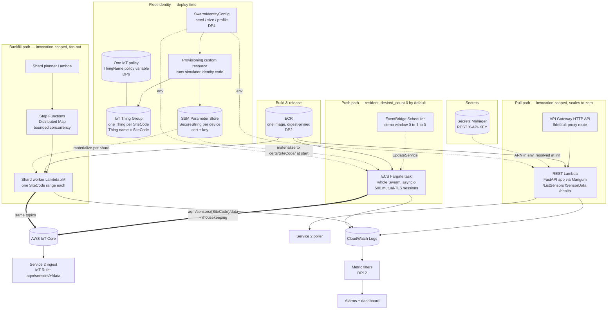
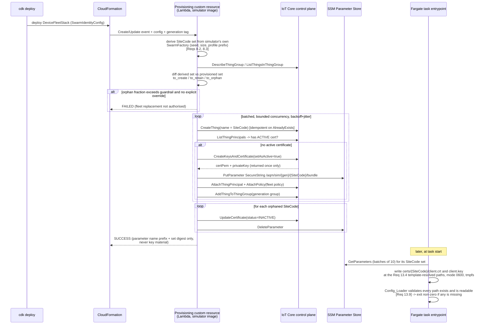

# Design Document: Simulator Deployment

## Overview

This spec covers the deployment and operation of the **Sensor Simulator Service** (Service 1) on AWS.
The simulator's own behavior — signal generation, the record contract, scenarios, geography, and
configuration semantics — is specified in the sibling spec `sensor-simulator-service`, which
explicitly places deployment out of its scope (its Scope section and assumption A2) and defers one
open decision to this document (its assumption A6). This spec resolves that decision and everything
that surrounds it: runtime selection, infrastructure-as-code, device identity and authorization,
credential lifecycle, secret delivery, observability wiring, CI/CD, and cost posture.

The design rests on a single load-bearing argument, which is worth stating before anything else
because almost every decision below follows from it.

**Every emitted value is a pure function of the Seed, the `SiteCode`, and the simulated timestamp.**
`sensor-simulator-service` Req 11 requires byte-identical replay from a Seed; Req 11.4 requires each
sensor's pseudo-random stream to be derived from the Seed and the `SiteCode` rather than from a
positional index; Req 12.4 requires Backfill_Mode output to equal real-time output for the same
simulated interval. The sibling design proves the last of these as its Property 35. Together they mean
an invocation-scoped runtime can recompute a completed Publish_Interval from scratch, carrying no
state across the invocation boundary, and produce identical records. Per-sensor work is therefore
independently recomputable, which makes it **shardable across invocations** rather than only across
asyncio tasks inside one resident process.

That is why the runtime is chosen **per interface** rather than once for the service
(`sensor-simulator-service` DD10):

| Interface | Runtime | Why |
|-----------|---------|-----|
| REST / pull | Lambda (container image) behind an API Gateway HTTP API | request/response, holds no connection, scales to zero between demos |
| Backfill_Mode | Lambda, one invocation per `SiteCode` shard, orchestrated by Step Functions | bounded range, stateless, independently recomputable per `SiteCode` |
| Real-time MQTT push | ECS Fargate task (resident process) | 500 concurrent per-device mutual-TLS sessions (Req 13.3), in-memory buffer and indefinite retry (Reqs 13.5–13.8) need a process that outlives an outage |

The counterweight is that a resident task bills continuously while an invocation-scoped runtime bills
per request. At demo scale the Fargate task is the single largest fixed line item — larger than the
IoT messaging it exists to produce — so the push path is deployed **scaled to zero by default** and
raised to one task for the duration of a demo. Cost posture is treated as a first-class design
concern in its own section, not an afterthought.

### Scope

In scope: the per-interface runtime split and the CDK that expresses it; IoT Core per-device X.509
identity, provisioning at scale, and least-privilege authorization; certificate and credential
lifecycle across local dev, cloud provisioning, rotation, and revocation; secret and configuration
delivery; observability wiring; the CI/CD pipeline; and cost and scale-to-zero posture.

Out of scope: the simulator's signal generation, record contract, scenarios, and configuration
semantics, all owned by `sensor-simulator-service`; Service 2 and Service 3 and their deployment; the
shared contract package. Where this document names a contract field, a topic, an endpoint, or a
numeric default, it **cites** the sibling spec rather than redefining it.

**Citation convention.** Inside a `Validates:` line, a bare dotted number means a
`sensor-simulator-service` requirement, and the owning spec is named in parentheses immediately after
the bolded segment; `DP` IDs are decisions original to this document, and `DD` IDs refer to the sibling
design's decisions. Elsewhere in this document a bare `Req X.Y` likewise means
`sensor-simulator-service Req X.Y` — this spec has no requirements of its own yet, so there is no
ambiguity — with the fully qualified form used wherever a citation appears far from its context. When
this spec's own requirements.md is generated, these `Validates:` lines will be renumbered to cite this
spec's requirements directly, with the sibling citations retained as parenthetical context.

### One gap this document fills, and one citation correction

`sensor-simulator-service` Req 7.9 requires housekeeping telemetry to be published to "an MQTT topic
distinct from the measurement topic of Requirement 13" but does not name that topic. Naming it is a
deployment concern because the name has to be expressible in an IoT policy and must not collide with
the topic filter Service 2 subscribes to. This document therefore names it
`aqm/sensors/{SiteCode}/housekeeping` (decision DP5). The measurement topic
`aqm/sensors/{SiteCode}/data` (Req 13.1) is unchanged.

### Design decisions

| # | Decision | Rationale |
|---|----------|-----------|
| DP1 | Runtime is chosen per interface: Lambda for pull and Backfill_Mode, Fargate for real-time push | Carries `sensor-simulator-service` DD10 forward; justified by Req 11 purity plus Req 12.4 mode-equivalence (sibling Property 35) against the 500-session cost of Reqs 13.3, 13.5–13.8 |
| DP2 | **One container image, three entrypoints** — the REST Lambda, the backfill Lambda, and the Fargate task all run the same image, referenced by digest | Push/pull byte-identity (Req 3.6) and mode-equivalence (Req 12.4) must hold *in deployment*, not only in the test suite; identical bytes is the cheapest way to guarantee it, and NumPy makes a zip package awkward anyway |
| DP3 | Device identities are **pre-provisioned at deploy time** by a CDK custom resource that calls the simulator's own identity-derivation code | The simulator fails fast when a credential path is absent at startup (Req 13.9); pre-provisioning is the only option that satisfies that without adding a bootstrap-exchange code path, which would break the "same build targets local broker or IoT Core with no source change" guarantee (Req 13.4) |
| DP4 | `SiteCode` set, Seed, swarm size, and Geography_Profile live in **one `SwarmIdentityConfig`** consumed by both the provisioner and every runtime | `SiteCode` values are deterministic from Seed and profile prefix (Reqs 8.2, 8.3); provisioning and generation must not derive them independently or they will drift |
| DP5 | Thing name **equals** `SiteCode`; MQTT client ID equals `SiteCode`; housekeeping topic is `aqm/sensors/{SiteCode}/housekeeping` | Thing-name policy variables only resolve when the client ID matches the Thing name, which is what makes one policy serve 500 devices; the housekeeping name is a sibling of `/data` so Service 2's `aqm/sensors/+/data` filter does not match it |
| DP6 | **One IoT policy for the whole fleet**, scoped by the `${iot:Connection.Thing.ThingName}` policy variable; no subscribe or receive permission at all | Least privilege per device without 500 policy documents (practice §7); cross-device publish becomes structurally impossible rather than merely disallowed |
| DP7 | Private keys are generated by IoT Core (`CreateKeysAndCertificate`) and written straight to **SSM Parameter Store SecureString, one parameter per device**; the custom resource returns parameter names only, never key material | No CA to operate at pilot scale; Parameter Store standard tier has no per-parameter monthly charge, where 500 Secrets Manager secrets would cost ~$200/month and dwarf the entire pilot budget; a custom resource's response `Data` is visible in CloudFormation, so key material must never travel that path |
| DP8 | Backfill shards partition by **contiguous `SiteCode` range in parallel** and by **consecutive time window sequentially within a shard** | Req 12.3 and Req 13.8 require non-decreasing `DateTime` order per Virtual_Sensor; splitting one sensor's intervals across concurrent invocations would break it, splitting across sensors cannot |
| DP9 | Shard plan is computed from the **Req 12.3 floor throughput** (24 simulated hours per wall-second per sensor), not a measured rate | Planning against the guaranteed floor makes "no shard exceeds the 15-minute ceiling" true by construction; real throughput is higher, so shards finish early rather than late |
| DP10 | **A6 resolved: the simulator stays stateless.** Served records are recomputed from the Seed per request. Wide-range history is served by Backfill_Mode over MQTT, not by a wide REST query | Recomputation is provably identical to a resident run (Property 35), and the retention window (Req 14.7) is a validity filter on `DateTime`, not a materialization mandate. The only real consumer of 365 days of history is Service 2 seeding its store, and Backfill_Mode exists for exactly that |
| DP11 | The API key is delivered as a **Secrets Manager ARN in the environment**, resolved at cold start; never as a synth-time value | A CDK-resolved secret value would land in the CloudFormation template. Req 14.6 forbids reading the key from a committed file and Req 14.10 forbids echoing it |
| DP12 | stdout JSON goes to CloudWatch Logs **unchanged**; metrics come from log **metric filters** over the Req 17.3 interval summary | Req 17.1 already mandates one single-line JSON object per event and nothing else on stdout, so the log contract is already the metric substrate; filters cost nothing at this volume and require no change to the log format |
| DP13 | X-Ray on the invocation-scoped runtimes only; the resident push task uses metrics and logs | A resident publisher has no request boundary — one segment per message would be 2,500 segments/hour of noise and cost with no correlation value |
| DP14 | No CDK environment lookups anywhere (`from_lookup`, account-dependent context); all cross-stack values passed explicitly | Req 16.10 requires the suite to pass with no AWS credentials and no network beyond localhost, and `cdk synth` plus template assertions run inside that suite |
| DP15 | Fargate task runs in a **public subnet with an egress-only security group**, not behind NAT | A NAT gateway is ~$32/month, nearly double the task itself, on a demo whose whole budget is $10–30 (`docs/architecture/00-overview.md` cost table). An interface VPC endpoint for the IoT data plane is the alternative when a private-only posture is required |
| DP16 | Push service `desired_count` defaults to **0**, raised for a demo window by EventBridge Scheduler | This is the scale-to-zero lever for the one component that cannot scale itself to zero |

## Architecture

### Deployment topology



Three observations about this topology.

**The image is the contract carrier.** DP2 puts the same image behind all three runtimes. Req 3.6
requires push and pull to render the record through the same Serializer and produce byte-identical
JSON; Req 12.4 requires backfill and real-time output to be equal. Those are properties of code, so
running different builds behind different interfaces would put them at risk for reasons that have
nothing to do with the simulator's logic. Referencing by **digest** rather than tag extends the
determinism the service is built around to the deployment of the service.

**Nothing in the pull path holds state.** The REST Lambda receives `SwarmIdentityConfig` in its
environment and the API key ARN, and derives everything else. In real-time mode simulated time equals
wall-clock time (Req 12.1), so "the most recently completed Publish_Interval" (Req 2.10) is
`floor(now / P) − P`, computable without memory. `/health` needs only the swarm size and the current
simulated timestamp (Req 14.8), both of which are config plus clock. This is what DP10 buys.

**Only the push path is resident, and only it needs the fleet's credentials.** The 500 SSM parameters
are read by the Fargate task at start and by backfill workers for their own shard's `SiteCode` range
only. The REST Lambda needs no device credentials at all, so its role is granted none.

### Provisioning flow



The two points that make this flow correct rather than merely plausible:

**The provisioner runs the simulator's own identity code** (DP4). `SiteCode` values are generated
deterministically from the Seed and the Geography_Profile prefix (Reqs 8.2, 8.3, and Req 1.7 for the
prefix-plus-four-digit form). A provisioner that reimplemented that rule would be a second source of
truth, and the failure mode of divergence is a fleet where some sensors have no credentials. Because
the provisioning Lambda runs the same image as the runtimes (DP2), it imports the simulator's
`SwarmFactory` directly. This is not a cross-service import — it is the same service — so it does not
violate the monorepo boundary rule in practice §0.

**Divergence is caught, not tolerated.** If the provisioned set and the derived set ever disagree, the
simulator's own startup validation is the backstop: a missing credential path makes the Config_Loader
exit non-zero with one message per affected value, naming the configuration value and the `SiteCode`
(Req 13.9). That is the desired behavior — a partial fleet publishing silently would be worse than a
failed start. A preflight check in the task entrypoint logs the diff before that exit, so the operator
sees *which* codes are missing rather than only that something is.

### Fleet generation and swarm changes

The `SiteCode` set is a function of Seed, swarm size, and profile prefix. Changes to those inputs have
materially different consequences, so the provisioner classifies them:

| Change | Effect on the `SiteCode` set | Provisioner behavior |
|--------|------------------------------|----------------------|
| Swarm size increased, Seed unchanged | superset — retained codes are stable by Req 11.4 | purely additive: create Things and credentials for the new codes, touch nothing existing |
| Swarm size decreased, Seed unchanged | subset | deactivate the removed devices' certificates, delete their parameters, remove from the group; keep the Things for audit until the retention delay elapses |
| Seed changed, or profile prefix changed | disjoint set — a different fleet | treated as a **new fleet generation**: provision the new set, deactivate the whole previous generation. Refused unless `allow_fleet_replacement` is explicitly set |
| Profile changed but prefix unchanged | codes identical, metadata values differ | no provisioning change; only the runtime's config changes |

A **generation tag** — a short digest of `(seed, swarm_size, profile_name, site_code_prefix)` — names
the Thing Group and prefixes every parameter path. That gives three things cheaply: a new generation
provisions alongside the old rather than mutating it, the orphan diff is a group-membership query
rather than a full registry scan, and rollback is a matter of pointing the runtime environment at the
previous generation tag.

The `allow_fleet_replacement` guardrail exists because a one-character edit to the Seed silently
invalidates 500 device identities. Requiring an explicit flag turns a typo from a fleet wipe into a
failed deploy.

## Components and Interfaces

### Provisioning options considered

DP3 selects pre-provisioning. The alternatives are real and worth recording, because the reason for
rejecting them is a requirement, not a preference.

**Fleet provisioning by claim certificate.** Devices ship with a shared claim certificate and exchange
it for a permanent one at first connect, through a provisioning template and a pre-provisioning hook.
This is the right answer at genuine fleet scale. It is the wrong answer here for three reasons. The
simulator has no bootstrap-exchange code path, and adding one would mean the cloud build differs from
the local build, which Req 13.4 exists to prevent ("so that the same build targets a local broker or
AWS IoT Core with no source change"). The claim certificate is itself a shared secret held by every
device, which is a weaker posture than the per-device identity `docs/architecture/01-sensor-simulator-service.md`
§4 and practice §7 both call for. And permanent certificates would be issued on every task start
unless persisted anyway, so an ephemeral Fargate task would accumulate orphaned certificates in the
registry.

**Just-in-time registration.** Devices present leaf certificates signed by a registered CA, and IoT
Core registers the Thing on first connect via a lifecycle event. This preserves the simulator's plain
file-based credential loading, so Req 13.4 is satisfied. But leaf certificates still have to be
generated and stored somewhere — JITR removes the *registration* work, not the *credential
distribution* work, which is the part that actually costs something here. It also rejects the first
connection attempt by design, which interacts badly with Req 13.10: the publisher gives up on a sensor
after a configured number of consecutive authentication rejections (default 5). One rejection out of
five is tolerable, but it makes first-run behavior depend on retry timing, which is exactly the kind of
order-dependence this service is otherwise built to avoid.

**Pre-provisioning via a CDK custom resource (selected).** Deploy-time creation of a Thing,
certificate, and policy attachment per device, with the private material written to Parameter Store
and materialized to the Req 13.4 template-resolved paths by the task entrypoint. The simulator sees
exactly what it sees locally: files at `certs/{SiteCode}/client.crt` and `certs/{SiteCode}/client.key`,
present and readable before signal generation starts. Registry state is declarative, the diff against
the derived `SiteCode` set is computable, and revoking one device is a single `UpdateCertificate` call.

The cost is deploy-time work proportional to N. IoT control-plane APIs are rate-limited —
`CreateKeysAndCertificate` in the region of 10 TPS — so 500 devices means batching with bounded
concurrency and exponential backoff with jitter, landing around one to two minutes. That fits inside a
custom resource comfortably at 500. It would not fit at 5,000, which is the documented city-scale
figure in the overview cost table, so **the boundary is explicit: pre-provisioning up to roughly 1,000
devices; beyond that, move the loop into a Step Functions distributed map, and beyond roughly 5,000
switch to claim-certificate fleet provisioning and accept the code-path cost.**

### Device authorization policy (DP6)

One policy document serves the whole fleet. Thing-name policy variables resolve only when the MQTT
client ID equals the Thing name and the certificate is attached to that Thing, which is why DP5 sets
Thing name, client ID, and `SiteCode` to the same value.

```json
{
  "Version": "2012-10-17",
  "Statement": [
    { "Effect": "Allow", "Action": "iot:Connect",
      "Resource": "arn:aws:iot:${Region}:${Account}:client/${iot:Connection.Thing.ThingName}" },
    { "Effect": "Allow", "Action": "iot:Publish",
      "Resource": [
        "arn:aws:iot:${Region}:${Account}:topic/aqm/sensors/${iot:Connection.Thing.ThingName}/data",
        "arn:aws:iot:${Region}:${Account}:topic/aqm/sensors/${iot:Connection.Thing.ThingName}/housekeeping"
      ] }
  ]
}
```

Four properties of this document are deliberate.

There is **no `iot:Subscribe` and no `iot:Receive`**. The simulator only publishes. Granting nothing
is cheaper to reason about than granting and auditing.

There is **no wildcard in any topic resource**. Device `CB0007` cannot publish to `CB0042`'s topic
because the only resource it is granted is the one the policy variable resolves to. Cross-device
publish is structurally impossible rather than disallowed by a matching rule, and no explicit `Deny` is
needed because IoT policies are default-deny.

The **`iot:Connect` resource pins the client ID**, so a certificate cannot be used to open a session
under another device's identity — which is what makes the topic restriction meaningful in the first
place.

The **housekeeping topic sits beside `/data` at the same depth**, so Service 2's ingest rule filter
`aqm/sensors/+/data` (`docs/architecture/02-ingestion-and-serving-service.md` §3) does not match it.
Req 7.9 requires housekeeping to carry none of the Sensor_Data_Record fields; keeping it off Service 2's
measurement filter means a mis-shaped housekeeping payload cannot reach the ingest path at all.

Authorization is verifiable at deploy time without connecting a device: `iot:TestAuthorization`
answers, for a given principal, whether a named action on a named topic is allowed. That is the
mechanism behind Correctness Property 2.

### Credential lifecycle

| Stage | Mechanism | Traceability |
|-------|-----------|--------------|
| Local dev generation | `scripts/gen_dev_certs.py` creates a local dev CA and a leaf per `SiteCode` at the template-resolved paths; the broker trusts the dev CA; everything is git-ignored | Reqs 16.11, 16.8, 13.4 |
| Cloud provisioning | `CreateKeysAndCertificate` per device, key written straight to Parameter Store SecureString, never returned in the custom resource response `Data` | DP7, practice §7 |
| Materialization | Task/worker entrypoint fetches its `SiteCode` range in `GetParameters` batches of ten and writes `certs/{SiteCode}/client.crt` and `.key` to a **tmpfs** mount at mode 0600, before the Config_Loader runs | Req 13.4, 13.9 |
| Rotation | Create a new certificate for the Thing, activate, attach policy, write a new parameter version, roll the task, then deactivate and delete the superseded certificate | Req 13.9 resolves credentials at startup, so rotation is a task restart, not a hot swap |
| Revocation | `UpdateCertificate(status=REVOKED)` for one device | The observable consequence is exactly Req 13.10: that sensor's sessions drop, its reconnects are rejected, the publisher gives up on it after the configured consecutive-rejection count, and **the rest of the swarm keeps publishing** |

Revocation is the payoff of per-device identity, and Req 13.10 is what makes it safe: a single revoked
device degrades the fleet by one sensor rather than stopping it. Two details matter operationally.
Rotation is a restart because the simulator resolves credential paths once at startup — a design
consequence of Req 13.9's fail-fast contract, not an oversight. And because the private key is
returned by IoT Core exactly once, the provisioner's write to Parameter Store is the only chance to
capture it; a failure between `CreateKeysAndCertificate` and `PutParameter` orphans a certificate whose
key is lost, which the error-handling section addresses.

The alternative to AWS-generated keys is registering our own CA and using `CreateCertificateFromCsr`,
so the private key never leaves the provisioner's memory. That is the right choice if key custody
policy forbids AWS-generated keys; it costs a CA to operate and rotate. For a simulator producing
synthetic data it is not warranted, and DP7 records that judgement rather than hiding it.

### Secret and configuration delivery

Configuration reaches every runtime as environment variables, which is the highest-precedence source
in the Config_Loader's resolution order (Req 15.1: environment over file over documented default). No
configuration file is shipped in the cloud image; the deployed configuration is entirely visible in the
stack.

The **REST API key** (Req 14.6: 16 to 256 characters, from an environment variable or a
runtime-injected secret, never from a committed file) is delivered differently per runtime, and the
difference is not cosmetic:

- **Fargate** uses the ECS-native secret injection (`ecs.Secret.from_secrets_manager`). ECS resolves
  the secret at task start and injects the value into the container environment. The value never
  appears in the task definition or the CloudFormation template — only the secret ARN does.
- **Lambda** gets the secret **ARN** in an environment variable and `secretsmanager:GetSecretValue` on
  that ARN alone, then resolves the value during initialization. CDK cannot inject a secret *value*
  into a Lambda environment variable without resolving it at synthesis time, which would write the
  plaintext into the template. DP11 exists to make that mistake unavailable.

If the key is absent or empty at initialization the runtime must exit non-zero before serving any
request (Req 14.9). For Lambda that maps to raising during the init phase so the invocation fails and
no request is served with an unauthenticated path.

Rotation deserves an honest note. Req 14.2 requires the full `X-API-KEY` value to match "the configured
API key" — singular. Accepting both the current and previous staged values during an overlap window
would mean two valid keys, which that criterion does not admit. Rotation is therefore a coordinated
operation with a brief window in which pollers using the old key receive 401 (Req 14.3). For a
development and demo dependency that is acceptable; it is recorded here so nobody discovers it during a
demo.

Device credentials are never delivered through Secrets Manager. Five hundred secrets at roughly
$0.40 each is about $200/month against a pilot budget the overview table puts at $40–120 — the secret
store would cost more than everything it protects. Parameter Store SecureString has no per-parameter
monthly charge in the standard tier, holds up to 4 KB (an ECDSA P-256 key PEM plus its certificate is
comfortably under that), and gives per-parameter IAM granularity that matches the per-device revocation
story. An S3 object encrypted with SSE-KMS holding the whole bundle is cheaper still and one
`GetObject` at start instead of fifty `GetParameters` calls; it trades away per-device IAM scoping, so
it is the recommended fallback only if startup latency becomes a problem.

### Runtime entrypoints

One image, three entrypoints (DP2), selected by command override:

```
aqm-sim serve-rest        # Mangum-wrapped FastAPI app, Lambda handler
aqm-sim backfill-shard    # reads a ShardDescriptor from the event, publishes, returns a receipt
aqm-sim run-realtime      # resident swarm, asyncio, MQTT push
```

The REST Lambda sits behind an API Gateway HTTP API with a single `$default` proxy route, so
`/ListSensors`, `/SensorData`, and `/health` all reach the same FastAPI app and the app's own
authentication and validation remain authoritative. Req 14.1 explicitly contemplates this shape ("the
deployment-provided endpoint where the REST_API is fronted by a managed HTTP endpoint"). No API
Gateway usage plan or gateway-level API key is configured: HTTP APIs do not offer them, and Req 14.2
puts `X-API-KEY` validation in the application, where the 401-before-query-validation ordering of
Req 14.3 can be honored.

`/health` is served without `X-API-KEY` (Req 14.8). That is one anonymous route on a network-exposed
API, so it is worth being explicit: it returns the swarm size and the current simulated timestamp and
nothing else — no sensor readings, no configuration, and per Req 14.10 no API key. Sensor data and
metadata remain authenticated. Stage-level throttling on the HTTP API bounds abuse of the unauthenticated
route.

## Data Models

These are deployment-side models. They do not touch the record contract, which is owned by
`sensor-simulator-service` Reqs 1–3.

### SwarmIdentityConfig — the single source of truth (DP4)

```python
@dataclass(frozen=True)
class SwarmIdentityConfig:
    """Every input that determines the SiteCode set. Consumed by the provisioner and
    by every runtime, so the two cannot diverge (Reqs 8.2, 8.3, 1.7)."""
    seed: int                    # 0..4_294_967_295 (Req 11.1)
    swarm_size: int              # 1..500 (Req 15.4)
    profile_name: str            # registered Geography_Profile (Req 15.9)
    site_code_prefix: str        # profile prefix, e.g. "CB" (Req 1.7)
    publish_interval_minutes: int = 60   # (Req 15.4, default 60)

    @property
    def generation_tag(self) -> str:
        """Short stable digest naming this fleet generation."""
        ...

    def site_codes(self) -> tuple[str, ...]:
        """Ascending SiteCode tuple, delegated to the simulator's own SwarmFactory.
        Never reimplemented here — that is the whole point of DP4."""
        ...
```

### ShardDescriptor — the unit of backfill work (DP8)

```python
@dataclass(frozen=True)
class ShardDescriptor:
    shard_index: int
    site_codes: tuple[str, ...]   # contiguous ascending slice — the PARALLEL dimension
    windows: tuple[TimeWindow, ...]  # consecutive, processed IN ORDER — the SEQUENTIAL dimension
    generation_tag: str

@dataclass(frozen=True)
class TimeWindow:
    start: datetime               # inclusive, aligned to a Publish_Interval boundary (Req 2.5)
    end: datetime                 # exclusive
    interval_count: int
```

`site_codes` is the parallel dimension and `windows` the sequential one. That asymmetry is the whole
of DP8: Req 12.3 requires non-decreasing `DateTime` order and Req 13.8 requires it per Virtual_Sensor,
so one sensor's intervals must not be split across concurrently running invocations. Splitting across
sensors cannot violate either.

### DeviceIdentityRecord — provisioning result, key material excluded

```python
@dataclass(frozen=True)
class DeviceIdentityRecord:
    site_code: str                # == Thing name, == MQTT client ID (DP5)
    thing_arn: str
    certificate_id: str
    certificate_arn: str
    parameter_name: str           # /aqm/sim/{generation_tag}/{site_code}/bundle
    active: bool
    # No private key, no certificate PEM. This model crosses the custom resource
    # response boundary, which is visible in CloudFormation (DP7).
```

### FleetDiff — what a deploy is about to do

```python
@dataclass(frozen=True)
class FleetDiff:
    to_create: tuple[str, ...]
    to_retain: tuple[str, ...]
    to_orphan: tuple[str, ...]

    @property
    def is_fleet_replacement(self) -> bool:
        return len(self.to_retain) == 0 and len(self.to_orphan) > 0
```

`is_fleet_replacement` gates the `allow_fleet_replacement` guardrail. An empty retain set with a
non-empty orphan set means the Seed or the prefix changed, which is a different fleet rather than a
resized one.

### ObservabilityBinding — log event to metric to alarm

```python
@dataclass(frozen=True)
class MetricFilterBinding:
    event_name: str        # simulator log event name (Req 17.1 requires an event name per line)
    json_path: str         # e.g. "$.records_dropped" from the interval summary (Req 17.3)
    metric_name: str
    dimensions: tuple[str, ...] = ()
```

Every binding names a log event that the simulator actually emits. Correctness Property 12 checks that
correspondence, because a metric filter pointed at an event name that was renamed produces a metric
that is silently always zero — which is worse than no metric, since an alarm on it never fires.

## Algorithms

Pseudocode is used for the two algorithms whose correctness this spec must argue; the CDK sketches
below are Python because the IaC language is fixed (practice §0).

### Provisioning algorithm

```pascal
ALGORITHM provisionFleet(config, provisioned_set, allow_replacement)
INPUT:  config ∈ SwarmIdentityConfig
        provisioned_set: set of SiteCode currently in the generation Thing Group
        allow_replacement: boolean
OUTPUT: records: list of DeviceIdentityRecord

PRECONDITIONS:
  - config validates against Reqs 11.1, 15.4, 15.9, 1.7
  - the fleet IoT policy exists and uses only ThingName policy variables (DP6)
  - the caller holds iot:CreateThing, iot:CreateKeysAndCertificate,
    iot:AttachThingPrincipal, iot:AttachPolicy, ssm:PutParameter on the
    generation path prefix, and nothing wider (practice §7)

POSTCONDITIONS:
  - for every SiteCode in config.site_codes(): exactly one ACTIVE certificate exists,
    attached to exactly one Thing whose name is that SiteCode, with the fleet policy
    attached, and a SecureString parameter holding its bundle
  - for every SiteCode in to_orphan: no ACTIVE certificate remains
  - no certificate is attached to more than one Thing
  - no private key appears in the response, in a log line, or in any CloudFormation output

BEGIN
  derived ← config.site_codes()          // simulator's own code, never reimplemented (DP4)
  ASSERT derived is strictly ascending AND |derived| = config.swarm_size

  diff ← FleetDiff(
      to_create ← derived \ provisioned_set,
      to_retain ← derived ∩ provisioned_set,
      to_orphan ← provisioned_set \ derived)

  IF diff.is_fleet_replacement AND NOT allow_replacement THEN
    FAIL "fleet replacement requires allow_fleet_replacement"   // guardrail against a Seed typo
  END IF

  records ← []
  FOR each site_code IN to_create, in ascending order DO      // defined order (practice §2)
    INVARIANT: every site_code already processed has exactly one ACTIVE certificate
               and one SecureString parameter

    TRY
      thing ← createThingIdempotent(site_code)   // AlreadyExists is success, not failure

      // Idempotence check BEFORE minting. This is what makes the
      // "exactly one active certificate per device" property hold across a
      // partial failure and retry.
      IF countActiveCertificates(thing) ≥ 1 THEN
        CONTINUE
      END IF

      cert, key ← iot.CreateKeysAndCertificate(setAsActive ← TRUE)
      // key is returned exactly once and only here; the very next step persists it
      ssm.PutParameter(
          name  ← parameterPath(config.generation_tag, site_code),
          value ← concat(cert.pem, key.pem),
          type  ← SecureString,
          overwrite ← TRUE)

      iot.AttachThingPrincipal(thing, cert)
      iot.AttachPolicy(FLEET_POLICY, cert)
      iot.AddThingToThingGroup(generationGroup(config), thing)

      records.append(DeviceIdentityRecord(site_code, ..., private material EXCLUDED))

    CATCH ThrottlingError
      backoffWithJitter()
      RETRY this site_code
    CATCH PersistFailure AS e
      // Key is unrecoverable: the certificate can never be used again.
      iot.UpdateCertificate(cert, status ← INACTIVE)
      LOG error WITH site_code, "orphaned certificate deactivated", e.type
      RERAISE                                 // fail the deploy, do not half-provision
    END TRY
  END FOR

  FOR each site_code IN diff.to_orphan, in ascending order DO
    iot.UpdateCertificate(certificateOf(site_code), status ← INACTIVE)
    ssm.DeleteParameter(parameterPath(config.generation_tag, site_code))
    LOG info WITH site_code, "device orphaned by swarm change"
  END FOR

  RETURN records
END
```

Three things carry the weight here. The **active-certificate check precedes minting**, which is what
makes a retry after partial failure converge on one certificate per device rather than accumulating
one per attempt. The **persist failure deactivates the certificate it could not store**, because a
certificate whose private key was lost is not merely useless — left ACTIVE it is an unaccounted-for
credential in the registry. And **iteration is in ascending `SiteCode` order** throughout, per
practice §2's prohibition on undefined iteration order anywhere order reaches output; here the output
is a log stream an operator reads to diagnose a failed deploy.

### Shard planning algorithm

```pascal
ALGORITHM planBackfillShards(config, range_start, range_end, budget_seconds)
INPUT:  config ∈ SwarmIdentityConfig
        range_start, range_end: ISO-8601 UTC instants
        budget_seconds: usable compute per invocation
OUTPUT: shards: list of ShardDescriptor

PRECONDITIONS:
  - range_start < range_end                                          (Req 12.6)
  - range_end − range_start ≤ max_backfill_span, default 365 days    (Req 12.6)
  - range_start is aligned to a Publish_Interval boundary            (Reqs 2.5, 2.6)
  - budget_seconds < 900, the invocation ceiling, with headroom reserved for
    cold start, credential materialization, broker connect, and final flush

POSTCONDITIONS:
  - the shards partition the (SiteCode × interval-start) space of the requested range
    EXACTLY ONCE: no pair covers the same (SiteCode, interval-start), and the union
    covers every pair                                                (Req 12.3)
  - all intervals of any one SiteCode lie in exactly one shard, ordered ascending,
    so per-sensor DateTime order survives the fan-out           (Reqs 12.3, 13.8, DP8)
  - the plan is a pure function of its inputs: independent of worker count,
    wall-clock time, and execution order                              (Req 11)
  - estimated duration of every shard ≤ budget_seconds at the Req 12.3 FLOOR rate

BEGIN
  P ← config.publish_interval_minutes × 60
  K ← (range_end − range_start) DIV P             // interval count, exact by precondition
  L ← config.site_codes()                         // ascending, deterministic (Reqs 8.2, 8.3)

  // Plan against the guaranteed floor, not a measured rate (DP9). Req 12.3 promises
  // at least 24 simulated hours per wall-clock second per Virtual_Sensor, which at a
  // 1-hour Publish_Interval is 24 intervals per second per sensor. Real throughput is
  // higher, so every shard finishes early rather than late — safe by construction.
  R ← floorIntervalsPerSecondPerSensor(P)         // = 24 for P = 1 hour
  capacity ← R × budget_seconds                   // sensor-intervals one invocation can do

  // Prefer parallel width over sequential depth: more shards means shorter wall time,
  // and the fan-out is throttled downstream rather than by the plan.
  S ← max(1, min(|L|, capacity DIV K))            // sensors per shard
  W ← min(K, capacity DIV S)                      // intervals per sequential window

  shards ← []
  i ← 0
  WHILE i < |L| DO
    chunk ← L[i : min(i + S, |L|)]                // contiguous, ascending, disjoint

    windows ← []
    j ← 0
    WHILE j < K DO
      w_start ← range_start + (j × P)
      w_count ← min(W, K − j)                     // last window truncates, never overruns
      windows.append(TimeWindow(w_start, w_start + w_count × P, w_count))
      j ← j + w_count
    END WHILE

    ASSERT sum of w.interval_count over windows = K       // exact time-axis partition
    shards.append(ShardDescriptor(|shards|, chunk, windows, config.generation_tag))
    i ← i + |chunk|
  END WHILE

  ASSERT sum of |shard.site_codes| over shards = |L|      // exact site-axis partition
  ASSERT every shard: |site_codes| × sum(interval_count) ≤ capacity
  RETURN shards
END
```

**Why the partition is exact.** The two axes are independent. On the site axis the chunks are
contiguous half-open slices of an ascending list advanced by exactly `|chunk|` each step, so they are
disjoint and cover `L`. On the time axis the windows are consecutive half-open intervals advanced by
exactly `w_count` each step with the last one truncated to `K − j`, so they are disjoint and cover
`[range_start, range_end)`. The shard set is the cross product of two exact partitions, so it is an
exact partition of the product space. Correctness Property 4 states this and Property 5 states the
determinism that lets a failed shard be retried identically.

**Worked example, 500 sensors over 365 simulated days.** `K = 8,760` intervals, `R = 24`,
`budget = 600s` leaves `capacity = 14,400` sensor-intervals. `S = max(1, min(500, 14400 / 8760)) = 1`,
`W = min(8760, 14400) = 8,760` — one sensor per shard covering the whole range, 500 shards of roughly
365 seconds each. Over a 30-day range, `K = 720` gives `S = 20`, so 25 shards of roughly 600 seconds.
Both plans sit inside the ceiling with the reserved headroom untouched.

**Fan-out concurrency is not a planning input.** The Distributed Map's `max_concurrency` is sized to
Service 2's ingest capacity, not to the shard plan, precisely so the plan stays deterministic. At 500
shards with concurrency 25 the full-year backfill takes about twenty waves of six minutes. Turning the
knob changes wall time and downstream pressure; it never changes which records land where.

**Duplicates are the accepted failure mode.** A retried shard republishes records it already
published. That is at-least-once delivery, and Service 2 deduplicates as part of its ingest step
(`docs/architecture/02-ingestion-and-serving-service.md` §3). Record content is identical on retry
because generation is pure, so a duplicate is a duplicate and never a conflict. This is a real
cross-service dependency and is stated rather than assumed.

## Resolving A6: where served REST records come from

`sensor-simulator-service` assumption A6 defers whether wide `/SensorData` queries are served from
in-process retention, from recomputation from the Seed, or from a backing store, and names it as the
decision that determines whether the simulator is stateless. This spec resolves it.

**The tension.** The default query returns only the most recently completed Publish_Interval
(Req 2.10) — at 500 sensors and four Species that is 2,000 records, cheap to recompute. But the
retention window reaches 365 simulated days (Req 14.7), which at a 1-hour Publish_Interval is 8,760
intervals, so a full-fleet full-window query spans 500 × 4 × 8,760 ≈ 1.75 × 10⁷ records. That is not a
two-second response, and the JSON alone would be gigabytes.

**The options.**

*In-process retention* is the worst of the three. It requires residency, which forfeits the
scale-to-zero pull path that is DP1's whole reason for existing, and 1.75 × 10⁷ records in memory is
several gigabytes per process.

*A backing store* — DynamoDB or Timestream inside the simulator's own stack — makes the simulator
stateful, adds a fixed monthly cost to a service whose value is being free between demos, and
duplicates the job Service 2 exists to do. It also breaks a useful invariant: a stateful simulator can
disagree with its own Seed.

*Recomputation* keeps the simulator stateless and is provably correct: Property 35 in the sibling
design already establishes that a recomputed interval equals a resident run's output for the same
interval.

**Decision (DP10): recomputation. The simulator stays stateless.**

Three observations make that defensible rather than optimistic.

The retention window is a **validity filter, not a materialization mandate**. Req 14.7 constrains only
that every served record's `DateTime` fall inside the window, and the sibling spec says so explicitly:
it "deliberately mandates no storage mechanism." Recompute cost is proportional to what the client
asked for, not to the width of the window.

The **two-second budget applies to `/ListSensors`**, not to a wide `/SensorData` query. Req 1.8 states
it for metadata at up to 500 sensors — 500 records derived from identity generation alone, well inside
budget. No requirement obliges a 365-day full-fleet measurement query to return in two seconds, and
inventing one here in order to justify a store would be manufacturing a constraint.

Most importantly, **the wide-range query has no real consumer.** The one workload that genuinely needs
365 days of history is Service 2 seeding its time-series store, and Backfill_Mode over MQTT exists for
exactly that (Req 12.3, and `docs/architecture/00-overview.md` build order step 2). Backfill is the
supported path: it is sharded, throttled, resumable, and it delivers into the ingest pipeline Service 2
already has. Routing history through a wide REST query instead would be using the wrong door.

**What the pull path does, concretely.** Per invocation, the REST Lambda recomputes only the requested
`(SiteCode × Species × interval)` set. The Regional_Field is shared across all sensors for a given
interval (sibling DD3), so it is memoized per interval within an invocation and per-sensor cost after
the first sensor of that interval is the local modifier only. All four Species derive from one tick
series per sensor (sibling DD8 derives index species from the emitted concentration), so the tick work
is shared rather than multiplied by four. For the default query that is 500 sensors × 60 ticks =
30,000 tick computations, vectorized per sensor with NumPy, comfortably inside a second at 2 GB of
Lambda memory.

**What is not solved, stated plainly.** A valid but very wide query will exhaust the Lambda timeout and
surface as a gateway 5xx. That is a deployment limit, not a contract violation — bad *input* still
never yields a 500 (practice §5, sibling Reqs 1.11, 1.13, 2.14–2.18), which is why Correctness
Property 11 treats any 5xx from the API as a defect signal and the alarm set treats it as page-worthy.
Mitigations are deployment-level and change no contract: keep the deployed retention window at the
documented 30-day default (Req 14.7) and widen it only for a deliberate history demo; apply stage-level
throttling; and size Lambda memory for CPU rather than for footprint.

**The escape hatch, deliberately not the default.** Backfill shard workers already generate exactly the
records a wide query would want. If a consumer with a genuine wide-query latency requirement ever
appears, those workers can also write partitioned JSON to S3 and the REST Lambda can range-read it.
Adopting that makes the simulator stateful, so it stays behind a named trigger — *a consumer with a
stated wide-range latency requirement* — rather than being built speculatively.

## Infrastructure as Code

AWS CDK in Python (practice §0). Stacks are split along lifecycle boundaries rather than along
service boundaries: the fleet identity changes rarely and destructively, the runtimes change on every
deploy, and observability changes independently of both.

```python
# infra/app.py
app = App()
env = Environment(account=app.node.try_get_context("account"),
                  region=app.node.try_get_context("region"))
# Explicit env, no from_lookup anywhere: `cdk synth` and the template assertions must
# run with no credentials and no network (Req 16.10, DP14).

swarm = SwarmIdentityConfig(
    seed=int(app.node.try_get_context("seed")),
    swarm_size=int(app.node.try_get_context("swarmSize")),
    profile_name=app.node.try_get_context("profile"),
    site_code_prefix=app.node.try_get_context("siteCodePrefix"),
)

image = SimulatorImageStack(app, "SimImage", env=env)
fleet = DeviceFleetStack(app, "SimFleet", swarm=swarm, provisioner_image=image.image, env=env)
pull  = PullApiStack(app, "SimPullApi", swarm=swarm, image=image.image, env=env)
push  = PushTaskStack(app, "SimPushTask", swarm=swarm, image=image.image, fleet=fleet, env=env)
back  = BackfillStack(app, "SimBackfill", swarm=swarm, image=image.image, fleet=fleet, env=env)
ObservabilityStack(app, "SimObservability", pull=pull, push=push, backfill=back, env=env)
```

### SimulatorImageStack — one image, digest-pinned (DP2)

```python
class SimulatorImageStack(Stack):
    def __init__(self, scope, id_, **kw):
        super().__init__(scope, id_, **kw)
        # Built from sensor-simulator/Dockerfile — the same file Docker Compose uses
        # locally (Reqs 16.5, 16.6), so the local and cloud builds cannot diverge.
        self.image = ecr_assets.DockerImageAsset(
            self, "SimulatorImage",
            directory="../sensor-simulator",
            platform=ecr_assets.Platform.LINUX_ARM64,   # Graviton: ~20% cheaper Fargate
        )
        # Consumers reference image_uri, which carries the digest, never a mutable tag.
        CfnOutput(self, "ImageUri", value=self.image.image_uri)
```

### DeviceFleetStack — identity, policy, provisioning (DP3, DP6, DP7)

```python
class DeviceFleetStack(Stack):
    def __init__(self, scope, id_, *, swarm: SwarmIdentityConfig, provisioner_image, **kw):
        super().__init__(scope, id_, **kw)
        gen = swarm.generation_tag
        self.param_prefix = f"/aqm/sim/{gen}"

        # ONE policy for the whole fleet, scoped by the ThingName policy variable (DP6).
        # No Subscribe, no Receive, no wildcard topic resource.
        self.policy = iot.CfnPolicy(
            self, "FleetPolicy",
            policy_name=f"aqm-sim-{gen}",
            policy_document={
                "Version": "2012-10-17",
                "Statement": [
                    {"Effect": "Allow", "Action": "iot:Connect",
                     "Resource": self.format_arn(
                         service="iot", resource="client",
                         resource_name="${iot:Connection.Thing.ThingName}")},
                    {"Effect": "Allow", "Action": "iot:Publish", "Resource": [
                        self.format_arn(service="iot", resource="topic",
                            resource_name="aqm/sensors/${iot:Connection.Thing.ThingName}/data"),
                        self.format_arn(service="iot", resource="topic",
                            resource_name="aqm/sensors/${iot:Connection.Thing.ThingName}/housekeeping"),
                    ]},
                ],
            },
        )
        self.group = iot.CfnThingGroup(self, "FleetGroup", thing_group_name=f"aqm-sim-{gen}")

        provisioner = lambda_.DockerImageFunction(
            self, "Provisioner",
            code=lambda_.DockerImageCode.from_ecr(provisioner_image.repository,
                                                  tag_or_digest=provisioner_image.image_tag,
                                                  cmd=["aqm-sim", "provision-fleet"]),
            timeout=Duration.minutes(15),
            memory_size=1024,
            environment={  # config only; no secrets, no credentials
                "AQM_SEED": str(swarm.seed),
                "AQM_SWARM_SIZE": str(swarm.swarm_size),
                "AQM_PROFILE": swarm.profile_name,
                "AQM_SITE_CODE_PREFIX": swarm.site_code_prefix,
                "AQM_GENERATION_TAG": gen,
                "AQM_POLICY_NAME": self.policy.policy_name,
                "AQM_THING_GROUP": self.group.thing_group_name,
                "AQM_PARAM_PREFIX": self.param_prefix,
            },
        )
        # Least privilege, scoped to this generation's paths (practice §7).
        provisioner.add_to_role_policy(iam.PolicyStatement(
            actions=["iot:CreateThing", "iot:DescribeThing", "iot:ListThingPrincipals",
                     "iot:CreateKeysAndCertificate", "iot:UpdateCertificate",
                     "iot:AttachThingPrincipal", "iot:DetachThingPrincipal",
                     "iot:AttachPolicy", "iot:DetachPolicy",
                     "iot:AddThingToThingGroup", "iot:ListThingsInThingGroup"],
            resources=["*"],  # iot:CreateKeysAndCertificate admits no resource scope
        ))
        provisioner.add_to_role_policy(iam.PolicyStatement(
            actions=["ssm:PutParameter", "ssm:DeleteParameter", "ssm:GetParametersByPath"],
            resources=[self.format_arn(service="ssm", resource="parameter",
                                       resource_name=f"aqm/sim/{gen}/*")],
        ))

        self.fleet = CustomResource(
            self, "FleetProvisioning",
            service_token=Provider(self, "FleetProvider",
                                   on_event_handler=provisioner).service_token,
            properties={
                "GenerationTag": gen,
                "SiteCodeDigest": swarm.site_code_digest,   # forces update when the set changes
                "AllowFleetReplacement":
                    self.node.try_get_context("allowFleetReplacement") or False,
            },
        )
        # RETAIN by default: a failed or rolled-back deploy must not revoke a working
        # fleet. Deletion is an explicit operation, never a rollback side effect.
        self.fleet.apply_removal_policy(RemovalPolicy.RETAIN)
```

Two details in that stack are load-bearing. `SiteCodeDigest` is a custom resource property, so a change
to the derived `SiteCode` set is what triggers an update — CloudFormation will not skip the
provisioning step just because the stack otherwise looks unchanged. And the `RETAIN` removal policy
means a rollback leaves the fleet alone; the alternative would let an unrelated deploy failure revoke
500 working device identities.

The `iot:CreateKeysAndCertificate` statement is the one place a `Resource: "*"` appears, because the
API creates a resource that does not yet exist and admits no resource scope. Correctness Property 10
enumerates it as the single permitted exception rather than allowing wildcards generally.

### PullApiStack — invocation-scoped REST (DP1, DP11)

```python
class PullApiStack(Stack):
    def __init__(self, scope, id_, *, swarm, image, **kw):
        super().__init__(scope, id_, **kw)
        self.api_key = secretsmanager.Secret(
            self, "RestApiKey",
            generate_secret_string=secretsmanager.SecretStringGenerator(
                password_length=48,          # inside Req 14.6's 16..256 characters
                exclude_punctuation=True,
            ),
        )
        self.fn = lambda_.DockerImageFunction(
            self, "RestFn",
            code=lambda_.DockerImageCode.from_ecr(image.repository,
                                                  tag_or_digest=image.image_tag,
                                                  cmd=["aqm-sim", "serve-rest"]),
            memory_size=2048,        # sized for CPU: Lambda CPU scales with memory
            timeout=Duration.seconds(29),   # HTTP API integration ceiling
            tracing=lambda_.Tracing.ACTIVE, # X-Ray on invocation-scoped runtimes only (DP13)
            environment={
                "AQM_SEED": str(swarm.seed),
                "AQM_SWARM_SIZE": str(swarm.swarm_size),
                "AQM_PROFILE": swarm.profile_name,
                "AQM_INTERFACE": "rest",
                "AQM_RETENTION_DAYS": "30",              # documented default (Req 14.7)
                "AQM_LOG_LEVEL": "info",                 # (Req 17.5 default)
                # ARN, not the value: a synth-time value would land in the template (DP11).
                "AQM_API_KEY_SECRET_ARN": self.api_key.secret_arn,
            },
            log_retention=logs.RetentionDays.TWO_WEEKS,  # retention is the log cost driver
        )
        self.api_key.grant_read(self.fn)   # GetSecretValue on this ARN alone
        # No device credentials: the pull path needs none, so its role is granted none.

        self.http_api = apigwv2.HttpApi(
            self, "SimHttpApi",
            # Single $default proxy route: the FastAPI app keeps authoritative control of
            # 401-before-validation ordering (Reqs 14.2, 14.3) and of /health being the one
            # unauthenticated route (Req 14.8). HTTP APIs have no gateway-level API key,
            # which suits a design that puts X-API-KEY checking in the app.
            default_integration=integrations.HttpLambdaIntegration("RestIntegration", self.fn),
        )
```

### PushTaskStack — resident, zero by default (DP1, DP15, DP16)

```python
class PushTaskStack(Stack):
    def __init__(self, scope, id_, *, swarm, image, fleet, **kw):
        super().__init__(scope, id_, **kw)
        vpc = ec2.Vpc(self, "SimVpc", max_azs=2, nat_gateways=0,   # DP15: NAT ~= 2x the task
                      subnet_configuration=[ec2.SubnetConfiguration(
                          name="public", subnet_type=ec2.SubnetType.PUBLIC, cidr_mask=24)])
        cluster = ecs.Cluster(self, "SimCluster", vpc=vpc)

        task = ecs.FargateTaskDefinition(
            self, "PushTask", cpu=512, memory_limit_mib=1024,
            runtime_platform=ecs.RuntimePlatform(
                cpu_architecture=ecs.CpuArchitecture.ARM64),
        )
        # tmpfs for materialized credentials: never on a persisted layer (practice §7).
        task.add_volume(name="certs", host=ecs.Host())

        container = task.add_container(
            "simulator",
            image=ecs.ContainerImage.from_docker_image_asset(image),
            command=["aqm-sim", "run-realtime"],
            logging=ecs.LogDrivers.aws_logs(
                stream_prefix="aqm-sim",
                # Req 17.1 already guarantees one single-line JSON object per event, so the
                # driver forwards stdout unchanged; no parsing, no reformatting (DP12).
                log_retention=logs.RetentionDays.TWO_WEEKS),
            environment={
                "AQM_SEED": str(swarm.seed),
                "AQM_SWARM_SIZE": str(swarm.swarm_size),
                "AQM_PROFILE": swarm.profile_name,
                "AQM_INTERFACE": "mqtt",
                "AQM_MQTT_ENDPOINT": fleet.iot_data_endpoint,
                "AQM_MQTT_PORT": "8883",                          # (Req 13.4 default)
                # Resolved template, byte-identical to the local default (Req 13.4), so the
                # simulator's credential loading is unchanged between local and cloud.
                "AQM_CERT_PATH_TEMPLATE": "/certs/{SiteCode}/client.crt",
                "AQM_KEY_PATH_TEMPLATE": "/certs/{SiteCode}/client.key",
                "AQM_CA_PATH": "/etc/ssl/certs/AmazonRootCA1.pem",
                "AQM_PARAM_PREFIX": fleet.param_prefix,
                "AQM_MQTT_BUFFER_MAX": "1000",                    # (Req 13.6 default)
                "AQM_MQTT_BACKOFF_MAX_SECONDS": "60",             # (Req 13.5 default)
            },
        )
        container.add_mount_points(ecs.MountPoint(
            container_path="/certs", source_volume="certs", read_only=False))

        task.task_role.add_to_policy(iam.PolicyStatement(
            actions=["ssm:GetParameters", "ssm:GetParametersByPath"],
            resources=[fleet.param_arn_pattern]))     # this generation only
        task.task_role.add_to_policy(iam.PolicyStatement(
            actions=["iot:DescribeEndpoint"], resources=["*"]))
        # No iot:Publish on the task role: publishing is authorised by the per-device X.509
        # certificate and the fleet IoT policy, not by IAM (DP6).

        self.service = ecs.FargateService(
            self, "PushService", cluster=cluster, task_definition=task,
            desired_count=0,                              # DP16: zero by default
            assign_public_ip=True,                        # DP15: no NAT
            circuit_breaker=ecs.DeploymentCircuitBreaker(rollback=True),
            capacity_provider_strategies=[ecs.CapacityProviderStrategy(
                capacity_provider="FARGATE_SPOT", weight=1)],   # see the cost section
        )
        # Egress-only: nothing reaches the task inbound.
        self.service.connections.allow_to_any_ipv4(ec2.Port.tcp(8883), "IoT Core MQTT")

        for action, count, cron in [("DemoStart", 1, "cron(45 13 ? * MON-FRI *)"),
                                    ("DemoStop", 0, "cron(30 18 ? * MON-FRI *)")]:
            scheduler.CfnSchedule(
                self, action, flexible_time_window={"mode": "OFF"},
                schedule_expression=cron,
                target={"arn": "arn:aws:scheduler:::aws-sdk:ecs:updateService",
                        "roleArn": self.scheduler_role.role_arn,
                        "input": Stack.of(self).to_json_string({
                            "Cluster": cluster.cluster_arn,
                            "Service": self.service.service_name,
                            "DesiredCount": count})})
```

### BackfillStack — planner plus bounded fan-out (DP8, DP9)

```python
class BackfillStack(Stack):
    def __init__(self, scope, id_, *, swarm, image, fleet, **kw):
        super().__init__(scope, id_, **kw)
        planner = lambda_.DockerImageFunction(
            self, "ShardPlanner",
            code=lambda_.DockerImageCode.from_ecr(image.repository,
                                                  tag_or_digest=image.image_tag,
                                                  cmd=["aqm-sim", "plan-backfill"]),
            timeout=Duration.minutes(1), memory_size=512,
            tracing=lambda_.Tracing.ACTIVE,
        )
        worker = lambda_.DockerImageFunction(
            self, "ShardWorker",
            code=lambda_.DockerImageCode.from_ecr(image.repository,
                                                  tag_or_digest=image.image_tag,
                                                  cmd=["aqm-sim", "backfill-shard"]),
            timeout=Duration.minutes(15),      # the ceiling DP9 plans against
            memory_size=2048,
            tracing=lambda_.Tracing.ACTIVE,
            environment={"AQM_BUDGET_SECONDS": "600", **fleet.runtime_env(swarm)},
        )
        worker.add_to_role_policy(iam.PolicyStatement(
            actions=["ssm:GetParameters"], resources=[fleet.param_arn_pattern]))

        self.machine = sfn.StateMachine(
            self, "BackfillMachine",
            definition_body=sfn.DefinitionBody.from_chainable(
                tasks.LambdaInvoke(self, "Plan", lambda_function=planner,
                                   output_path="$.Payload")
                .next(sfn.DistributedMap(
                    self, "RunShards",
                    items_path="$.shards",
                    # Sized to Service 2's ingest capacity, NOT to the shard plan: the plan
                    # must stay a pure function of its inputs (DP9, Correctness Property 5).
                    max_concurrency=25,
                ).item_processor(
                    tasks.LambdaInvoke(self, "RunShard", lambda_function=worker)
                    # Retries are safe: a shard's output is a pure function of its
                    # descriptor, so a retry republishes identical records and Service 2
                    # deduplicates.
                    .add_retry(errors=["States.TaskFailed"], max_attempts=3,
                               backoff_rate=2.0, interval=Duration.seconds(5))))
            ),
            tracing_enabled=True,
        )
```

### ObservabilityStack — filters, alarms, dashboard (DP12)

```python
class ObservabilityStack(Stack):
    INTERVAL_SUMMARY_METRICS = [   # the four counts of Req 17.3
        MetricFilterBinding("publish_interval_summary", "$.records_generated", "RecordsGenerated"),
        MetricFilterBinding("publish_interval_summary", "$.records_published", "RecordsPublished"),
        MetricFilterBinding("publish_interval_summary", "$.records_buffered",  "RecordsBuffered"),
        MetricFilterBinding("publish_interval_summary", "$.records_dropped",   "RecordsDropped"),
    ]

    def __init__(self, scope, id_, *, pull, push, backfill, **kw):
        super().__init__(scope, id_, **kw)
        for b in self.INTERVAL_SUMMARY_METRICS:
            logs.MetricFilter(
                self, f"MF{b.metric_name}", log_group=push.log_group,
                filter_pattern=logs.FilterPattern.all(
                    logs.FilterPattern.string_value("$.event", "=", b.event_name)),
                metric_namespace="AQM/Simulator", metric_name=b.metric_name,
                metric_value=b.json_path, default_value=0,
            )
        # The Req 17.7 warn line is the highest-value signal in the system: generated > 0
        # with published == 0 means the stream is silently dead.
        logs.MetricFilter(
            self, "MFSilentStream", log_group=push.log_group,
            filter_pattern=logs.FilterPattern.string_value(
                "$.event", "=", "publish_blocked_interval"),
            metric_namespace="AQM/Simulator", metric_name="SilentIntervals",
            metric_value="1", default_value=0,
        )
```

## Observability

Req 17.1 requires each log event to be exactly one single-line JSON object on stdout and forbids any
non-JSON text there. That requirement was written for a human reading a terminal, but it happens to
make the log stream directly machine-consumable, so DP12 changes nothing about the format: the
`awslogs` driver on Fargate and Lambda's automatic capture forward stdout to CloudWatch Logs as-is, and
every line is Logs Insights-queryable without a parse expression.

### Metrics extracted from log events

The Req 17.3 interval summary is emitted exactly once per Publish_Interval and carries four
non-negative counts, which become four metrics in the `AQM/Simulator` namespace:

| Log event (Req 17.3 / 17.7) | Metric | Why it is worth a metric |
|-----------------------------|--------|--------------------------|
| interval summary, records generated | `RecordsGenerated` | the denominator for every ratio below; also the liveness signal |
| interval summary, records published | `RecordsPublished` | the actual output rate; divergence from generated is the health question |
| interval summary, records buffered | `RecordsBuffered` | rising buffer means the broker is unavailable and the clock is running out (Req 13.6) |
| interval summary, records dropped | `RecordsDropped` | buffer overflow: data has been lost, not delayed (Req 13.7) |
| publish-blocked warn (Req 17.7) | `SilentIntervals` | generated > 0 with published == 0 — the failure that otherwise looks like success |

Two counts deliberately do *not* become metrics. Per-tick diagnostics — Dry_Concentration, growth
factor, clamp events (Reqs 5.10, 4.11) — are internal telemetry at 500 sensors × 60 ticks per hour;
promoting them to metrics would cost more than the compute producing them and answer no operational
question. And the scenario window open/close events (Reqs 17.2, 17.6) are better as log annotations on
a dashboard than as metrics, because what an operator wants is "was the episode scenario active when
this spike happened", which is a correlation, not a rate.

The metric-filter approach has one real weakness: a filter pointed at an event name the simulator no
longer emits produces a metric that is permanently zero, and an alarm on a permanently-zero metric never
fires. That failure is silent, which is why Correctness Property 12 asserts that every binding's
`event_name` exists in the simulator's emitted event vocabulary, checked in the offline suite where
both sides are importable. Embedded Metric Format is the alternative — the simulator would emit
metrics inline and skip filters entirely — and it is compatible with Req 17.1 since EMF is still
single-line JSON. It is the right move at city scale where dimensioned per-sensor metrics start to
matter; at pilot scale it adds fields to a log contract for no gain.

### Alarms worth setting

| Alarm | Condition | Why |
|-------|-----------|-----|
| **Silent stream** | `SilentIntervals ≥ 1` for 2 consecutive periods | The Req 17.7 case. Generation continuing while publishing has stopped is the only failure mode that produces healthy-looking logs and no data. This is the one alarm to set first |
| Records dropped | `RecordsDropped > 0`, any period | Buffer overflow (Req 13.7) means the outage outlasted the buffer. Data is lost and only a Backfill_Mode re-run recovers it |
| Buffer high-water | `RecordsBuffered > 80%` of the configured maximum | The leading indicator for the alarm above, giving time to act before loss |
| Device auth give-up | count of the Req 13.10 give-up event `≥ 1` | A revoked, misprovisioned, or drifted device. Because the swarm keeps publishing (Req 13.10), nothing else surfaces it |
| Per-sensor error rate | count of `level = error` (Req 17.4) above a threshold per interval | Isolated failures are by design survivable; a rising rate is not |
| Push task absent | ECS running task count `< 1` while desired count `≥ 1` | Distinguishes "we scaled it to zero" from "it died" |
| REST 5xx | HTTP API `5xx ≥ 1` | Practice §5 and Reqs 1.11–1.13, 2.14–2.18 make every bad-input case a 4xx, so **any** 5xx is either a defect or the wide-query timeout of DP10. Both deserve attention |
| Backfill shard failure | shard worker `Errors ≥ 1` | A failed shard leaves a hole in seeded history; retries are automatic but exhausted retries are not |

### Tracing

X-Ray active tracing on the REST Lambda, the shard planner, the shard workers, and the Step Functions
execution. Each has a natural request or task boundary, and for backfill the trace answers the question
that actually comes up — which shard was slow, and where inside it.

The resident push task gets no tracing (DP13). It has no request boundary: the unit of work is a
publish, and at 2,500 publishes per hour, tracing would produce a segment stream with no correlation
value and a real cost. Its diagnostics are the metrics above plus the per-sensor error lines of
Req 17.4. The one exception is opt-in: an environment flag enables tracing of the **startup** path —
credential materialization and first connect — which is where provisioning problems live and where
there genuinely is a bounded operation to trace.

### What must never be logged

Practice §6 and Reqs 14.10 and 16.9 converge on the same rule, so it is worth stating once: the API
key never appears in a response body, in the `/health` response, or in any diagnostic output; private
keys never appear in a log line, in a custom resource response, or in a CloudFormation output; and the
unresolved-secret messages of Req 16.9 name the configuration value and the affected `SiteCode` and
exclude the value itself. Correctness Properties 6 and 7 are the mechanical checks behind that.

## CI/CD

### The constraint that shapes the pipeline

Req 16.10 requires the suite to pass on a machine with no AWS credentials and no network access beyond
localhost. Req 16.3 requires each of the sibling design's 42 properties to run at least 100 examples.
Those two, together with DP14's ban on CDK environment lookups, decide the pipeline's shape: the
expensive, safety-relevant stages need no cloud access at all, so they run first, in parallel, on the
cheapest possible runner, and nothing touches an AWS account until they pass.

### Stages

| Stage | Runs | Credentials |
|-------|------|-------------|
| 1. Lint and type check | ruff, mypy | none |
| 2. Offline suite | `pytest -m "not docker"` — 42 property tests at ≥100 examples, unit and error-case tests, plus `cdk synth` and template assertions | none |
| 3. Compose integration | `pytest -m docker` — the simulator plus a local broker, connect and publish within one Publish_Interval (Req 16.6) | none; Docker and localhost only |
| 4. Image build and push | one image, ARM64, pushed to ECR, **recorded by digest** (DP2) | deploy role via OIDC |
| 5. Deploy dev | `cdk deploy` all stacks, `desired_count` 0 | deploy role |
| 6. Post-deploy verification | the infrastructure properties that need a live account: authorization via `iot:TestAuthorization`, provisioned-vs-derived `SiteCode` set, one-active-certificate-per-device | read-mostly verification role |
| 7. Deploy demo | manual approval, then the same digest | deploy role |

Stage 2 runs the CDK checks because `cdk synth` needs no credentials once DP14 removes environment
lookups, and `aws_cdk.assertions.Template` assertions are ordinary pytest tests. That is what lets
Correctness Properties 7, 9, and 10 — no plaintext secrets in templates, no wildcard topic resources,
no unscoped IAM — run before anything is deployed rather than after.

Stage 4 pushes by digest and stages 5 and 7 consume that digest. A demo deploy is therefore bit-identical
to the dev deploy that was verified, which is the same reproducibility argument the simulator makes
about its own output, applied one level up.

### Property-test runtime, and how to keep it tolerable

Forty-two properties at 100 examples is 4,200 property executions as a floor, and the executions are
not uniform. The determinism and mode-equivalence properties (sibling Properties 30, 32, 35) each run
two full simulations per example. The window properties (rush-hour ratio, autocorrelation, humidity
correlation) each simulate 72 hours per example. Naively that is not a ten-minute CI stage.

Four levers, none of which weakens the Req 16.3 floor:

**Swarm size in generators, not in properties.** The properties are size-independent — spatial decay,
determinism, and monotonicity hold at three sensors exactly as at five hundred. Generators draw swarm
sizes from a small range (3–20) and the 500-sensor case is pinned by a handful of example tests rather
than being multiplied across 4,200 property runs. Since Req 11.4 keys streams on `SiteCode` rather than
a positional index, a small swarm exercises the same code path a large one does.

**Hypothesis profiles.** A `ci` profile at exactly the required 100 examples with `deadline=None` for
the simulation-heavy properties, a `dev` profile at 20 for the inner loop, and a `nightly` profile at
1,000 that runs on a schedule and can fail loudly without blocking a merge. The `ci` profile is the one
that gates.

**Parallelism.** `pytest-xdist` across available cores. Property tests are independent by construction
because every source of time and randomness is injected (practice §2), so there is no shared state to
serialize on.

**No real waiting.** The determinism and mode-equivalence harness already drives one instance with the
`BackfillClock` and one with a fake `SystemClock` advanced without sleeping (sibling Testing Strategy).
Nothing in the suite waits on wall-clock time.

Target: under ten minutes for stage 2 on a four-vCPU runner. If it drifts past that, the lever to pull
is generator size, not example count — the example count is a requirement.

### The Docker Compose check

Req 16.10 names the Compose integration check as the sole test allowed to be skipped offline, and
Req 16.6 requires it to run with no AWS credentials present. It is marked with a pytest `docker`
marker: stage 2 excludes it, stage 3 runs it in a job that has a Docker daemon and localhost
networking. The distinction is between *no network* and *no AWS* — the Compose check needs the former
relaxed and the latter enforced, which is exactly what a separate job with no role attached provides.

### Why GitHub Actions with OIDC rather than CDK Pipelines

Stages 1 through 3 — the expensive ones — need no AWS access, so paying for an always-on in-account
pipeline to run them is spending money to satisfy a constraint that says credentials must not be
present. Actions gives per-minute billing and true zero cost between demos, which matches the cost
posture of the thing being deployed. Deployment uses an OIDC-assumed role with no long-lived keys.

The trade-off is real: CDK Pipelines keeps everything in-account with no third-party trust
relationship, and self-mutates so pipeline changes deploy themselves. It costs roughly a dollar a month
per pipeline plus CodeBuild minutes and it is the better answer once the account has a compliance
posture that objects to an external identity provider. Path filtering (changes under
`sensor-simulator/` or `infra/`) applies either way, so the simulator's pipeline does not run when
Service 2 changes.

## Cost Posture

Figures below are us-east-1 order-of-magnitude, consistent with the tables in
`docs/architecture/00-overview.md` (demo 20–50 sensors, pilot 500, city 5,000) and
`docs/architecture/02-ingestion-and-serving-service.md` §6. They are for sizing intuition; validate
against the AWS Pricing Calculator before committing.

### The asymmetry that DP1 creates

| Component | At rest, between demos | During a demo hour |
|-----------|------------------------|--------------------|
| REST Lambda + HTTP API | **$0** | fractions of a cent per thousand requests |
| Backfill Lambda + Step Functions | **$0** | only while a backfill runs |
| Fargate push task | **$0 only if desired_count is 0** | ~$0.02/hour |
| Parameter Store (500 SecureString, standard tier) | **$0** | $0 |
| Secrets Manager (1 API key) | ~$0.40/month | — |
| ECR image storage | cents | — |
| CloudWatch Logs | driven by retention, not by volume at this scale | — |

The invocation-scoped paths genuinely reach zero. Nothing bills when no one is calling: no idle
compute, no provisioned concurrency, no reserved capacity. That is DP1's payoff, and it is what makes
the simulator affordable to leave deployed indefinitely.

**The resident task does not, and that is the whole cost problem.** A 0.5 vCPU / 1 GB ARM64 Fargate
task is roughly $0.02 per hour, or **about $14–18 per month running continuously** — publishing
nothing in particular. Against a demo-scale budget the overview table puts at $10–30 *in total*, an
idle push task is the largest single line item in the system, larger than the IoT messaging it exists
to produce. Hence DP16: `desired_count` defaults to 0 and EventBridge Scheduler raises it for a demo
window. A weekday 14:00–18:30 schedule is about 90 hours a month, or roughly $2.

Two cost traps around that task are worth naming because both are larger than the task itself.
**NAT gateway**: a private-subnet task needs one at roughly $32/month plus data processing, which more
than doubles the cost of the entire demo. DP15 avoids it with a public subnet and an egress-only
security group; the public IPv4 address adds about $3.60/month, and an interface VPC endpoint for the
IoT data plane (~$7.20/month per AZ) is the alternative when a private-only posture is required.
**Log retention**: CloudWatch Logs cost is dominated by retention, not ingestion, at this volume, so
every log group has an explicit retention (two weeks in dev). Leaving retention at "never expire" is
how a demo account quietly accumulates a bill.

### Fargate Spot, and why determinism makes it safe

The push service uses `FARGATE_SPOT`, which is roughly 70% cheaper. Spot interrupts, and an
interrupted task loses its in-memory buffer, so the Publish_Interval in flight is simply missing —
Req 13.5–13.8's buffering assumes the process outlives the outage, and a terminated process does not.
That would normally rule Spot out for a data producer.

It is acceptable here for one reason: **the missing interval is recomputable.** Output is a pure
function of Seed, `SiteCode`, and timestamp (Req 11), and Backfill_Mode reproduces exactly the
real-time output for the same interval (Req 12.4, sibling Property 35). A gap left by a Spot
interruption is repaired by a narrow Backfill_Mode run over the affected window. Determinism, which
was introduced to make demos reproducible, turns out to also make the cheapest compute option viable.
For a demo where a gap would be visible on stage, switch the capacity provider to on-demand for that
window; the difference is a few cents.

### Message volume, and the lever that is already pulled

`docs/architecture/00-overview.md` names batching or pre-averaging to hourly as the single biggest cost
lever, worth about 60×. **The simulator's default already is the pre-averaged shape**: Req 12.2 averages
sixty one-minute ticks into one hourly record and Req 2.6 emits `PT1H`. The lever is built into the
contract rather than being an optimization applied on top, which is why the figures below are small.

At 500 sensors with a 1-hour Publish_Interval, Req 13.2 forbids combining records, so each sensor
publishes four measurement messages (one per Species) plus one housekeeping message (Req 7.6) per
interval — five messages, 2,500 per hour, about **1.8 million per month ≈ $2** at IoT Core's
per-million messaging rate. Payloads are a few hundred bytes, well inside a single metered block.
Adding the ~$2 of scheduled Fargate and $0.40 of Secrets Manager, a pilot-scale simulator run on a
weekday demo schedule sits in the low single digits per month — comfortably under the $40–120 the
overview table allots to pilot scale, which is dominated by Service 2's Timestream writes rather than
by the simulator.

A one-off **365-day 500-sensor backfill** is the outlier and is worth pricing because it dwarfs a month
of real-time operation: 8,760 intervals × 500 sensors × 5 messages ≈ 2.2 × 10⁷ messages ≈ **$22** in
IoT messaging, plus 500 shards × ~365 s × 2 GB ≈ 365,000 GB-seconds ≈ **$6** of Lambda, so roughly
**$28 for a full-year seed**. Narrowing the seed to 30 days brings it under $3. Worth knowing before
someone seeds a year of history for a demo that needs a week.

### Scaling the shape, not rewriting it

At city scale (5,000 sensors) three things change and the topology does not. Swarm size exceeds the
Req 15.4 maximum of 500 per process, so the push path becomes several tasks each owning a `SiteCode`
range — the same partitioning DP8 already uses for backfill, applied to residency. Provisioning
crosses the custom resource's practical ceiling, so the loop moves to a Step Functions distributed map,
and past roughly 5,000 the claim-certificate path becomes worth its code cost. And IoT messaging
becomes the dominant line item at roughly $220 a month for 1-minute publishing, which is the point at
which the pre-average lever would matter — except it is already applied, so the remaining option is
publishing less often rather than batching harder.

## Correctness Properties

These are infrastructure properties: each is a universally quantified statement checkable either
offline against a synthesized template and the simulator's own code, or against a deployed account by
read-only API calls. Property numbers are local to this spec. `Validates:` cites the
`sensor-simulator-service` requirement or the design decision the property defends.

### Property 1: One active certificate per device, and no certificate shared

*For all* `SiteCode` values in the derived swarm, the provisioned fleet holds exactly one certificate in
`ACTIVE` status whose principal is attached to exactly one Thing, that Thing's name equals the
`SiteCode`, and no certificate is attached to more than one Thing.

**Validates: Requirements 13.3** (sensor-simulator-service) — DP3, DP7

### Property 2: Each device may publish only to its own topics

*For all* ordered pairs of distinct provisioned devices `(a, b)`, `a`'s principal is authorized to
publish to `aqm/sensors/{a}/data` and `aqm/sensors/{a}/housekeeping`, and is **not** authorized to
publish to `aqm/sensors/{b}/data` or `aqm/sensors/{b}/housekeeping`, nor to connect with client ID `b`.

**Validates: Requirements 13.1, 7.9** (sensor-simulator-service) — DP5, DP6

### Property 3: No subscribe, receive, or wildcard grant

*For all* IoT policy documents in the stack, no statement grants `iot:Subscribe` or `iot:Receive`, and
no topic resource ARN contains a `*` or `#` wildcard segment; every topic resource is expressed through
the `${iot:Connection.Thing.ThingName}` policy variable.

**Validates: Requirements 13.1, 13.3** (sensor-simulator-service) — DP6, practice §7

### Property 4: Provisioned set equals derived set

*For all* `SwarmIdentityConfig` values, the set of `SiteCode` values with a Thing, an `ACTIVE`
certificate, and a credential parameter equals the set the simulator's own `SwarmFactory` generates for
that Seed, swarm size, and Geography_Profile prefix — no extra, none missing.

**Validates: Requirements 8.2, 8.3, 1.7, 13.9** (sensor-simulator-service) — DP4

### Property 5: Shard plans partition the request exactly once

*For all* valid `(config, range_start, range_end)` triples, the shard plan's shards partition the
`(SiteCode × interval-start)` space of the requested range exactly once: no pair of shards covers the
same `(SiteCode, interval-start)`, and every such pair in the range is covered by some shard.

**Validates: Requirements 12.3, 12.6** (sensor-simulator-service) — DP8

### Property 6: One sensor's intervals never split across shards

*For all* shard plans and *for all* `SiteCode` values in the range, every interval of that `SiteCode`
lies in exactly one shard, and within that shard the time windows are consecutive and ascending — so
per-sensor `DateTime` order is non-decreasing across the whole fan-out.

**Validates: Requirements 12.3, 13.8** (sensor-simulator-service) — DP8

### Property 7: Shard plans are deterministic and budget-bounded

*For all* valid plan inputs, two independent invocations of the planner produce identical shard
descriptors, the plan depends on no wall-clock value and on no worker or concurrency count, and every
shard's estimated duration at the Req 12.3 floor throughput is less than or equal to the configured
budget, which is itself strictly less than the 15-minute invocation ceiling.

**Validates: Requirements 11, 12.3** (sensor-simulator-service) — DP9

### Property 8: No committed file contains credential material

*For all* files tracked by version control in this repository, the file contains no PEM private key
block, no X.509 certificate block, and no value matching the API key shape; the `certs/` tree and every
generated development credential is excluded from version control.

**Validates: Requirements 16.8, 13.4, 16.11** (sensor-simulator-service) — practice §7

### Property 9: No synthesized template contains a plaintext secret

*For all* stacks in the CDK app, the synthesized CloudFormation template contains no plaintext secret
or credential value in any resource property, output, or metadata entry; secrets appear only as ARNs,
as ECS secret references, or as dynamic references resolved at deploy or run time.

**Validates: Requirements 14.6, 16.8** (sensor-simulator-service) — DP11, practice §7

### Property 10: Every role is scoped, with one enumerated exception

*For all* IAM policy statements attached to a role in this app, the statement's resources are named
ARNs or ARN patterns confined to this fleet generation's paths, except for the single enumerated
statement granting `iot:CreateKeysAndCertificate`, whose API admits no resource scope, and
`iot:DescribeEndpoint`.

**Validates: Requirements 13.9** (sensor-simulator-service) — practice §7, DP7

### Property 11: No credential material crosses the custom resource boundary

*For all* provisioning custom resource responses, the response `Data` contains parameter names,
certificate identifiers, and the derived set digest, and contains no private key and no certificate
PEM; and *for all* log lines the provisioner emits, none contains private key material.

**Validates: Requirements 16.9** (sensor-simulator-service) — DP7, practice §6, §7

### Property 12: Every metric filter binds to an emitted event

*For all* `MetricFilterBinding` values in the observability stack, the binding's `event_name` is a
member of the set of event names the simulator emits, and its `json_path` names a field that event
carries.

**Validates: Requirements 17.1, 17.3, 17.7** (sensor-simulator-service) — DP12

### Property 13: The housekeeping topic is invisible to the measurement filter

*For all* `SiteCode` values, the topic `aqm/sensors/{SiteCode}/housekeeping` does not match the topic
filter `aqm/sensors/+/data` that Service 2's ingest rule subscribes to, while
`aqm/sensors/{SiteCode}/data` does.

**Validates: Requirements 7.9, 13.1** (sensor-simulator-service) — DP5

### Property 14: Every runtime runs the same image digest

*For all* runtimes in the app — the REST Lambda, the shard planner, the shard worker, the provisioner,
and the Fargate task definition — the container image is referenced by digest and every digest is
identical.

**Validates: Requirements 3.6, 12.4** (sensor-simulator-service) — DP2

### Property 15: Credential materialization is complete before generation starts

*For all* deployed runtimes selecting the `mqtt` interface, every credential path resolved from the
Req 13.4 template exists and is readable at the moment the Config_Loader validates it, or the process
exits non-zero having written one message per affected value naming the configuration value and the
`SiteCode` and excluding the value itself.

**Validates: Requirements 13.9, 16.9, 13.4** (sensor-simulator-service)

### Property 16: Removing a device leaves no active credential

*For all* `SiteCode` values that a swarm change removes from the derived set, after the provisioner runs
there is no `ACTIVE` certificate and no credential parameter for that `SiteCode`.

**Validates: Requirements 13.9, 13.3** (sensor-simulator-service) — DP4, practice §7

### Property 17: The suite and synth need no credentials and no egress

*For all* tests in the offline suite, including `cdk synth` and every template assertion, execution
completes successfully on a machine with no AWS credentials and no network access beyond localhost;
only the Docker Compose integration check is excluded.

**Validates: Requirements 16.10, 16.6** (sensor-simulator-service) — DP14

## Error Handling

The boundaries here are deploy time, runtime startup, and steady state. Each catches the exception
types it expects and logs before it handles (practice §5, §6). The simulator's own runtime failure
modes — per-sensor tick errors, broker rejection, buffer overflow, REST request validation — are
already specified in `sensor-simulator-service` and are not restated; what follows is the deployment
behavior around them.

### Deploy-time failures

| Failure | Handling | Rationale |
|---------|----------|-----------|
| IoT control-plane throttling during provisioning | Bounded concurrency, exponential backoff with jitter, retry the individual `SiteCode` | `CreateKeysAndCertificate` is rate-limited; 500 devices must not fail a deploy because they arrived too fast |
| Provisioner partially completes, then fails | Retry converges: `CreateThing` treats `ResourceAlreadyExists` as success, and the active-certificate check precedes minting | This is what makes Property 1 hold across a partial failure, rather than accumulating one certificate per attempt |
| `PutParameter` fails after `CreateKeysAndCertificate` | Deactivate the certificate whose key could not be stored, log with `SiteCode`, then fail the deploy | The private key is returned exactly once. A certificate whose key was lost is not merely useless — left `ACTIVE` it is an unaccounted-for credential |
| Derived `SiteCode` set is disjoint from the provisioned set | Fail with "fleet replacement requires allow_fleet_replacement" | A one-character Seed edit would otherwise silently invalidate 500 identities |
| Stack rollback after a fleet change | `RemovalPolicy.RETAIN` on the fleet resources; no certificate is deleted by a rollback | An unrelated deploy failure must not revoke a working fleet. Deletion is an explicit operation |
| Provisioner exceeds its 15-minute limit | Ceiling reached at roughly 1,000 devices; beyond that, the loop moves to a Step Functions distributed map | Named as a boundary rather than discovered as an outage |
| Custom resource sees no change but the set changed | `SiteCodeDigest` is a resource property, so a set change forces an update | Without it, CloudFormation would skip provisioning for a stack that looks unchanged |

### Startup failures

| Failure | Handling | Traceability |
|---------|----------|--------------|
| A credential parameter is missing or unreadable | The entrypoint logs the diff of derived-versus-materialized `SiteCode` values, then the Config_Loader exits non-zero with one message per affected value naming the configuration value and the `SiteCode` | Req 13.9, Req 16.9. Failing loudly beats a partial fleet publishing silently |
| API key secret absent or empty | Fargate: task fails to start, the deployment circuit breaker rolls back. Lambda: raise during init so the invocation fails and no request is served | Req 14.9, Req 16.9 |
| `GetParameters` throttled at task start | Batches of ten with backoff; startup is a bounded retry loop, not an indefinite one | 500 parameters is 50 calls, well inside standard throughput |
| A bad image or credential set loops the service | ECS deployment circuit breaker with rollback | Without it a broken deploy restarts forever and looks like activity |
| Secret value logged by accident | Messages name the configuration value and the `SiteCode`, never the value | Req 16.9, Req 14.10, practice §6 |

### Steady-state failures

| Failure | Handling | Traceability |
|---------|----------|--------------|
| Broker unavailable, resident task | The simulator's own behavior: backoff to the configured maximum, buffer, drop-oldest on overflow, ordered flush on restore | Reqs 13.5–13.8. Deployment adds only the buffer and dropped-record alarms |
| Broker unavailable, invocation-scoped | The publisher reports each unpublished record with `SiteCode`, `Species`, and `DateTime`; the shard is retried and recomputes that Publish_Interval | Req 13.11 |
| One device's certificate revoked | That sensor's reconnects are rejected, the publisher gives up on it after the configured consecutive-rejection count, the rest of the swarm keeps publishing, the give-up alarm fires | Req 13.10 — the payoff of per-device identity |
| Shard fails after publishing part of its range | Step Functions retries; the retry republishes identical records and Service 2 deduplicates | Reqs 11, 12.4 make retry idempotent in content; at-least-once is the accepted contract with Service 2 (`02-ingestion-and-serving-service.md` §3) |
| Shard retries exhausted | Execution fails, the shard-failure alarm fires; the plan is deterministic so the same shard can be re-run alone | Property 7 |
| Spot interruption on the push task | The in-flight interval is lost; the gap is repaired by a narrow Backfill_Mode run | Req 12.4 and sibling Property 35 make the gap recomputable |
| Wide REST query exhausts the Lambda timeout | Surfaces as a gateway 5xx and alarms. Bad *input* still returns 4xx naming the offending parameter, never 500 | Practice §5, Reqs 1.11, 1.13, 2.14–2.18. The intended path for wide ranges is Backfill_Mode (DP10) |
| Metric filter pointed at a renamed event | Caught offline by Property 12, before it can produce a permanently-zero metric | A silent always-zero metric is worse than no metric: an alarm on it never fires |

## Testing Strategy

TDD applies (practice §3): a failing test first, then the smallest change that passes it. The
infrastructure code is no exception — a CDK construct's template assertion is written before the
construct.

### Offline layer — no credentials, no egress (Req 16.10)

**Template assertions** (`aws_cdk.assertions.Template`, `pytest`) carry most of the security-relevant
properties, because a synthesized template is a data structure and DP14 makes synthesis
credential-free. Properties 3, 9, 10, 13, and 14 are template assertions: no subscribe or wildcard in
any IoT policy, no plaintext secret in any template, every role scoped except the two enumerated
statements, the housekeeping topic outside the measurement filter, and one image digest across all
runtimes. These run in the same `pytest` invocation as the simulator's own suite.

**Property-based tests** (`hypothesis`) cover the algorithms, where the input space is large and the
invariants are universal:

| Property | Generators | Assertion |
|----------|-----------|-----------|
| 5 — exact partition | swarm sizes, ranges from 1 interval to 365 days, Publish_Intervals from 1 minute to 24 hours, budgets | the union of shard cross-products equals the request set, and pairwise intersections are empty |
| 6 — per-sensor order preserved | same | every `SiteCode` appears in exactly one shard, whose windows are consecutive and ascending |
| 7 — determinism and budget | same, plus repeated invocation | two plans are equal, and every shard's floor-rate estimate is within budget |
| 4 — set agreement | Seeds across the full Req 11.1 range, swarm sizes 1–500, both built-in profiles | the planner's and provisioner's `SiteCode` sets equal `SwarmFactory`'s |
| 16 — orphan cleanup | pairs of configs differing in swarm size or Seed | the computed `FleetDiff` marks exactly the removed codes as orphans |

Each runs at least 100 examples, matching the Req 16.3 floor the sibling suite already applies.

**Unit and example tests** pin the concrete cases property tests do not: the worked shard plans above
(500 sensors over 365 days gives 500 shards of one sensor; over 30 days gives 25 shards of twenty), the
`allow_fleet_replacement` refusal, the throttling retry path against a faked client, the
`PutParameter`-fails-after-mint deactivation path, and the exact text of each Req 16.9 unresolved-secret
message with an assertion that the secret value is absent from it.

**Repository scan** for Property 8: iterate the tracked file list and assert no PEM block and no
API-key-shaped value. This is a test rather than only a pre-commit hook so it runs in CI where it cannot
be skipped.

**Provisioning against a fake IoT client** for Properties 1 and 11. The provisioner takes an injected
client (practice §1, DIP), so the whole algorithm — including the idempotence check, the throttling
retry, and the orphan sweep — is testable offline. The fake asserts the negative case too: no private
key reaches the returned `DeviceIdentityRecord` set or any log line.

### Docker layer — localhost only, no AWS (Req 16.6)

Marked `docker` and excluded from the offline job. It is the sibling spec's Compose check: the simulator
plus a local broker, a connection inside 60 seconds, one record per Virtual_Sensor inside one
Publish_Interval, with locally generated credentials at the Req 13.4 template paths (Req 16.11) and
nothing committed (Req 16.8). This spec adds one case: the container entrypoint's credential
materialization step, exercised with a faked parameter source, must produce files at exactly the
template-resolved paths — the same paths the local `gen_dev_certs.py` command produces — so that the
simulator cannot tell local from cloud.

### Post-deploy layer — read-only, against a real account

Three properties need a live registry and are verified in CI stage 6:

**Property 2** (per-device authorization) uses `iot:TestAuthorization`, which answers whether a named
principal may perform a named action on a named topic without connecting anything. The check samples
pairs of devices and asserts own-allow and cross-deny in both directions. Sampling rather than
exhausting is deliberate: 500 devices is 249,500 ordered pairs, and the policy is a single document, so
a sample of a few dozen pairs plus the template assertion of Property 3 gives the same confidence at a
fraction of the cost.

**Property 1** (one active certificate, none shared) walks the generation's Thing Group, and for each
Thing calls `ListThingPrincipals`, asserting exactly one `ACTIVE` certificate, then asserts the
certificate-to-Thing mapping is injective.

**Property 4** (set agreement) compares `ListThingsInThingGroup` against the locally derived set. This
is the drift detector, and it is worth running on a schedule as well as post-deploy, because drift
arrives from manual console changes rather than from deploys.

**Property 15** is verified by observation rather than assertion: the push task either starts and serves
traffic, or exits non-zero having named the missing values. Both outcomes are visible in its log group,
and the second one is what the deployment circuit breaker acts on.

### What is deliberately not tested here

The record contract, the signal properties, and the scenario behavior are the sibling spec's 42
properties and are not duplicated (that spec's Testing Strategy owns them). This spec's tests assert
that the deployment does not *break* them — chiefly Property 14, that every runtime runs the same image
digest, which is the mechanical guarantee behind Req 3.6's push/pull byte-identity and Req 12.4's
mode-equivalence holding in the deployed system rather than only on a developer's machine.

## Dependencies

**AWS services.** IoT Core (MQTT broker, device registry, per-device X.509, policies), Lambda
(container images), API Gateway HTTP API, ECS Fargate, Step Functions (distributed map),
EventBridge Scheduler, SSM Parameter Store (SecureString, standard tier), Secrets Manager (one secret),
ECR, CloudWatch Logs and Alarms, X-Ray, IAM, VPC. All are in the `docs/architecture` service lists;
no new service class is introduced.

**Build and IaC.** AWS CDK in Python (practice §0), `aws-cdk-lib` and `constructs` pinned to exact
versions in the infra manifest. Python 3.12 throughout. Docker with ARM64 build support for the image
asset.

**Runtime libraries added by deployment.** `mangum` to adapt the existing FastAPI app to a Lambda
handler, `boto3` for the parameter and secret reads and the provisioning calls. Both pinned exactly
(practice §0). Nothing here touches the simulator's domain code: the adapters sit at the boundary, and
the domain continues to depend only on the abstractions the sibling design defines.

**Test libraries.** `pytest`, `hypothesis`, and `aws-cdk-lib.assertions`, all runnable with no AWS
credentials and no egress (Req 16.10).

**Cross-service dependency.** Service 2's ingest path deduplicates (`02-ingestion-and-serving-service.md`
§3), which is what makes at-least-once shard retry acceptable. If that ever ceased to be true, backfill
retry semantics would need revisiting — recorded here so the dependency is explicit rather than assumed.

**Account prerequisites.** An IoT data endpoint in the target region, an OIDC trust relationship for the
deploy role, and ECR. No Bedrock access is needed: that is Service 3's prerequisite, not this one.
