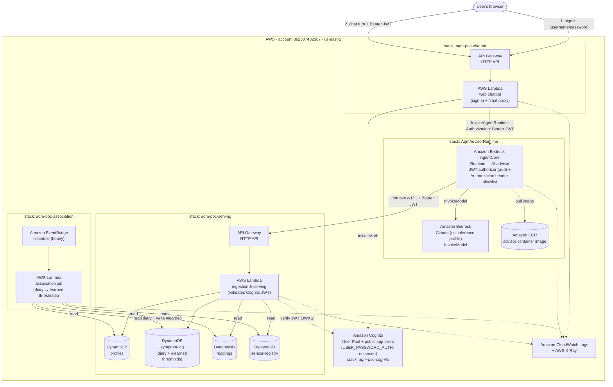

# Cloud deployment — AWS services and relationships

The deployed proof-of-concept in AWS account `862307432587`, region `us-east-1`.
Every service and edge below is provisioned by the CDK stacks in
[`../../infra/`](../../infra/) and [`../../agent-advisor/infra/`](../../agent-advisor/infra/),
so this diagram is the source code's shape, not an aspiration.

> **Scope.** This is the POC footprint: Lambda + DynamoDB with a **seeded**
> exposure history. It deliberately does **not** stand up the IoT Core / Timestream
> ingestion path from the original investigation
> ([`00-overview.md`](00-overview.md)); the sensor simulator's push pipeline runs
> against a local MQTT broker in Docker Compose, not a cloud ingress. See the
> deploy/teardown guide in
> [`../../.kiro/specs/personal-diary-memory/DEPLOY.md`](../../.kiro/specs/personal-diary-memory/DEPLOY.md).

## Deployment diagram

## The identity path (one JWT, validated once at each hop)

The blue request path carries a single Cognito **ID token** end to end — the same
token is validated at every hop, so there is one identity, never two that drift:

1. The browser signs in through the chatbot, which calls Cognito `InitiateAuth`
   and returns the ID token to the browser (held in memory only, never persisted).
2. Each chat turn sends that token as `Authorization: Bearer <JWT>`. The chatbot
   Lambda forwards it to the advisor over a **plain HTTPS** `InvokeAgentRuntime`
   call (not SigV4 — the runtime is JWT-authorized).
3. The AgentCore runtime's **JWT authorizer** validates the token's `aud` against
   the Cognito app client, and its **request-header allowlist** lets the
   `Authorization` header reach the container.
4. The advisor forwards the same token to the serving API, which **verifies the
   JWT against Cognito's JWKS** and reads the `sub` claim as the user id — the key
   under which that user's profile and diary live in DynamoDB.

## Services and why each is here

| AWS service | Role | Stack |
|-------------|------|-------|
| **Cognito** (User Pool + public app client) | Per-user identity; mints the ID token every service validates. `USER_PASSWORD_AUTH`, no client secret (browser client). | `aqm-poc-cognito` |
| **API Gateway HTTP API** (×2) | Public HTTPS front doors for the chatbot and the serving Lambda. | chatbot, serving |
| **AWS Lambda** (×3) | The chatbot proxy, the ingestion/serving API, and the scheduled association job. | chatbot, serving, association |
| **Bedrock AgentCore Runtime** | Hosts the AI advisor container; JWT-authorized inbound, forwards the credential to serving. | `AqmAdvisorRuntime` |
| **Amazon Bedrock** (Claude, `us.` inference profile) | The language model the advisor invokes (`bedrock:InvokeModel`). | (invoked by the runtime) |
| **Amazon ECR** | Holds the advisor's `linux/arm64` container image (built + pushed at deploy by a CDK `DockerImageAsset`). | `AqmAdvisorRuntime` |
| **DynamoDB** (×4: profiles, symptom-log, readings, sensor-registry) | Per-user profiles and diary (symptom-log also holds the `#learned` thresholds), plus the seeded exposure history and site registry. Encrypted at rest, PAY_PER_REQUEST. | `aqm-poc-serving` |
| **EventBridge** (schedule rule) | Triggers the association job hourly, off the request path. | `aqm-poc-association` |
| **CloudWatch Logs + X-Ray** | Structured JSON logs and traces for every Lambda and the runtime. | all |
| **S3** | The CDK bootstrap asset bucket (Lambda bundles, templates). | (bootstrap) |

## Least-privilege IAM (the edges that are grants, not traffic)

- The **serving Lambda** role has DynamoDB actions scoped to exactly its four
  table ARNs — read-write on `profiles` and `symptom-log`, read-only on `readings`
  and `sensor-registry` — never `Resource: "*"`.
- The **association Lambda** role imports the same four table ARNs cross-stack and
  is scoped the same way (read-write symptom-log, read the other three).
- The **advisor** execution role trusts `bedrock-agentcore.amazonaws.com` with
  `aws:SourceAccount`/`aws:SourceArn` confused-deputy guards, and grants
  `bedrock:InvokeModel` scoped to the Claude inference profile (and the foundation
  models it routes to), plus ECR pull and CloudWatch/X-Ray.
- The **chatbot** Lambda role grants only `bedrock-agentcore:InvokeAgentRuntime`
  on the one advisor runtime ARN.
