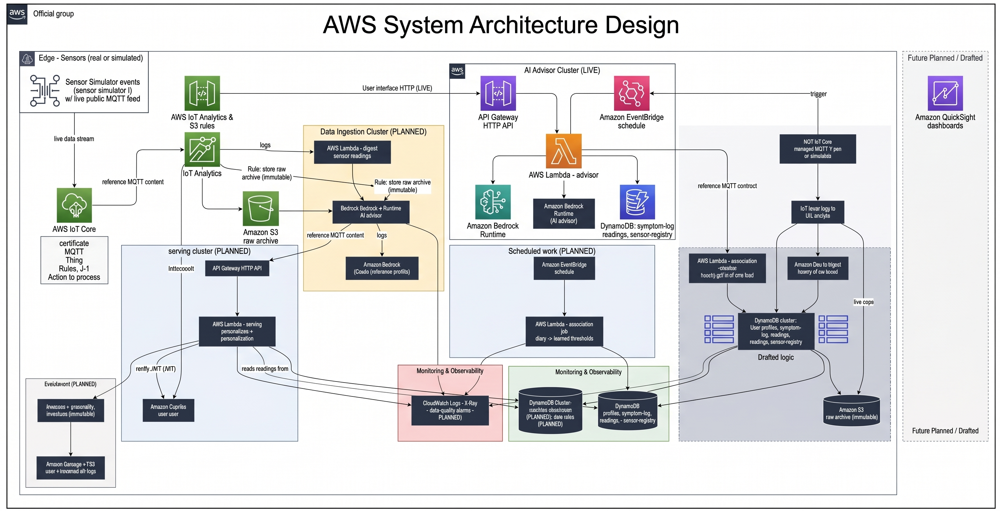

# Target architecture — the full system (with everything the POC omitted)

This is the **full intended system**: the live sensor-ingestion path, the
time-series store, per-device identity, and the enrichment and hardening the
proof-of-concept deliberately left out. It complements two existing docs:

- [`00-overview.md`](00-overview.md) — the original investigation this design
  derives from.
- [`03-cloud-deployment.md`](03-cloud-deployment.md) — **what is actually
  deployed today** (the POC footprint).

Read this as the destination and `03-cloud-deployment.md` as the current
milestone. The section ["What the POC omitted"](#what-the-poc-omitted) is the
explicit delta between the two.

> **Design status.** This is a design, not a deployed system. Everything drawn in
> green below is live today; everything in the "planned" styling is specified
> (in the service docs and specs) but not built. Cost figures are order-of-
> magnitude — validate with the [AWS Pricing Calculator](https://calculator.aws)
> before committing.

## Full deployment diagram

> **Note.** The diagram image predates the store change and may still label the
> readings store "Timestream"; the current target is **Amazon Timestream for
> InfluxDB** (managed InfluxDB), described below. The text here is authoritative.

`readings*`: in the POC the readings live in a DynamoDB table seeded with a bounded
history; in the target they are written live to **Amazon Timestream for InfluxDB**
(managed InfluxDB) by the ingest Lambda.

## The full ingestion path (the heart of what's deferred)

1. **A sensor publishes** `/SensorData` to `aqm/sensors/{SiteCode}/data` over MQTT,
   authenticated to **AWS IoT Core** with a **per-device X.509 certificate** (so an
   individual device can be revoked). A live public feed can substitute via the
   scheduled REST poller instead.
2. **An IoT Rule** copies the raw payload to **S3** (immutable archive, before
   anything derives from it) and routes the message to the **ingest Lambda** —
   through **Kinesis Data Streams** at high volume to smooth spikes and enable
   replay.
3. **The ingest Lambda** validates against the record contract, deduplicates,
   applies **humidity-aware calibration** (low-cost PM2.5 is unusable raw),
   converts units, computes per-species **sub-indices**, a **NowCast**, and the
   **overall AQI + driving pollutant**, attaches a quality/confidence flag, and
   writes the readings to **Amazon Timestream for InfluxDB** (managed InfluxDB) +
   upserts **DynamoDB** (profiles, symptom-log, sensor-registry).
4. **The serving Lambda** (unchanged from the POC in shape) joins those readings
   with the user's profile and, in the target, **enriches** with forecast/pollen
   data pulled via Lambda using keys from **Secrets Manager**.

Everything downstream of the readings store — serving, the advisor, the chatbot,
the diary/association loop — already exists and works today; the target simply
replaces the *seeded* readings with a *live* pipeline feeding them.

## What the POC omitted

| Capability | Target | POC today | How it slots in |
|------------|--------|-----------|-----------------|
| **Device connectivity** | AWS IoT Core (managed MQTT) | none — simulator publishes to a **local** mosquitto broker in Docker Compose | Point the simulator's MQTT transport at the IoT Core endpoint; the transport is already an injected adapter. |
| **Per-device identity** | Per-device **X.509** certs, revocable | none deployed (dev cert generation exists locally) | Provision certs + IoT policies per `SiteCode`; the simulator already models per-sensor identity. |
| **Message routing** | IoT Rules Engine (+ Kinesis at scale) | none | An IoT Rule → ingest Lambda; add Kinesis only when volume warrants. |
| **Live ingest pipeline** | Ingest Lambda: validate → calibrate → AQI → store | **not deployed** (the calibration/AQI code exists and is tested; it just isn't wired to a cloud trigger) | Deploy the ingest handler behind the IoT Rule; the domain logic is done. |
| **Readings store** | **Amazon Timestream for InfluxDB** (managed InfluxDB, purpose-built time-series) | DynamoDB table **seeded** with a bounded history (`just seed-readings`) | Swap the readings-store adapter to an InfluxDB adapter behind the same port; profiles, symptom-log and sensor-registry stay on DynamoDB. |
| **Raw archive** | S3, immutable, lifecycle to Glacier | none deployed (the archive port + adapter exist) | Enable the IoT Rule's S3 action + the archive adapter. |
| **Live feed pull** | EventBridge Scheduler → feed-poller Lambda | none (the pull interface exists in code, `AQM_ENABLE_PULL`) | Deploy the poller; supply the feed API key via Secrets Manager. |
| **Enrichment** | Forecast + pollen APIs via Lambda | none (the enricher port exists; POC returns no forecast) | Wire the enricher adapter to real APIs; keys in Secrets Manager. |
| **Secrets** | Secrets Manager / SSM | env/context at deploy | Move the feed/forecast keys into Secrets Manager; runtime already loads from env. |
| **Edge protection** | AWS WAF + API throttling/usage plans | shared-key gate on the chatbot only | Attach WAF + usage plans to the two HTTP APIs. |
| **Bedrock guardrail** | Managed `ApplyGuardrail` alongside the local check | local pattern/closure check only (`guardrail_checker=local`) | Provision a Bedrock Guardrail and set `guardrail_checker=bedrock`; the dual-enforcement design (DD4) is already in place. |
| **Observability depth** | CloudWatch + X-Ray + **data-quality alarms** | structured logs + X-Ray on every Lambda/runtime | Add CloudWatch alarms on ingest quality flags and dedup/rejection rates. |
| **Compute for the swarm** | Fargate (a long-running sensor swarm) | the simulator runs locally / as a one-shot | Containerize the swarm on Fargate publishing to IoT Core. |

Nothing in the "POC today" column is a dead end: every omitted piece has either a
port-and-adapter seam already in the code (readings store, archive, enricher, MQTT
transport, guardrail) or a documented deploy step — so the target is an
incremental build-out, not a rewrite.

## Additional AWS services in the target (beyond the POC's set)

| Service | Role | Why it was deferred |
|---------|------|---------------------|
| **AWS IoT Core** | Managed MQTT ingress + per-device X.509 auth + Rules Engine | The POC demonstrates the *advice* loop; a local broker was enough to exercise ingestion in tests. |
| **Amazon Timestream for InfluxDB** (managed InfluxDB) | Purpose-built readings time-series with time-window queries. (Timestream for LiveAnalytics is closed to new customers; the managed-InfluxDB engine is AWS's current time-series offering.) | A seeded DynamoDB table demonstrates the association loop without a second store to operate. |
| **Kinesis Data Streams** | Ingest buffer/replay at high sensor volume | Only justified at pilot/city scale; skipped for a demo swarm. |
| **EventBridge Scheduler (feed poller)** | Hourly pull of a live public feed | No live feed is connected in the POC. (EventBridge *is* used — for the association schedule.) |
| **Amazon S3 (raw archive)** | Immutable raw payload store for replay/audit/ML | No live ingestion means no raw payloads to archive yet. |
| **Secrets Manager / SSM** | Feed + forecast API keys | The POC has no external feed/forecast integration. |
| **AWS WAF** | Edge protection + throttling on the public APIs | A shared-key gate is sufficient for a gated demo. |
| **AWS Fargate** | Runs the sensor swarm as a long-lived service | The simulator runs locally or as a backfill for the demo. |
| **Bedrock Guardrails** | Managed content guardrail (second enforcement point) | The local guardrail + verification chain covers the demo; the managed layer needs a provisioned guardrail resource. |

## Cost implications of going live

The POC is nearly free (Lambda + DynamoDB + a gated Bedrock spend). The target's
new cost drivers are **IoT Core messaging** (~$1/million messages) and
**InfluxDB** (Timestream for InfluxDB) instance + storage. The single biggest lever, per the investigation,
is to **publish at 1-minute resolution but batch/pre-average to hourly before
publishing**, cutting message and write counts ~60×. Order-of-magnitude: a 20–50
sensor demo stays under ~$10–30/mo; a 5,000-sensor city-scale deployment at
1-minute cadence is ~$300–700/mo (see [`00-overview.md`](00-overview.md#approximate-cost-summary-us-east-1-usdmonth--order-of-magnitude)).

## Sequencing to get from the POC to the target

1. **Containerize the simulator on Fargate**, publishing to a local/dev IoT Core
   endpoint with per-device X.509 certs.
2. **Stand up IoT Core + an IoT Rule** → the ingest Lambda (the calibration/AQI
   domain code already exists and is tested), writing to the readings store.
3. **Introduce Amazon Timestream for InfluxDB** behind the readings-store port and
   migrate reads off the seeded DynamoDB table (profiles/diary/registry stay on
   DynamoDB).
4. **Enable the raw-archive S3 action** and the enrichment + secrets path.
5. **Harden the edge** (WAF, usage plans) and add the managed **Bedrock
   guardrail** as the second enforcement point.
6. **Add data-quality alarms** on ingest.

At each step the serving API, the advisor, the chatbot, and the diary/association
loop are unchanged — the build-out is entirely upstream of the readings store.
